# Fahrzeugkosten automatisiert – Benutzerhandbuch

> **Quelle bearbeiten (Markdown).** Browser und der In-App-Reader öffnen den **gerenderten HTML**:
> - Web: [`docs/user-manual.html`](user-manual.html) (neu generieren mit `./scripts/render-user-manual.sh`)
> - App: Hilfe / Info → vollständiges Handbuch (gebündeltes HTML + Screenshots)
>
> Weisen Sie Endbenutzer nicht auf unformatierte „.md“-URLs hin – Browser zeigen nur Klartext an.

Kamerabasierte Verfolgung von Tankfüllungen und Fahrzeugkosten, mit optionaler Synchronisierung und Sicherung mehrerer Geräte unter **Ihren** Cloud-Konten.

Dies ist das **vollständige Handbuch** (Screenshots + jeder Schritt). Auf dem Telefon ist **Menü → Hilfe** eine kürzere Kurzanleitung.

**Hier nicht behandelt:** Alte Bilder importieren, Ausrichtungsexperiment und Pumpenexperiment (Entwickler-/erweiterte Tools).

---

## Inhaltsverzeichnis

1. [Was Sie brauchen](#what-you-need)
2. [Symbole auf einen Blick](#icons-at-a-glance)
3. [Menü öffnen](#open-the-menu)
4. [Erstmalige Einrichtung: Fahrzeuge verwalten](#first-time-setup-manage-vehicles)
5. [Backups und Multi-Device-Synchronisierung](#backups-and-multi-device-sync)
6. [Schnellbetankung (Kraftstoff)](#quick-fill-up-fuel)
7. [Reise starten](#start-trip)
8. [Ausgaben](#Ausgaben)
9. [Berichte](#reports)
10. [Einstellungen (lokale Präferenzen)](#settings-local-preferences)
11. [Synchronisierung](#syncing)
12. [Hilfe und Info](#help--about)
13. [Verwandte Dokumente](#related-docs)

---

## Was Sie brauchen

- Android-Telefon oder -Tablet.
- Für beste OCR: eine klare Sicht auf Ihren **Armaturenbrett-Kilometerzähler** und **Pumpengesamtwerte** (oder geben Sie die Zahlen von Hand ein).
- Optional: Konten **von Ihnen kontrolliert** für Tabellenkalkulationsdaten und/oder Fotosicherungen (siehe [Backups und Synchronisierung mehrerer Geräte](#backups-and-multi-device-sync)).

---

## Icons auf einen Blick

Diese erscheinen auf den Hauptbildschirmen. Wenn man sie kennt, erspart man sich viel Jagd.

| Wo | Symbol / Steuerung | Was es tut |
|-------|----------------|--------------|
| Obere Leiste | **☰ Menü** (Hamburger) | Öffnet die Navigationsleiste |
| Obere Leiste | **ⓘ** (Seitenhilfe) | Kurzhilfe zur **aktuellen** Seite (neben dem Menü, sofern verfügbar) |
| Obere Leiste | **`?N`** (gelb) | Ausstehende Importüberprüfungsfragen – öffnet Importüberprüfung |
| Obere Leiste | **!** (rot) | Eine Tabellenkalkulation oder ein Fotoziel ist kürzlich fehlgeschlagen. Öffnen Sie **Synchronisierung**, um das Problem zu beheben
| Obere Leiste | **☰ + ←** | Kinder melden und Ausgabenliste zeigen **Menü und zurück** zusammen an; Der Berichts-Hub ist nur im Menü verfügbar |
| Einstellungen / Kraftstoff bearbeiten | **←** | Zurück (Einstellungen, Tabellenkalkulation/Foto und Kraftstoffbearbeitung bleiben im Fokus) |
| Schnellfüllung | **Weißer Kreis** (Verschluss) | Erfassen Sie die Kilometerzähler- oder Pumpenanzeige für OCR |
| Schnellfüllung | **Datenträger / Speichern** | Sparen Sie das Tanken (benötigt ein Fahrzeug und mindestens eines von odo / Volumen / Kosten) |
| Schnellfüllung | **↕ Pfeile** (Modusschalter) | Schalten Sie zwischen **Kilometerzählermodus** und **Pumpenmodus (Kosten/Volumen)** um. Der grüne Rand markiert die aktive Feldgruppe |
| Schnellfüllung | **↔ Pfeile** (zwischen Kosten und Volumen) | Kosten und Volumen vertauschen, wenn OCR sie in die falschen Felder einfügt |
| Schnellfüllung | **Zoom 1x / …** | Zoomverhältnisse der Kamera, wenn das Objektiv sie unterstützt |
| Quick Fill (nach der Aufnahme) | **Aktualisieren** auf der Hauptschaltfläche | Vorschau verwerfen und zur Live-Kamera zurückkehren |
| Quick Fill (während der Verarbeitung) | **X** auf der Hauptschaltfläche | Laufende Erfassung/OCR abbrechen |
| Aufwand | **Speichern** | Sparen Sie die Kosten |
| Aufwand | **Verschlusskreis** | Machen Sie ein Quittungsfoto |
| Aufwand | **Galerie** | Wählen Sie ein Belegbild aus der Bibliothek aus |
| Aufwand | **Wiederholung** | Aktuelles Belegfoto löschen und erneut aufnehmen |
| Kosten / Fahrzeuge verwalten | **+ / −** FABs | Zoomen Sie die Fotovorschau |
| Dialogfeld „Sehenswürdigkeiten“ | **OCR bearbeiten** | Korrigieren oder fügen Sie wegweisenden Text hinzu, den die Engines übersehen haben |
| Tabellenkalkulation / Fotoformulare | **🔍Suche** | Durchsuchen Sie Google Drive nach einem Blatt oder Ordner (nach der Anmeldung) |

Währungssymbole in Kostenfeldern und **Hauptbuch** in Volumenfeldern können angetippt werden: Öffnen Sie ein kleines Menü, um die Währung oder Gallonen vs. Liter für diesen Eintrag zu ändern.

---

## Öffnen Sie das Menü

1. Tippen Sie oben links auf **☰**.
2. Wählen Sie eine Seite.

**Hauptschublade:** Schnelltanken · Fahrt starten · Fahrzeuge verwalten · Neue Ausgaben · **Berichte** · Einstellungen · Synchronisierung · Hilfe · Info.

**Experimentschublade** (Einstellungen → Experimentbildschirme anzeigen): Ausrichtungsexperiment · Pumpenexperiment · **Alte Bilder importieren**.

**Über den Berichts-Hub (nicht über die Hauptschublade):** Spesenliste · Verlauf ausfüllen.

---

## Ersteinrichtung: Fahrzeuge verwalten

OCR und **automatischer Fahrzeugabgleich** funktionieren am besten, nachdem Sie jedes Fahrzeug mit einem **Referenz-Dashboard-Foto** registriert, den Kilometerzähler zugeschnitten und **Discovery** ausgeführt haben, damit die App Orientierungstext für dieses Armaturenbrett speichert. (Wie Orientierungspunkte ausgewählt und zugeordnet werden, wird in einem späteren Update detaillierter dokumentiert.)

### Öffnen Sie „Fahrzeuge verwalten“.

Menü → **Fahrzeuge verwalten**. Wählen Sie ein Fahrzeug (oder **Neues Fahrzeug hinzufügen**).

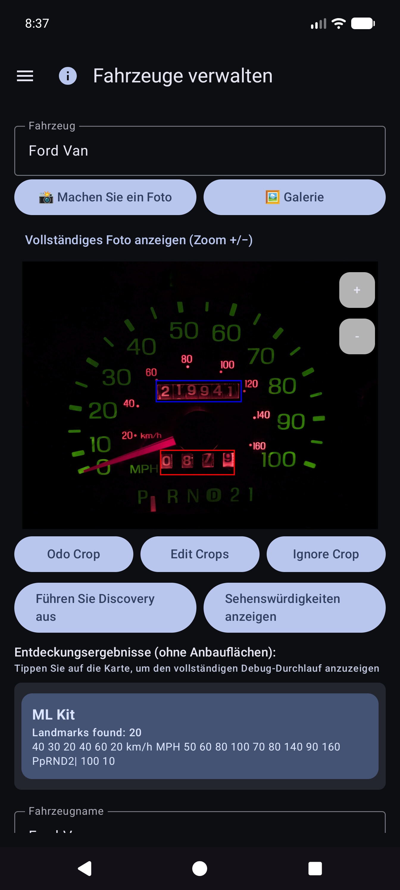

### Ein Fahrzeug hinzufügen oder bearbeiten

1. Öffnen Sie das Dropdown-Menü **Fahrzeug** → wählen Sie ein Fahrzeug aus oder **Neues Fahrzeug hinzufügen**.
2. Nehmen Sie ein klares **Referenz-Armaturenbrettfoto** auf oder wählen Sie es aus (komplettes Kombiinstrument, gut beleuchtet, Telefon ungefähr im rechten Winkel). Verwenden Sie **Foto aufnehmen** oder **Galerie**.
3. Pflanzen zeichnen:
   - **Odo Crop** – Rechteck eng um die Ziffern des Kilometerzählers (auf der Schaltfläche wird **Done Odo** angezeigt, während dieser Modus aktiv ist).
   - **Zuschnitt ignorieren** – optionaler Bereich zum Ignorieren (Uhr, Radio usw.).
   - **Zuschnitte bearbeiten** – Vorhandene Rechtecke anpassen.
4. Tippen Sie auf **Erkennung ausführen** – die mehrmotorige OCR findet wichtige Wörter außerhalb der Zuschnitte.
5. Überprüfen Sie mit **Sehenswürdigkeiten anzeigen**. Verwenden Sie **OCR bearbeiten**, um Lesefehler zu korrigieren oder übersehenen Text hinzuzufügen.
6. Geben Sie **Fahrzeugname** (erforderlich) sowie Marke/Modell/Jahr/Kennzeichen nach Wunsch ein.
7. Tippen Sie auf **Fahrzeug erstellen** oder **Änderungen speichern** (für ein neues Fahrzeug sind Name und Referenzfoto erforderlich).

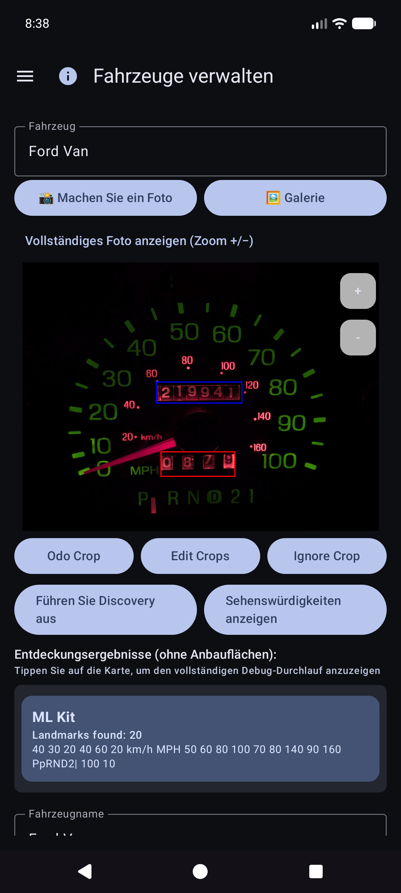

### Sehenswürdigkeiten: Korrigieren Sie, was Discovery übersehen hat

Scrollen Sie nach **Sehenswürdigkeiten anzeigen** durch die Liste und korrigieren Sie die Werte. Bei Engines fehlen manchmal kleine Ziffern (z. B. eine Uhr **60** unten rechts im Cluster). Verwenden Sie **OCR bearbeiten**, um sie hinzuzufügen oder zu korrigieren, damit die Fahrzeugidentität zuverlässig bleibt.

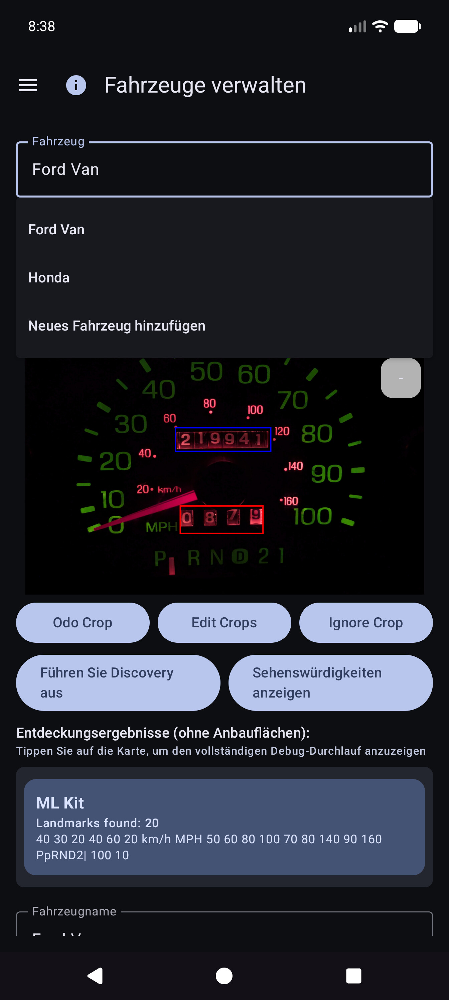

### Tippen ohne perfektes Foto

Sie können die App weiterhin verwenden, indem Sie ein Fahrzeug auswählen und Kilometerzähler, Volumen und Kosten in Quick Fill **eingeben** – OCR ist für jedes Feld optional. Der Galerieimport funktioniert für das Referenz-Dash-Foto, wenn Sie nicht in der App fotografieren möchten.

**Tipp:** Nach der Synchronisierung der Tabellenkalkulation sind die Fahrzeugdefinitionen (Kulturpflanzen, Orientierungspunkte) in der lokalen Datenbank gespeichert – Sie müssen „Fahrzeuge verwalten für Quick Fill“ nicht erneut öffnen, um sie zu verwenden.

---

## Backups und Synchronisierung mehrerer Geräte

Die App ist so konzipiert, dass **mehrere Telefone oder Tablets dieselben Flottendaten teilen können** und dass Sie eine **Kopie Ihrer Daten und Fotos vom Gerät fernhalten können**. Dies erfolgt über Ziele, die Sie unter **Ihren** Konten oder **Ihren** selbst gehosteten Servern konfigurieren – und nicht über eine vom Unternehmen betriebene „Fahrzeugkosten-Cloud“, die andere Personen sehen können.

### Was läuft wo

| Freundlich | Was es speichert | Typische Verwendung |
|------|----------------|-------------|
| **Tabellenkalkulation/Tabellensynchronisierung** | Fahrzeuge, Tankfüllungen, Ausgaben (Zeilen und Registerkarten) | Zusammenführung mehrerer Geräte + strukturiertes Backup |
| **Fotosicherung** | Binärbilder (Armaturenbrett/Pumpe/Quittung/Referenzfotos) | Fotosicherung + fehlende Dateien wiederherstellen |

Sie können **mehrere Ziele** jedes Typs konfigurieren (Soft-Cap pro Typ). Manuelle **Jetzt synchronisieren**- und **Hintergrund**-Worker führen die aktivierten Worker aus.

### Zuerst offline

- **Es ist kein Netzwerk erforderlich**, um eine Tankfüllung, eine Ausgabe oder einen Beleg hinzuzufügen. Alles wird **zuerst lokal** gespeichert.
- Wenn das Netzwerk verfügbar ist, werden Synchronisierung und Fotosicherung als **Hintergrundaufgaben** ausgeführt (nach einem von Ihnen festgelegten Zeitplan und wenn Sie auf **Jetzt synchronisieren** tippen). Fehler werden als roter Text unter den Einstellungszeilen und als **!** in der Titelleiste der App angezeigt.

### Nur Ihre Konten

Anmeldung und Token bleiben für die von Ihnen ausgewählten Anbieter (Google, Microsoft, S3-Schlüssel, selbst gehostete URLs usw.) auf dem Gerät. Die Ziele unterliegen der **vollständigen Kontrolle des Benutzers** – Ihrem Google-Konto, Ihrem OneDrive, Ihrem MinIO-Bucket, Ihrem EtherCalc-Host usw. Über ein gemeinsames Backend wird nichts mit anderen Vehicle Expenses-Benutzern geteilt.

### Unterstützte Ziele – Daten (Tabellenkalkulation/Tabelle)

Konfiguriert unter **Menü → Synchronisierung → Tabellenkalkulationssynchronisierung** (auch über die Zusammenfassungszeilen der Einstellungen erreichbar). Erstklassige Picker-Optionen:

| Ziel | Notizen |
|--------|--------|
| **Google Sheets** | Gemeinsamer Standard; Registerkarten für Fahrzeuge, Ausgaben und Kraftstoff pro Fahrzeug |
| **Excel** | Microsoft-Arbeitsmappe über Graph-/OneDrive-Bindung |
| **EtherCalc** | Selbstgehostete kollaborative Tabellenkalkulationsräume |
| **Andere →** implementierte Backends | **Baserow**, **NocoDB**, **Airtable**, **PocketBase**, **Supabase**, **Firebase**, **Zoho Sheet** |

Zurückgestellt/noch nicht Headless (unter Andere aufgeführt, aber nicht vollständig implementiert): OnlyOffice, Collabora. Siehe auch [Self-Host-Index](reference/self-host/INDEX.md).

CSV **Export/Import** (ZIP mit demselben Tab-Layout) ist in den Einstellungen als tragbares Backup verfügbar, unabhängig von der Live-Synchronisierung.

### Unterstützte Ziele – Fotos (Bildsicherung)

Konfiguriert unter **Menü → Synchronisierung → Fotosicherung** (auch aus den Zusammenfassungszeilen der Einstellungen):

| Ziel | Notizen |
|--------|--------|
| **Google Drive** | Von Ihnen ausgewählter Ordner (URL durchsuchen oder einfügen) |
| **OneDrive** | Microsoft-Konto + Pfadpräfix |
| **S3** | AWS, Wasabi, Cloudflare R2, MinIO und andere S3-kompatible Endpunkte |
| **Andere** | rclone-gestützter Speicher (z. B. WebDAV, SFTP und andere kuratierte Remotes, die in der In-App-Auswahl verfügbar sind) |

Richten Sie Cheatsheets für selbst gehostete Foto- und Tabellenziele ein: [self-host index](reference/self-host/INDEX.md).

### Verhalten bei mehreren Geräten (kurz)

– Zeilen werden nach **Sync-ID** mit **Last-Write-Wins** auf **Aktualisierten** Zeitstempeln zusammengeführt.
- Löschvorgänge sind weich; Eine neuere Bearbeitung auf einem anderen Gerät kann eine Zeile wiederherstellen.
- Wenn Sie auf zwei Geräten die **gleiche Füllung zweimal** eingeben, entstehen **zwei Zeilen** – löschen Sie die zusätzlichen Zeilen, wenn Sie es bemerken.
- Weitere Details: [Verhaltenshinweise synchronisieren](#sync-behavior-notes) und [SYNC_BEHAVIOR.md](reference/SYNC_BEHAVIOR.md).

### Beispiel: Google Sheets (Daten) hinzufügen

1. **Menü → Synchronisierung → Tabellenkalkulationssynchronisierung** (oder Einstellungen → Tabellenkalkulationssynchronisierung).

   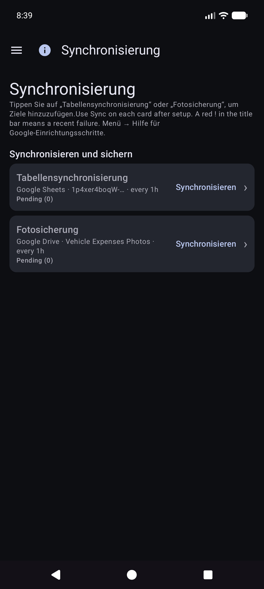

2. Tippen Sie auf **Tabellenziel hinzufügen**.

   

3. Wählen Sie **Google Sheets**.

   

4. **Mit Google anmelden** → Anzeigename → **Tabellen-URL** oder **🔍** Durchsuchen/Erstellen → Optionen planen → Aktivieren → Speichern.
5. **Jetzt synchronisieren** einmal, um Registerkarten zu erstellen/aktualisieren: „Fahrzeuge“, „Ausgaben“, „Kraftstoff – {Fahrzeugname}“.

### Beispiel: Google Drive hinzufügen (Fotos)

1. **Menü → Synchronisierung → Fotosicherung** (oder Einstellungen → Fotosicherung).

   

2. Tippen Sie auf **Fotoziel hinzufügen**.

   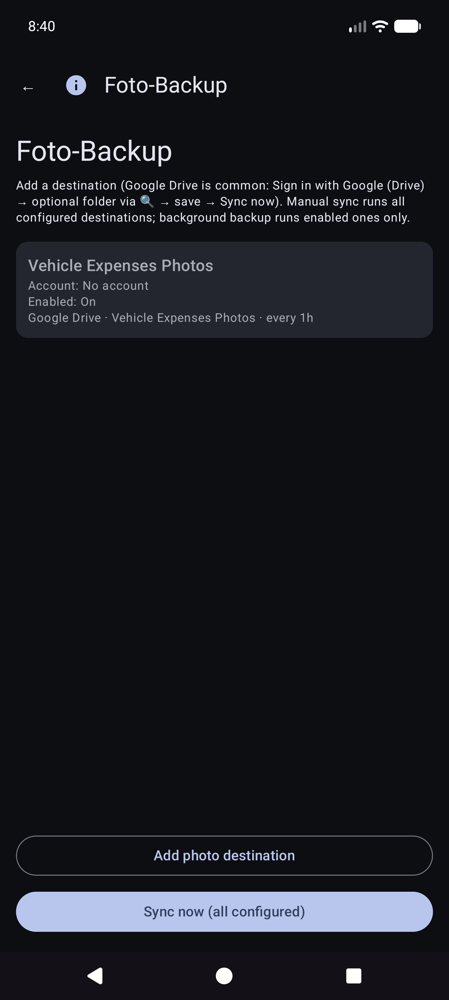

3. Wählen Sie **Google Drive**.

   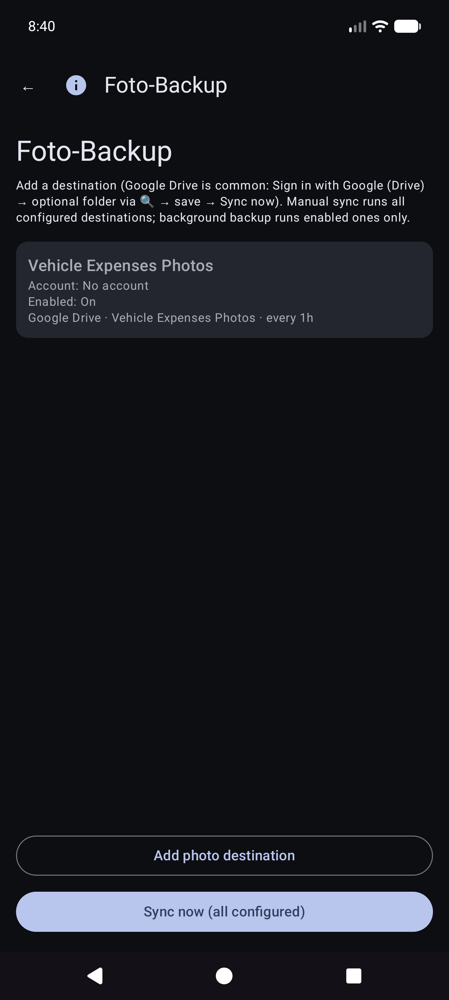

4. **Mit Google (Drive) anmelden** → optionale Ordner-URL/Durchsuchen → Aktivieren → Speichern → **Jetzt synchronisieren**.

Manuelles **Jetzt synchronisieren** für Fotos ist ein vollständiger Durchgang; Die Hintergrundsicherung verarbeitet normalerweise **nur ausstehende** Uploads nach einem Zeitplan.

### Hinweise zum Synchronisierungsverhalten

- Nach dem App-Upgrade wird möglicherweise kurz **„Datenbank wird nach Upgrade aktualisiert…“** angezeigt (lokales Synchronisierungs-ID-Backfill).
- Wenn eine Synchronisierung unterbrochen wird, werden bei der nächsten **erfolgreichen** Synchronisierung Remote-Tabs erneut zusammengeführt und repariert.
- Fehler: rote Zusammenfassung bei der Synchronisierung von Karten + **!** in der App-Leiste.

---

## Schnellbetankung (Kraftstoff)

Dies ist der **Startbildschirm**, wenn Sie die App öffnen.

### Fahrzeugauswahl (normalerweise automatisch)

Sie müssen **nicht** zuerst das Fahrzeug auswählen. Wenn für Fahrzeuge in „Fahrzeuge verwalten“ **Orientierungspunkte** eingerichtet sind, erkennt Quick Fill **automatisch** anhand des Armaturenbrettbilds, welches Fahrzeug** ist, nachdem Sie den Kilometerzähler erfasst haben. Sie können weiterhin das Dropdown-Menü **Fahrzeug** öffnen, um es bei Bedarf zu überschreiben.

### Zielen Sie auf den Kilometerzähler

Bleiben Sie im Kilometerzählermodus und rahmen Sie den Cluster ein. Anleitung: *Zielen Sie auf den Kilometerzähler. Tippen Sie zum Aufnehmen auf den Auslöser.*

### Nach dem Kilometerzähler-Verschluss

OCR füllt **Odo** aus und versucht, das Fahrzeug anhand von Orientierungspunkten abzugleichen (überprüfen Sie bei Bedarf beide). Die Hauptschaltfläche wird zu **Wiederholen**, um erneut zu schießen. Die Anleitung fasst die Lektüre zusammen.

### Pumpenmodus (Kosten und Volumen)

1. Tippen Sie auf **↕**, um in den Pumpenmodus zu wechseln: *Zielen Sie auf die Pumpenanzeige (Kosten/Volumen). Tippen Sie auf den Auslöser.*
2. Erfassen Sie die Pumpengesamtwerte. Kosten- und Volumenfelder ausfüllen; Verwenden Sie **↔**, wenn sie vertauscht sind.
3. Tippen Sie bei Bedarf auf Währung oder **Sachbuch** und dann auf **Speichern** (Datenträger). Leere Felder führen zu einer **teilweisen Füllung** (immer noch zulässig).

Sie bleiben für den nächsten Stopp auf Quick Fill (Felder werden nach dem Speichern gelöscht). Vollständig **offline** arbeiten; Die Synchronisierung wird bei entsprechender Konfiguration später im Hintergrund ausgeführt.

### Manuelle Eingabe (keine Kamera / schlechte OCR)

1. Tippen Sie auf **Odo**, **Kosten** oder **Volumen** und geben Sie Werte ein (im Hochformat wird die Systemtastatur verwendet; im Querformat wird eine Bildschirmtastatur verwendet).
2. Wählen Sie **Fahrzeug** aus oder bestätigen Sie es, wenn die automatische Erkennung nicht ausgeführt wurde.
3. Speichern Sie wie oben.

### Modi und Grenzen

- **Grüner Rand** um Fahrzeug+odo → Kilometerzähler erfassen/bearbeiten.
- **Grüner Rand** um Kosten+Volumen → Pumpmodus.
- **Speichern** bleibt deaktiviert, bis ein Fahrzeug ausgewählt wird und mindestens eines von odo/cost/volume Daten hat und OCR noch nicht läuft.

Tipp auf dem Bildschirm (unterhalb der Anweisungszeile): *Auslöser = Aufnahme · Festplatte = Speichern · ↕ = Odo-/Pumpmodus · ↔ = Kosten/Volumen tauschen.*

---

## Ausgaben

### Neue Ausgabe

Menü → **Neue Ausgabe**.

1. **Speichern** (Datenträger), **Auslöser** (Quittungsfoto) oder **Galerie** (Bild auswählen).
2. Geben Sie **Datum**, **Fahrzeug**, **Anbieter**, **Beschreibung**, **Betrag** (Währungssymbol antippbar), **Kategorie**, optional **Kilometerzähler** ein.
3. Mehrseitige Belege: Erfassen Sie zusätzliche Seiten, wenn die Benutzeroberfläche Paging anbietet (Seite 0 ist der primäre Beleg).
4. **Speichern** zum Speichern (zuerst lokal; Fotosicherung und Tabellensynchronisierung erfolgen bei Konfiguration im Hintergrund).

### Spesenliste

Menü → **Berichte** → **Ausgabenliste** – durchsuchen Sie vergangene Ausgaben, die nicht mit Treibstoff zusammenhängen; Öffnen Sie ein Element zum Bearbeiten.

### Ausgabe bearbeiten

Öffnen Sie eine Zeile aus der Liste. Korrigieren Sie Anbieter, Menge, Kategorie, Fahrzeug und Beschreibung. Wenn sich die Quittung nur in der Fotosicherung befindet (keine lesbare lokale Datei), verwenden Sie **Bild aus Archiv abrufen**, wenn angezeigt (funktioniert für alle konfigurierten Fotoziele).

---

## Reise starten

Menü → **Fahrt starten** (nach Quick Fill in der Schublade). Erfassen Sie den Kilometerzähler oder geben Sie ihn ein, wählen Sie den Fahrttyp und speichern Sie ihn mit dem **Diskettensymbol**. **Stop** ist eine Abkürzung für „Persönlich jetzt“ am gehaltenen GPS-Standort. Verwenden Sie **ⓘ** für Kontrollerinnerungen.

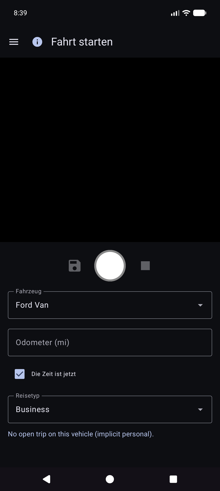

Fahrtbeginne werden als Kraftstoffzeilen mit einem **Fahrttyp** gespeichert (keine normalen Füllungen). Sie erscheinen unter **Berichte → Fahrtmeilen**, nicht unter Kraftstoffverlauf.

---

## Berichte

Menü → **Berichte** öffnet den Produkt-Hub (allzeitige Zusammenfassung + Katalogkarten). Dies ist die einzige Produktberichtsoberfläche – es gibt kein separates Schubladenelement „Berichte und Diagramme“.

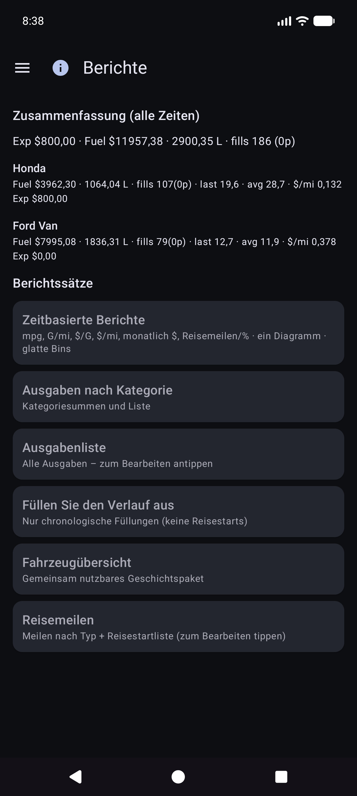

Öffnen Sie eine Karte für den Fahrzeugmodus (**Alle / Jeder / Einzeln**), Zeitraumfilter, Diagramme und Teilen (**TEXT / CSV / PDF**). Obere Leiste bei Berichtskindern: **☰ + ←** (und **ⓘ** bei Registrierung).

### Zeitbasierte Berichte

Die Hauptkartenkarte. Optionale Metriken (MPG, Volumen/Entfernung wie G/Meilen, Stückpreis wie $/G, Kosten/Entfernung, monatliche $, Reisemeilen, Reise-% nach Typ) mit **glatten** Bins und **unabhängigen Y-Skalen** (Economy links; Geld- und Reisefamilien rechts).

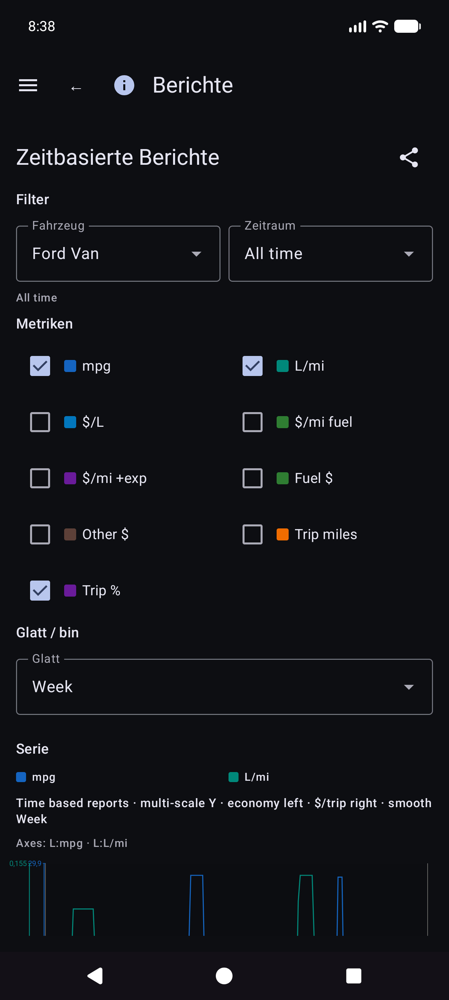

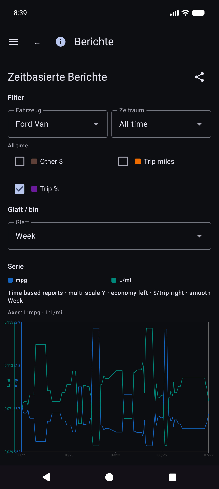

Details zur Wirtschaftsmathematik: [REPORTS_METRICS.md](reference/REPORTS_METRICS.md).

### Füllverlauf vs. Kraftstoffverlauf

- **Berichte → Ausfüllverlauf** – chronologische Ausfüllungen für die Berichtsfilter (**nur Ausfüllungen**; keine Reisestarts).

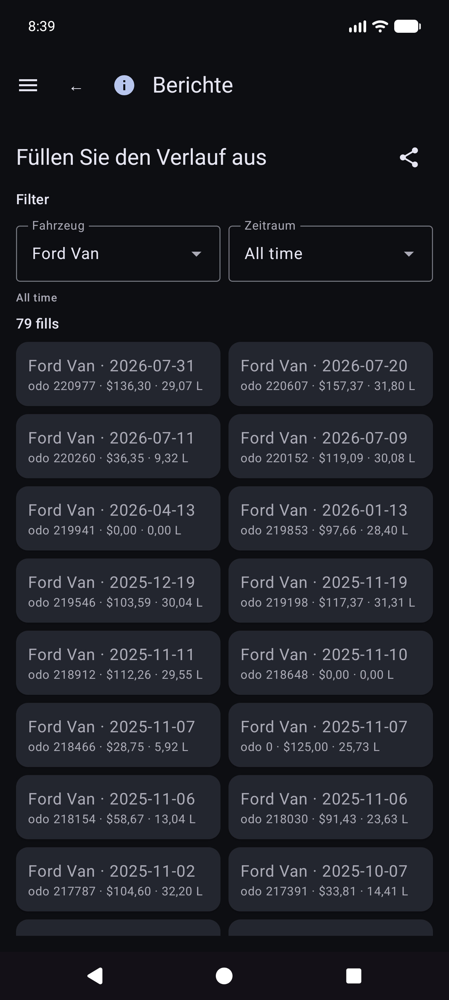

- **Kraftstoffhistorie** (sofern in der Navigation Ihres Builds vorhanden) – Füllstand pro Fahrzeug, auch nur Füllungen; Tippen Sie auf eine Zeile, um sie zu bearbeiten.

### Reisemeilen

**Berichte → Reisemeilen** – Meilen nach Typ, Diagramme und eine chronologische **Reisestart-/Segmentliste**. Tippen Sie auf einen echten Anfang, um **Füllung bearbeiten** für diese Zeile zu öffnen.

### Füllung bearbeiten

Öffnen Sie unter Füllhistorie, Kraftstoffhistorie oder Fahrtmeilen eine Füllung. Layout: Fahrzeug und Kilometerzähler, **Währung vor Kosten**, Volumen, Notizen. Der Reisetyp wird nur angezeigt, wenn es sich bei der Zeile um einen Reisebeginn handelt. Der Standort verfügt über eine Zusammenfassung sowie **Standortdetails**. Fehlendes lokales Foto mit Cloud-Identität: **Bild aus Archiv abrufen**.

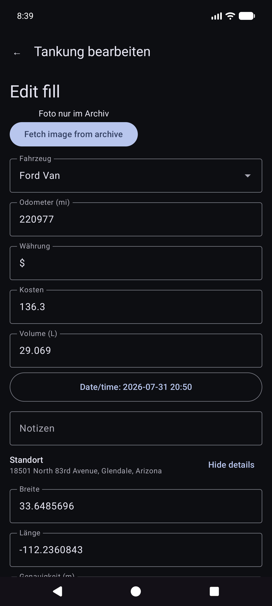

Zu den weiteren Katalogkarten gehören Ausgaben nach Kategorie, eine Fahrzeugübersicht und eine Ausgabenliste.

Für Geld wird die Währung jeder Zeile verwendet, wenn diese festgelegt ist. Gesamtsummen in gemischten Währungen zeigen **Zwischensummen pro Währung** (keine stille Devisenumrechnung).

---

## Synchronisierung

Menü → **Synchronisierung** ist die Zentrale für Tabellenkalkulations- und Fotoziele (nicht nur unter „Einstellungen“ vergraben).

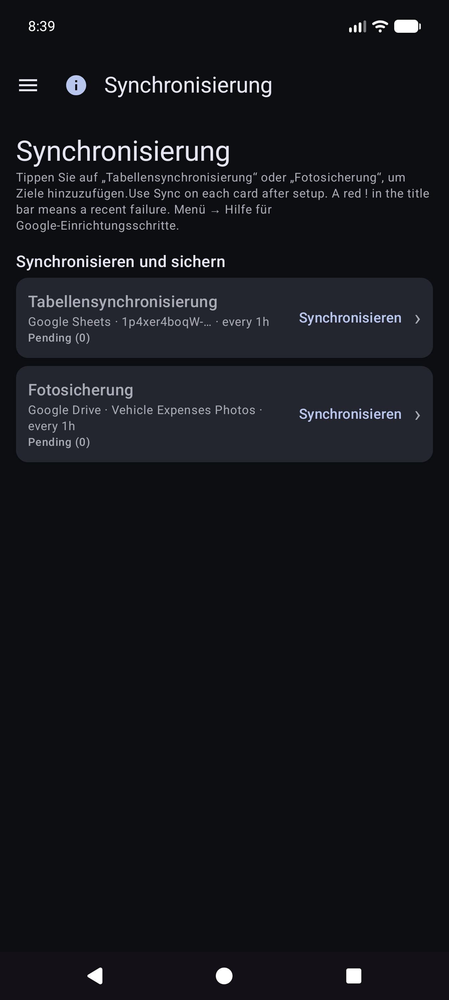

- Karten für **Tabellenkalkulation** und **Fotosicherung** mit Kurzstatus, **Synchronisierung** für diese Art und **›** in die Zielliste.
- Öffnen Sie ein Ziel für **Verbindung testen** und **Jetzt synchronisieren (dieses Ziel)** / alles konfiguriert.
- Fehler **Details** und das rote **!** in der Titelleiste landen hier.
- Schritt-für-Schritt-Einrichtung von Google Sheets und Drive: [Backups und Synchronisierung mehrerer Geräte] (#backups-and-multi-device-sync).

---

## Einstellungen (lokale Präferenzen)

Menü → **Einstellungen**.

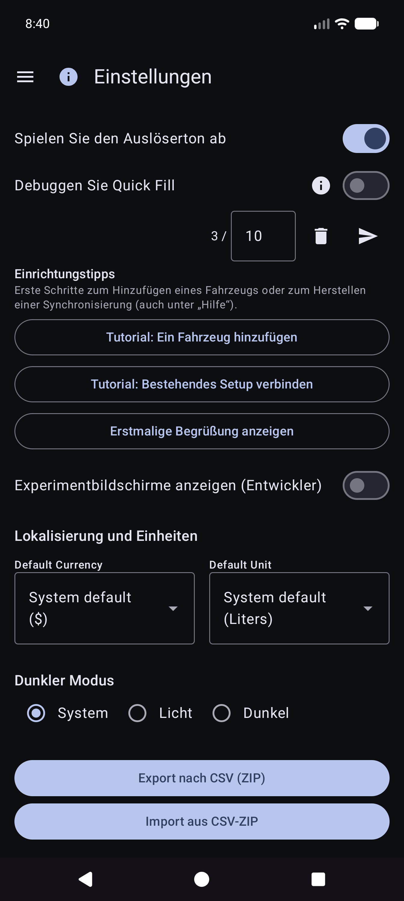

Für Ziele bevorzugen Sie **Menü → Synchronisierung**. In den Einstellungen werden möglicherweise weiterhin Zusammenfassungszeilen angezeigt, die dieselben Listen öffnen.

### Lokale Präferenzen (häufig)

- **Fotos von Kraftstoffbelegen speichern** / **Fotos von Spesen lokal speichern** – Bilder auf dem Gerät behalten (evtl. um Erlaubnis für Fotos bitten).
- **Auslöserton abspielen**
- **Währung** / **Volumeneinheit** – App-Standardeinstellungen (System oder explizit). Beim Ändern der Volumeneinheit mit vorhandenen Kraftstoffdaten wird möglicherweise ein Konvertierungsdialog angezeigt.
- **Dunkler Modus**
- **Tipps zur Einrichtung** – Öffnen Sie die Tutorials zum ersten Fahrzeug/Synchronisierung erneut.
- **Debug Quick Fill** / **Experimentbildschirme anzeigen (Entwickler)** – erweitert; Für den täglichen Gebrauch weglassen. Experimentierbildschirme werden hier nicht dokumentiert.

CSV **Export/Import** (Postleitzahl der Registerkarten „Fahrzeuge/Ausgaben/Kraftstoff“) ist in den Einstellungen verfügbar, sofern dies im aktuellen Build angeboten wird.

---

## Hilfe und Info

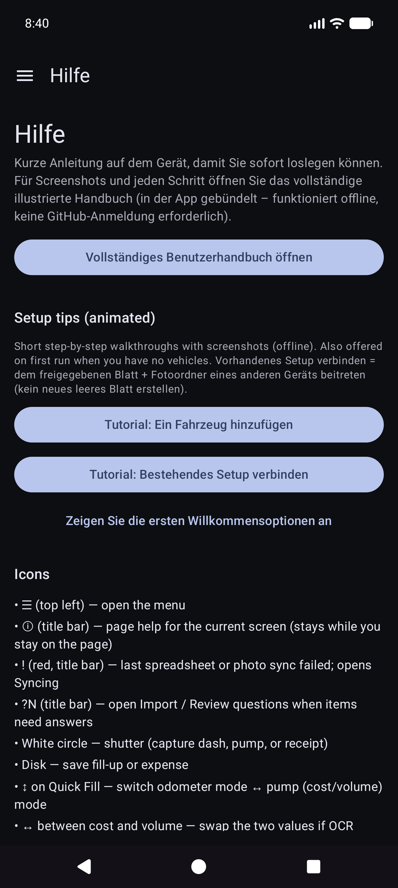

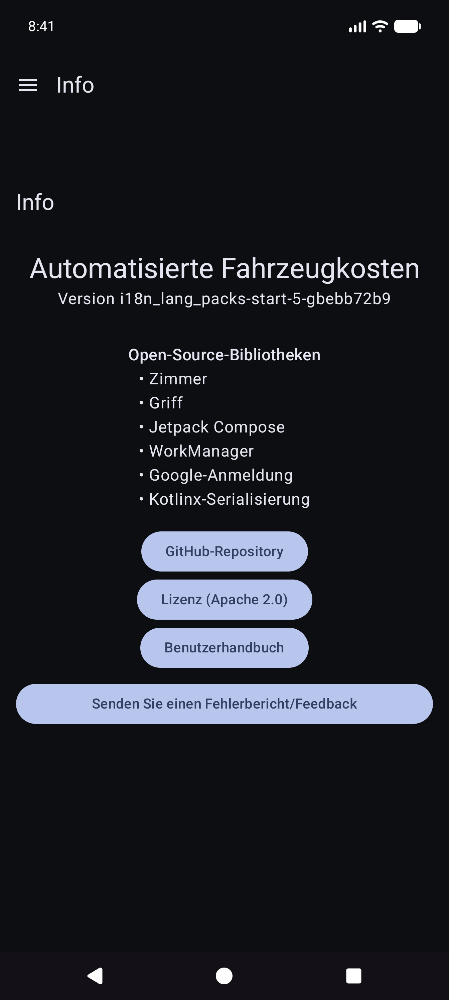

- **Hilfe** – Schnellstart auf dem Gerät, Setup-Tutorials, Link zu diesem Handbuch, Self-Host-Setup-Index.
- **Über** – Version, Lizenzen, GitHub, dieses Handbuch (offline gebündelt + Online-HTML bei Veröffentlichung).

---

## Verwandte Dokumente

- [USER_GUIDE.md](reference/USER_GUIDE.md) – Kurzreferenz
- [self-host/INDEX.md](reference/self-host/INDEX.md) – selbstgehostetes Foto-/Tabellen-Setup
- [SYNC_BEHAVIOR.md](reference/SYNC_BEHAVIOR.md) – Zusammenführung, Wiederherstellung, Duplikate
- [REPORTS_METRICS.md](reference/REPORTS_METRICS.md) – Details zu Wirtschaftskennzahlen