# Gastos de Vehículo Automatizados — Manual de Usuario

> **Editar fuente (Markdown).** Los navegadores y el lector de la aplicación abren el **HTML renderizado**:
> - Web: [`docs/user-manual.html`](user-manual.html) (regenerar con `./scripts/render-user-manual.sh`)
> - Aplicación: Ayuda / Acerca de → manual completo (HTML incluido + capturas de pantalla)
>
> No dirija a los usuarios finales a URL `.md` sin formato: los navegadores solo muestran texto sin formato.

Seguimiento con cámara para repostajes de combustible y gastos del vehículo, con sincronización multidispositivo opcional y copia de seguridad en **tus** cuentas en la nube.

Este es el **manual completo** (capturas de pantalla + cada paso). En el teléfono, **Menú → Ayuda** es una guía de introducción más breve.

**No se cubre aquí:** Importar imágenes antiguas, experimento de alineación y experimento de bombeo (desarrollador/herramientas avanzadas).

---

## Tabla de contenidos

1. [Lo que necesitas](#lo-que-necesitas)
2. [Iconos de un vistazo](#iconos-de-un-vistazo)
3. [Abrir el menú](#abrir-el-menú)
4. [Configuración por primera vez: Administrar vehículos](#configuración-por primera vez-administrar-vehículos)
5. [Copias de seguridad y sincronización multidispositivo](#copias de seguridad-y-sincronización-multidispositivo)
6. [Llenado rápido (combustible)](#llenado-rápido-combustible)
7. [Iniciar viaje](#inicio-viaje)
8. [Gastos](#gastos)
9. [Informes](#informes)
10. [Configuración (preferencias locales)](#configuración-preferencias-locales)
11. [Sincronización](#sincronización)
12. [Ayuda y acerca de](#help--about)
13. [Documentos relacionados](#documentos-relacionados)

---

## Lo que necesitas

- Teléfono o tableta Android.
- Para obtener el mejor OCR: una vista clara del **odómetro del tablero** y los **totales de la bomba** (o escriba los números a mano).
- Opcional: cuentas **que usted controla** para datos de hojas de cálculo y/o copias de seguridad de fotografías (consulte [Copias de seguridad y sincronización multidispositivo](#copias de seguridad y sincronización-multidispositivo)).

---

## Iconos de un vistazo

Estos aparecen en las pantallas principales. Conocerlos ahorra mucha caza.

| Dónde | Icono/control | Qué hace |
|-------|----------------|-----------------------|
| Barra superior | **☰ Menú** (hamburguesa) | Abre el cajón de navegación |
| Barra superior | **ⓘ** (ayuda de la página) | Ayuda breve para la página **actual** (al lado del menú cuando esté disponible) |
| Barra superior | **`?N`** (amarillo) | Preguntas pendientes de revisión de importación: abre Revisión de importación |
| Barra superior | **!** (rojo) | Un destino de hoja de cálculo o foto falló recientemente: abra **Sincronización** para solucionarlo |
| Barra superior | **☰ + ←** | Informe de niños y lista de gastos muestran **menú y atrás** juntos; El centro de informes es solo menú |
| Configuración/edición de combustible | **←** | Atrás (la configuración de la hoja de cálculo/edición de fotos y combustible permanece enfocada) |
| Llenado rápido | **Círculo blanco** (obturador) | Capture la pantalla del odómetro o de la bomba para OCR |
| Llenado rápido | **Disco/Guardar** | Guardar el repostaje (necesita un vehículo y al menos uno de odo/volumen/coste) |
| Llenado rápido | **↕ flechas** (cambio de modo) | Alternar **modo de odómetro** frente a **modo de bomba (costo/volumen)**. El borde verde resalta el grupo de campos activo |
| Llenado rápido | **↔ flechas** (entre costo y volumen) | Intercambiar costo y volumen si OCR los coloca en los campos incorrectos |
| Llenado rápido | **Zoom 1x / …** | Relaciones de zoom de la cámara cuando la lente las admite |
| Relleno rápido (después de la captura) | **Actualizar** en el botón principal | Descartar vista previa y volver a cámara en vivo |
| Llenado rápido (durante el procesamiento) | **X** en el botón principal | Cancelar captura en curso/OCR ​​|
| Gasto | **Guardar** | Ahorre el gasto |
| Gasto | **Círculo de obturación** | Tome una foto del recibo |
| Gasto | **Galería** | Elija una imagen de recibo de la biblioteca |
| Gasto | **Retomar** | Borre la foto del recibo actual y vuelva a disparar |
| Gastar / Gestionar Vehículos | **+ / −** FAB | Ampliar la vista previa de la foto |
| Diálogo de puntos de referencia | **Editar OCR** ​​| Corrija o agregue texto emblemático que los motores omitieron |
| Formularios de hoja de cálculo/fotografía | **🔍 Buscar** | Busque en Google Drive una hoja o carpeta (después de iniciar sesión) |

Se pueden tocar los símbolos de moneda en los campos de costo y **G/L** en los campos de volumen: abra un pequeño menú para cambiar la moneda o galones versus litros para esa entrada.

---

## Abre el menú

1. Toca **☰** en la parte superior izquierda.
2. Elija una página.

**Cajón principal:** Recarga rápida · Iniciar viaje · Administrar vehículos · Nuevo gasto · **Informes** · Configuración · Sincronización · Ayuda · Acerca de.

**Cajón de experimentos** (Configuración → Mostrar pantallas de experimentos): Experimento de alineación · Experimento de bomba · **Importar imágenes antiguas**.

**A través del centro de informes (no del cajón principal):** Lista de gastos · Historial de llenado.

---

## Configuración por primera vez: Administrar vehículos

El OCR y la **combinación automática de vehículos** funcionan mejor después de registrar cada vehículo con una **foto de referencia del tablero**, recortar el odómetro y ejecutar **Discovery** para que la aplicación almacene el texto de referencia para ese tablero. (La forma en que se eligen y combinan los puntos de referencia se documentará con más detalle en una actualización posterior).

### Abrir Administrar vehículos

Menú → **Administrar vehículos**. Elija un vehículo (o **Agregar vehículo nuevo**).

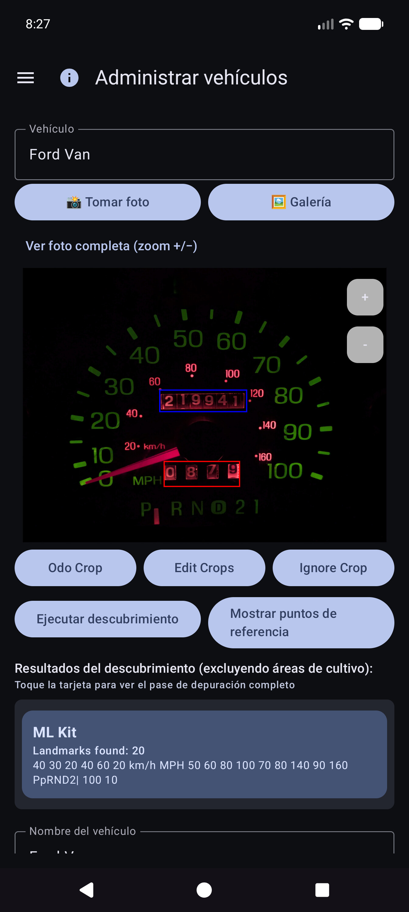

### Agregar o editar un vehículo

1. Abra el menú desplegable **Vehículo** → elija un vehículo o **Agregar vehículo nuevo**.
2. Capture o elija una **foto de tablero de referencia** clara (grupo de instrumentos completo, bien iluminado, teléfono aproximadamente en posición cuadrada). Utilice **Tomar foto** o **Galería**.
3. Dibujar cultivos:
   - **Odo Crop**: rectángulo ajustado alrededor de los dígitos del odómetro (el botón muestra **Done Odo** mientras ese modo está activo).
   - **Ignorar recorte**: región opcional para ignorar (reloj, radio, etc.).
   - **Editar cultivos**: ajusta los rectángulos existentes.
4. Toque **Ejecutar Discovery**: el OCR multimotor encuentra palabras clave fuera de los cultivos.
5. Revise con **Mostrar puntos de referencia**. Utilice **Editar OCR** ​​para corregir errores de lectura o **agregar** texto que se omitió.
6. Complete **Nombre del vehículo** (obligatorio), además de la marca/modelo/año/placa que desee.
7. Toque **Crear vehículo** o **Guardar cambios** (requiere nombre + foto de referencia para un vehículo nuevo).

### Puntos de referencia: solucione lo que Discovery pasó por alto

Después de **Mostrar puntos de referencia**, desplácese por la lista y corrija los valores. A los motores a veces les faltan dígitos pequeños (por ejemplo, un reloj **60** en la parte inferior derecha del grupo). Utilice **Editar OCR** ​​para agregarlos o corregirlos para que la identidad del vehículo siga siendo confiable.

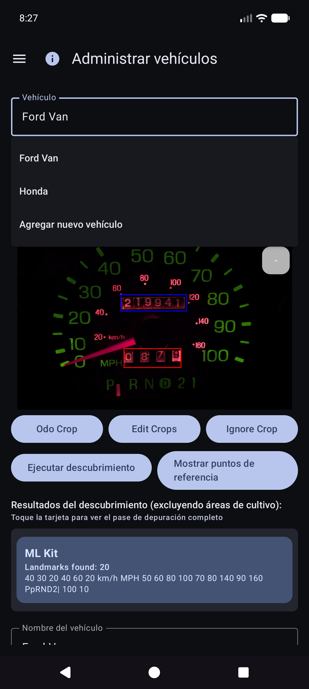

### Escribiendo sin una foto perfecta

Aún puede usar la aplicación seleccionando un vehículo y **escribiendo** el odómetro, el volumen y el costo en Quick Fill; el OCR es opcional para todos los campos. La importación de galería funciona para la foto del tablero de referencia cuando prefieres no tomar fotografías en la aplicación.

**Consejo:** Después de la sincronización de la hoja de cálculo, las definiciones de vehículos (cultivos, puntos de referencia) se encuentran en la base de datos local; no es necesario volver a abrir Administrar vehículos para Quick Fill para usarlas.

---

## Copias de seguridad y sincronización multidispositivo

La aplicación está diseñada para que **varios teléfonos o tabletas puedan compartir los mismos datos de la flota** y para que puedas guardar una **copia de tus datos y fotos fuera del dispositivo**. Esto se hace con los destinos que **usted** configura en **sus** cuentas o **sus** servidores autohospedados, no con una “nube de gastos de vehículos” administrada por la empresa que otras personas pueden ver.

### ¿Qué corre y dónde?

| Amable | Qué almacena | Uso típico |
|------|----------------|-------------|
| **Hoja de cálculo/sincronización tabular** | Vehículos, llenados de combustible, gastos (filas y pestañas) | Fusión de múltiples dispositivos + copia de seguridad estructurada |
| **Copia de seguridad de fotos** | Imágenes binarias (guión/bomba/recibo/fotos de referencia) | Copia de seguridad de fotos + restaurar archivos faltantes |

Puede configurar **múltiples destinos** de cada tipo (límite flexible por tipo). Los trabajadores manuales **Sincronizar ahora** y **en segundo plano** ejecutan los habilitados.

### Sin conexión primero

- **No se requiere red** para agregar un reabastecimiento, un gasto o un recibo. Todo se guarda **localmente primero**.
- Cuando la red está disponible, la sincronización y la copia de seguridad de las fotos se ejecutan como **tareas en segundo plano** (según un cronograma que usted establezca y cuando toque **Sincronizar ahora**). Los errores se muestran como texto rojo debajo de las filas de Configuración y un **!** en la barra de título de la aplicación.

### Solo tus cuentas

El inicio de sesión y los tokens permanecen en el dispositivo para los proveedores que elija (Google, Microsoft, claves S3, URL autohospedadas, etc.). Los destinos están bajo **control total del usuario**: su cuenta de Google, su OneDrive, su depósito MinIO, su host EtherCalc, etc. No se comparte nada con otros usuarios de Gastos de Vehículos a través de un backend compartido.

### Objetivos admitidos: datos (hoja de cálculo/tabular)

Configurado en **Menú → Sincronización → Sincronización de hoja de cálculo** (también accesible desde las filas de resumen de Configuración). Opciones de recogida de primera clase:

| Objetivo | Notas |
|--------|--------|
| **Hojas de cálculo de Google** | Incumplimiento común; pestañas de Vehículos, Gastos y combustible por vehículo |
| **Excelente** | Libro de trabajo de Microsoft mediante encuadernación estilo Graph/OneDrive |
| **EtherCalc** | Salas de hojas de cálculo colaborativas autohospedadas |
| **Otros →** backends implementados | **Baserow**, **NocoDB**, **Airtable**, **PocketBase**, **Supabase**, **Firebase**, **Zoho Sheet** |

Diferido/aún no sin cabeza (incluido en Otros pero no completamente implementado): OnlyOffice, Collabora. Consulte también [índice de autohospedaje](referencia/self-host/INDEX.md).

CSV **exportar/importar** (ZIP del mismo diseño de pestaña) está disponible en Configuración como una copia de seguridad portátil, independiente de la sincronización en vivo.

### Objetivos admitidos: fotos (copia de seguridad de imagen)

Configurado en **Menú → Sincronización → Copia de seguridad de fotos** (también desde las filas de resumen de Configuración):

| Objetivo | Notas |
|--------|--------|
| **GoogleDrive** | Carpeta que elijas (buscar o pegar URL) |
| **OneDrive** | Cuenta de Microsoft + prefijo de ruta |
| **T3** | AWS, Wasabi, Cloudflare R2, MinIO y otros puntos finales compatibles con S3 |
| **Otro** | almacenamiento respaldado por rclone (por ejemplo, WebDAV, SFTP y otros controles remotos seleccionados disponibles en el selector de la aplicación) |

Configure hojas de trucos para fotografías y objetivos tabulares autohospedados: [índice de autohospedaje] (referencia/self-host/INDEX.md).

### Comportamiento multidispositivo (breve)

- Las filas se fusionan por **ID de sincronización** con **ganancias de última escritura** en marcas de tiempo **actualizadas**.
- Las eliminaciones son suaves; una edición más reciente en otro dispositivo puede restaurar una fila.
- Al ingresar **el mismo relleno dos veces** en dos dispositivos se crean **dos filas**; elimine el exceso cuando lo note.
- Más detalles: [Notas de comportamiento de sincronización](#sync-behavior-notes) y [SYNC_BEHAVIOR.md](referencia/SYNC_BEHAVIOR.md).

### Ejemplo: agregar Google Sheets (datos)

1. **Menú → Sincronización → Sincronización de hojas de cálculo** (o Configuración → Sincronización de hojas de cálculo).

   

2. Toca **Agregar destino de hoja de cálculo**.

   

3. Elija **Hojas de cálculo de Google**.

   

4. **Inicie sesión con Google** → nombre para mostrar → **URL de la hoja** o **🔍** explorar/crear → opciones de programación → habilitar → guardar.
5. **Sincronice ahora** una vez para crear/actualizar pestañas: `Vehículos`, `Gastos`, `Combustible - {nombre del vehículo}`.

### Ejemplo: agregar Google Drive (fotos)

1. **Menú → Sincronización → Copia de seguridad de fotos** (o Configuración → Copia de seguridad de fotos).

   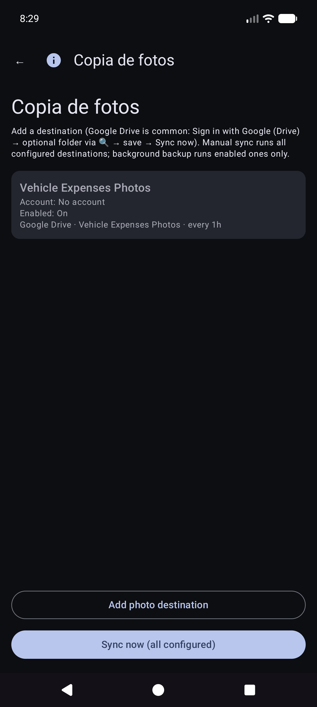

2. Toca **Agregar destino de la foto**.

   

3. Elija **Google Drive**.

   

4. **Inicie sesión con Google (Drive)** → URL de carpeta opcional/explorar → habilitar → guardar → **Sincronizar ahora**.

Manual **Sincronizar ahora** para fotos es un pase completo; La copia de seguridad en segundo plano normalmente procesa cargas **solo pendientes** según una programación.

### Notas de comportamiento de sincronización

- Después de la actualización de la aplicación, es posible que vea brevemente **“Actualizando la base de datos después de la actualización…”** (relleno de ID de sincronización local).
- Si se interrumpe una sincronización, la siguiente sincronización **exitosa** se vuelve a fusionar y repara las pestañas remotas.
- Fallos: resumen rojo en Sincronización de tarjetas + **!** en la barra de aplicaciones.

---

## Llenado rápido (combustible)

Esta es la **pantalla de inicio** cuando abres la aplicación.

### Selección de vehículo (normalmente automática)

**No** es necesario que elijas el vehículo primero. Cuando los vehículos tienen **puntos de referencia** configurados en Administrar vehículos, Quick Fill **detecta automáticamente qué vehículo** de la imagen del tablero después de capturar el odómetro. Aún puedes abrir el menú desplegable **Vehículo** para anularlo si es necesario.

### Apunta al odómetro

Permanezca en modo odómetro y encuadre el grupo. Instrucción: *Apunte al odómetro. Toque el obturador para capturar.*

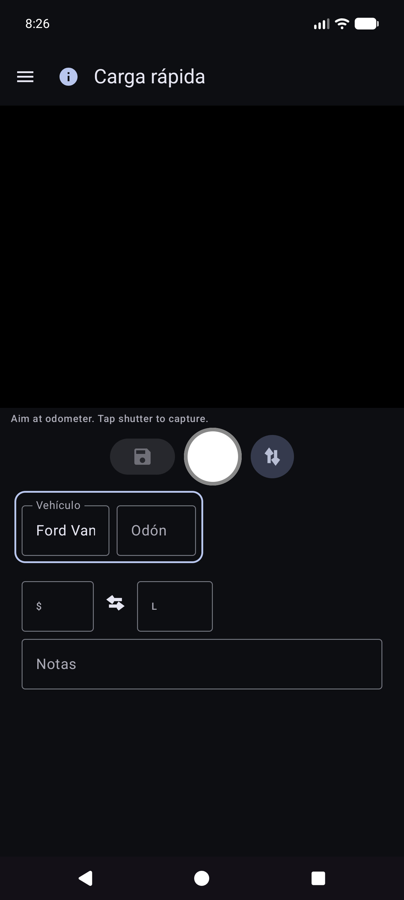

### Después de la persiana del odómetro

OCR llena **Odo** e intenta hacer coincidir el vehículo con los puntos de referencia (revise ambos si es necesario). El botón principal se convierte en **Reintentar** para volver a disparar. La instrucción resume la lectura.

### Modo de bomba (coste y volumen)

1. Toque **↕** para cambiar al modo de bomba: *Apunte a la pantalla de la bomba (costo/volumen). Toque el obturador.*
2. Capture los totales de la bomba. Se llenan los campos de costo y volumen; use **↔** si se intercambian.
3. Toque moneda o **L/M** si es necesario, luego **Guardar** (disco). Los campos vacíos generan un **relleno parcial** (aún se permite).

Permanece en Quick Fill para la siguiente parada (los campos se borran después de guardar). Trabaje completamente **sin conexión**; la sincronización se ejecuta más tarde en segundo plano cuando se configura.

### Entrada manual (sin cámara/OCR incorrecto)

1. Toque **Odo**, **costo** o **volumen** y escriba los valores (la vertical usa el teclado del sistema; la horizontal usa un teclado en pantalla).
2. Elija o confirme el **Vehículo** si no se ejecutó la detección automática.
3. Guarde como se indica arriba.

### Modos y fronteras

- **Borde verde** alrededor del vehículo+odo → captura/edición del odómetro.
- **Borde verde** alrededor de costo+volumen → modo de bomba.
- **Guardar** permanece deshabilitado hasta que se selecciona un vehículo y al menos uno de odo/costo/volumen tiene datos y el OCR aún no se está ejecutando.

Consejo en pantalla (debajo de la línea de instrucciones): *Obturador = capturar · Disco = guardar · ↕ = modo odo/bomba · ↔ = costo/volumen de intercambio.*

---

## Gastos

### Nuevo gasto

Menú → **Nuevo gasto**.

1. **Guardar** (disco), **obturador** (foto del recibo) o **galería** (seleccionar imagen).
2. Complete **Fecha**, **Vehículo**, **Proveedor**, **Descripción**, **Cantidad** (símbolo de moneda que se puede tocar), **Categoría**, **Odómetro** opcional.
3. Recibos de varias páginas: capture páginas adicionales si la interfaz de usuario ofrece paginación (la página 0 es el recibo principal).
4. **Guardar** en la tienda (primero local; la copia de seguridad de las fotos y la sincronización de la hoja de cálculo se realizan en segundo plano cuando se configuran).

### Lista de gastos

Menú → **Informes** → **Lista de gastos**: explore los gastos no relacionados con el combustible; abrir un elemento para editarlo.

### Editar gasto

Abra una fila de la lista. Proveedor, monto, categoría, vehículo y descripción correctos. Si el recibo solo está en la copia de seguridad de la foto (no hay un archivo local legible), use **Obtener imagen del archivo** cuando se muestre (funciona en destinos de fotos configurados).

---

## Iniciar viaje

Menú → **Iniciar viaje** (después de Quick Fill en el cajón). Capture o ingrese el odómetro, elija el tipo de viaje y guárdelo con el ícono **disco**. **Detener** es un atajo para Personal ahora en la ubicación GPS retenida. Utilice **ⓘ** para recordatorios de control.

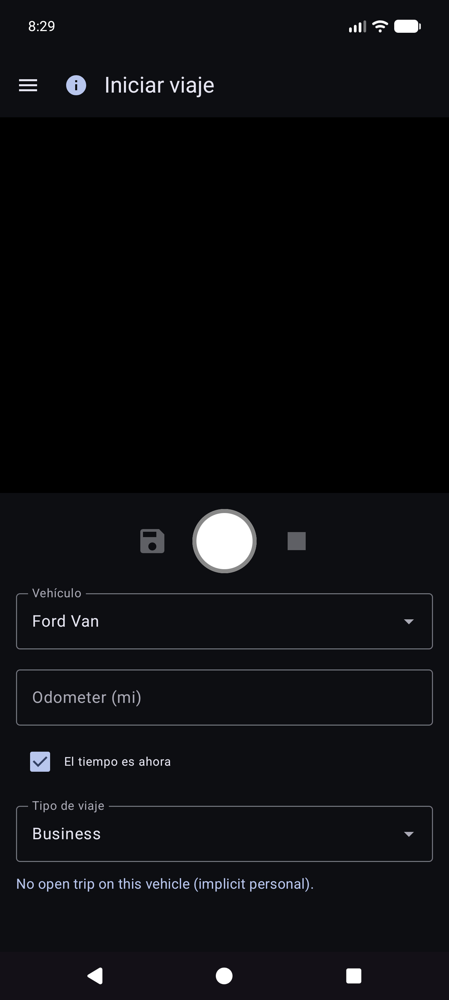

Los inicios de viaje se almacenan como filas de combustible con un **Tipo de viaje** (no llenados normales). Aparecen en **Informes → Millas de viaje**, no en Historial de combustible.

---

## Informes

Menú → **Informes** abre el centro de productos (resumen de todos los tiempos + tarjetas de catálogo). Esta es la única superficie de informes de productos: no hay un elemento separado en el cajón "Informes y gráficos".

Abra una tarjeta para el modo de vehículo (**Todos/Cada/Único**), filtros de período, gráficos y compartir (**TEXTO/CSV/PDF**). Barra superior en informes de niños: **☰ + ←** (y **ⓘ** cuando esté registrado).

### Informes basados en el tiempo

La tarjeta del gráfico principal. Métricas opcionales (mpg, volumen/distancia como G/mi, precio unitario como $/G, costo/distancia, $ mensuales, millas de viaje, % de viaje por tipo) con contenedores **Smooth** y **escalas Y independientes** (economía a la izquierda; dinero y familias de viajes a la derecha).

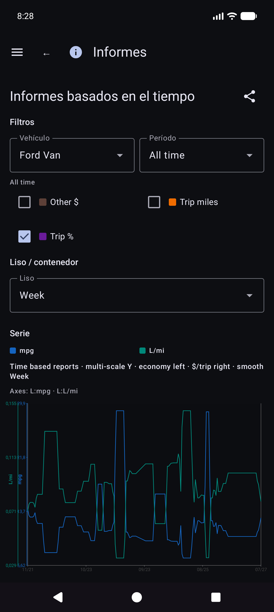

Detalles de matemáticas económicas: [REPORTS_METRICS.md](referencia/REPORTS_METRICS.md).

### Historial de llenado vs Historial de combustible

- **Reportes → Historial de llenado**: llenados cronológicos para los filtros de informes (**solo llenados**; no se inician viajes).

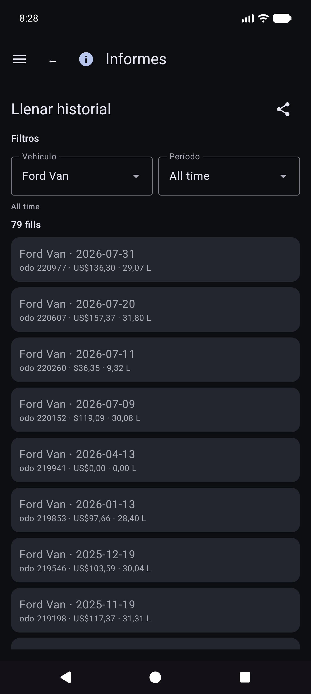

- **Historial de combustible** (si está presente en la navegación de tu versión): inventario de llenado por vehículo, también solo llenado; toque una fila para editarla.

### Millas de viaje

**Informes → Millas de viaje**: millas por tipo, gráficos y una **lista de inicio de viaje/segmento** cronológica. Toque un comienzo real para abrir **Editar relleno** para esa fila.

### Editar relleno

Desde Historial de repostaje, Historial de combustible o Millas de viaje, abra un repostaje. Diseño: vehículo y odómetro, **moneda antes de costo**, volumen, billetes. El tipo de viaje aparece solo cuando la fila es un inicio de viaje. La ubicación tiene un resumen más **Detalles de la ubicación**. Falta una foto local con identidad en la nube: **Obtener imagen del archivo**.

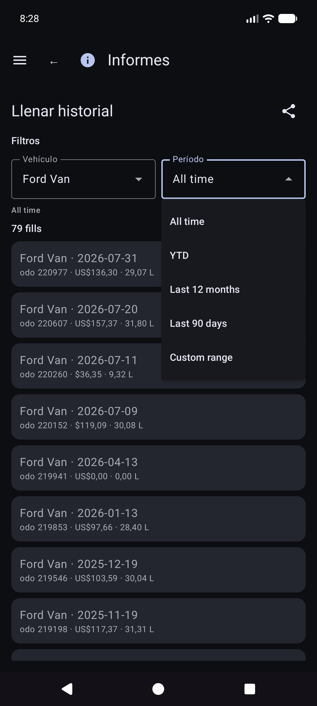

Otras tarjetas de catálogo incluyen gastos por categoría, resumen de vehículos y lista de gastos.

El dinero utiliza la moneda de cada fila cuando se establece. Los totales en monedas mixtas muestran **subtotales por moneda** (sin conversión de divisas silenciosa).

---

## Sincronización

Menú → **Sincronización** es el centro para destinos de hojas de cálculo y fotografías (no solo oculto en Configuración).

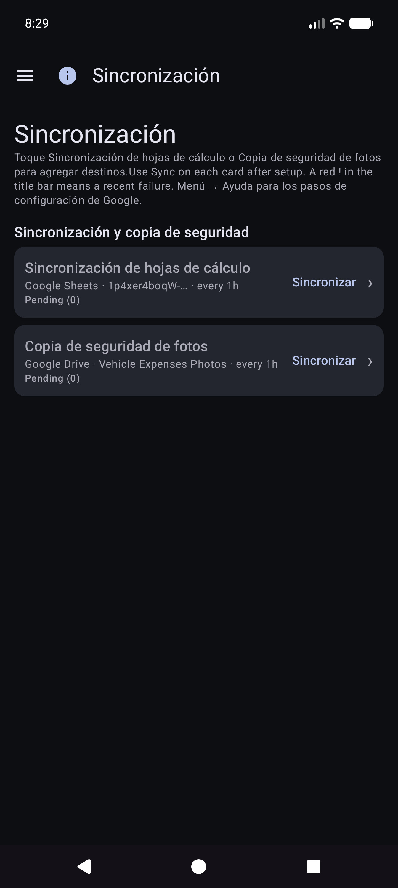

- Tarjetas para **Sincronización de hojas de cálculo** y **Copia de seguridad de fotos** con estado breve, **Sincronización** para ese tipo y **›** en la lista de destinos.
- Abra un destino para **Probar conexión** y **Sincronizar ahora (este destino)**/todo configurado.
- El error **Detalles** y el **!** rojo en la barra de título aterrizan aquí.
- Configuración paso a paso de Google Sheets y Drive: [Copias de seguridad y sincronización multidispositivo](#backups-and-multi-device-sync).

---

## Configuración (preferencias locales)

Menú → **Configuración**.

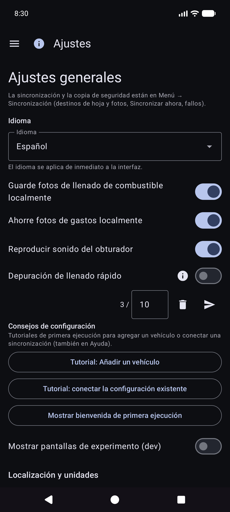

Para destinos, prefiera **Menú → Sincronización**. Es posible que la configuración aún muestre filas de resumen que abren las mismas listas.

### Preferencias locales (comunes)

- **Guardar fotos de recibos de combustible** / **Guardar fotos de gastos localmente**: mantenga las imágenes en el dispositivo (puede solicitar permiso para fotos).
- **Reproducir sonido del obturador**
- **Moneda** / **Unidad de volumen**: valores predeterminados de la aplicación (del sistema o explícitos). Cambiar la unidad de volumen con datos de combustible existentes puede ofrecer un cuadro de diálogo de conversión.
- **Modo oscuro**
- **Consejos de configuración**: vuelva a abrir los tutoriales de sincronización/vehículo de primera ejecución.
- **Depurar relleno rápido** / **Mostrar pantallas de experimento (dev)** — avanzado; déjelo para el uso diario. Las pantallas de experimentos no están documentadas aquí.

CSV **exportar/importar** (ZIP de pestañas de vehículos/gastos/combustible) está disponible en Configuración cuando lo ofrece la versión actual.

---

## Ayuda y acerca de

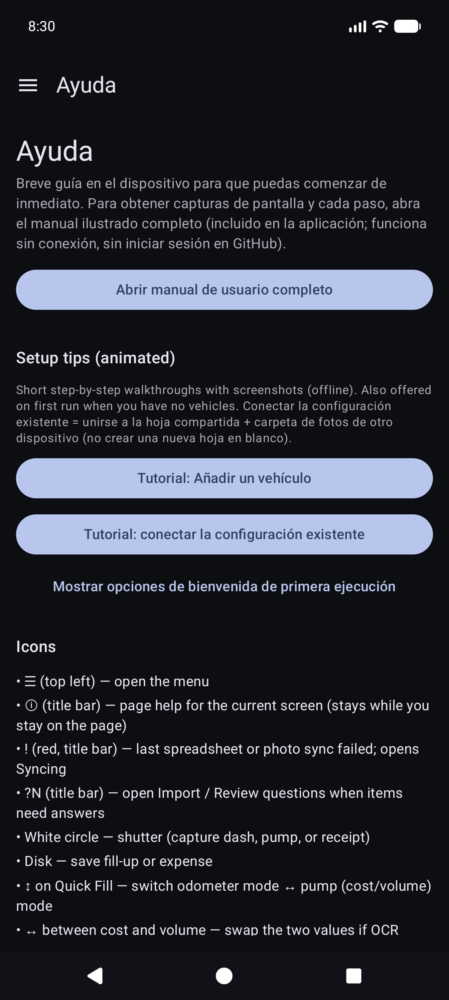

- **Ayuda**: inicio rápido en el dispositivo, tutoriales de configuración, enlace a este manual, índice de configuración de autohospedaje.
- **Acerca de**: versión, licencias, GitHub, este manual (incluido sin conexión + HTML en línea cuando se publique).

---

## Documentos relacionados

- [USER_GUIDE.md](referencia/USER_GUIDE.md) — referencia condensada
- [self-host/INDEX.md](reference/self-host/INDEX.md) — configuración tabular/de fotografía autohospedada
- [SYNC_BEHAVIOR.md](referencia/SYNC_BEHAVIOR.md) — fusión, recuperación, duplicados
- [REPORTS_METRICS.md](referencia/REPORTS_METRICS.md) — detalle de métricas económicas