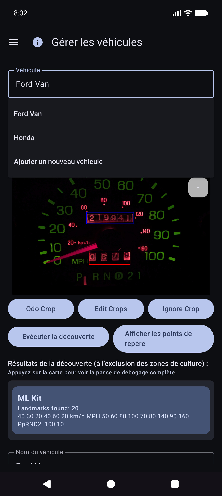
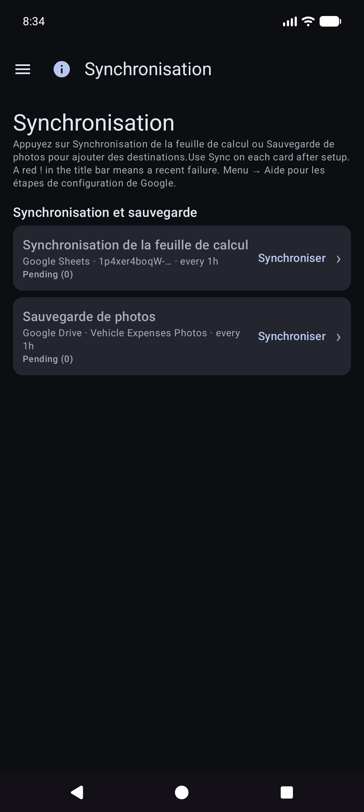
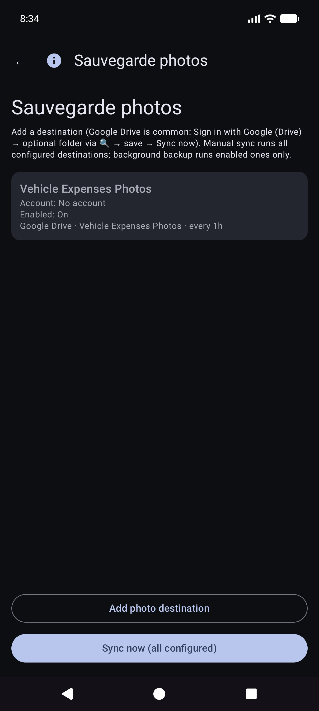
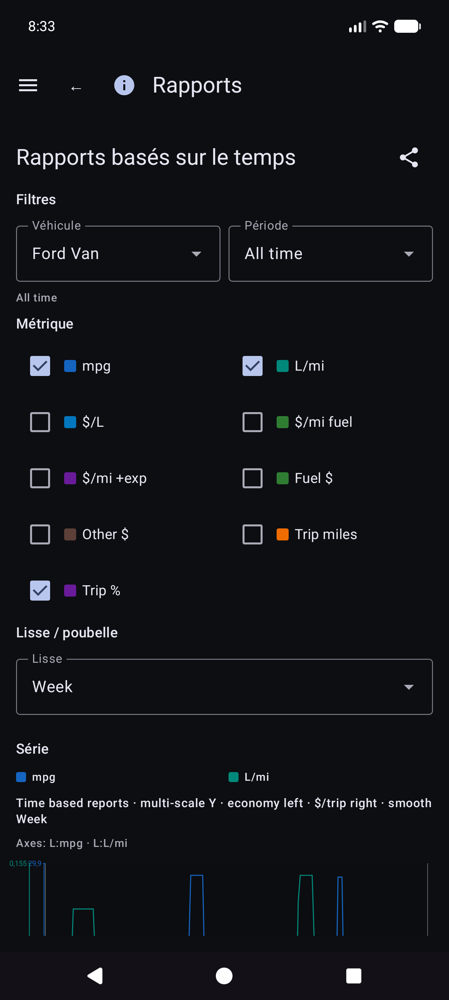
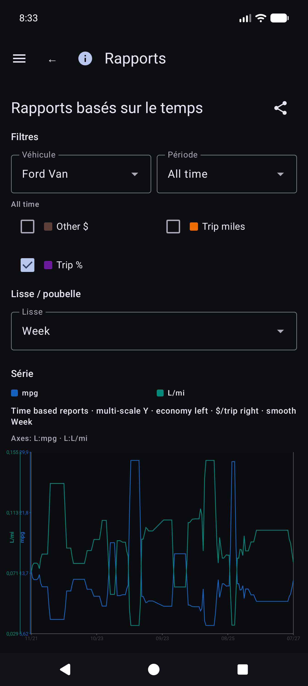
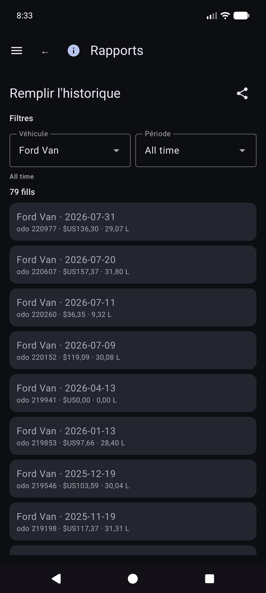
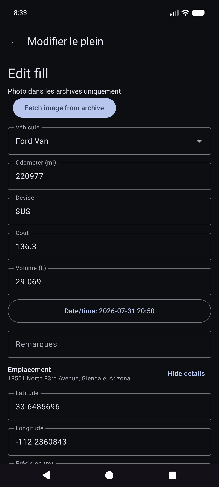
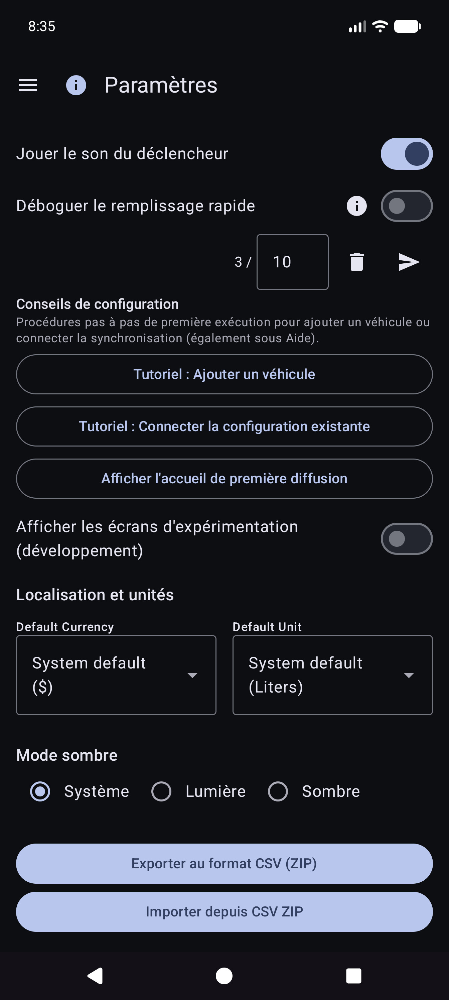
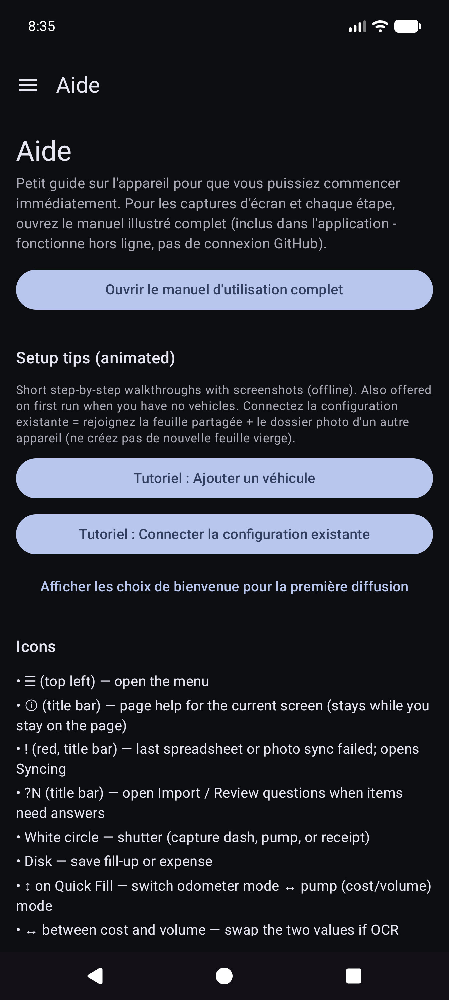

# Dépenses de véhicule automatisées — Manuel d'utilisation

> **Modifier la source (Markdown).** Les navigateurs et le lecteur intégré à l'application ouvrent le **HTML rendu** :
> - Web : [`docs/user-manual.html`](user-manual.html) (régénérer avec `./scripts/render-user-manual.sh`)
> - Application : Aide / À propos → manuel complet (HTML + captures d'écran fournies)
>
> Ne dirigez pas les utilisateurs finaux vers des URL brutes `.md` : les navigateurs affichent uniquement du texte brut.

Suivi par caméra des pleins de carburant et des dépenses liées aux véhicules, avec synchronisation et sauvegarde multi-appareils en option sous **vos** comptes cloud.

Ceci est le **manuel complet** (captures d'écran + chaque étape). Sur le téléphone, **Menu → Aide** est un guide de démarrage plus court.

**Non couvert ici :** Importez d'anciennes images, une expérience d'alignement et une expérience de pompe (développeur/outils avancés).

---

## Table des matières

1. [Ce dont vous avez besoin](#ce dont vous avez besoin)
2. [Icônes en un coup d'oeil](#icons-at-a-glance)
3. [Ouvrir le menu](#ouvrir-le-menu)
4. [Première configuration : Gérer les véhicules](#first-time-setup-manage-vehicles)
5. [Sauvegardes et synchronisation multi-appareils](#backups-and-multi-device-sync)
6. [Remplissage rapide (carburant)](#quick-fill-up-fuel)
7. [Démarrer le voyage](#start-trip)
8. [Dépenses](#dépenses)
9. [Rapports](#rapports)
10. [Paramètres (préférences locales)](#settings-local-preferences)
11. [Synchronisation](#syncing)
12. [Aide et à propos](#help--à propos)
13. [Documents associés](# Related-docs)

---

## Ce dont vous avez besoin

- Téléphone ou tablette Android.
- Pour un meilleur OCR : une vue claire de votre **compteur kilométrique du tableau de bord** et de vos **totaux de pompe** (ou saisissez les chiffres à la main).
- Facultatif : comptes **que vous contrôlez** pour les données de feuille de calcul et/ou la sauvegarde de photos (voir [Sauvegardes et synchronisation multi-appareils](#sauvegardes-et-synchronisation multi-appareils)).

---

## Icônes en un coup d'œil

Ceux-ci apparaissent sur les écrans principaux. Les connaître évite beaucoup de chasse.

| Où | Icône / contrôle | Ce qu'il fait |
|-------|----------------|--------------|
| Barre supérieure | **☰ Menu** (hamburger) | Ouvre le tiroir de navigation |
| Barre supérieure | **ⓘ** (page d'aide) | Aide courte pour la page **actuelle** (à côté du menu lorsqu'il est disponible) |
| Barre supérieure | **`?N`** (jaune) | Questions de révision d'importation en attente — ouvre la révision d'importation |
| Barre supérieure | **!** (rouge) | Une feuille de calcul ou une destination de photo a récemment échoué : ouvrez **Synchronisation** pour corriger |
| Barre supérieure | **☰ + ←** | Le rapport sur les enfants et la liste des dépenses affichent ** le menu et l'arrière ** ensemble ; Le hub de rapports est un menu uniquement |
| Paramètres / carburant modifier | **←** | Retour (la feuille de calcul des paramètres/les modifications des photos et du carburant restent centrées sur l'arrière) |
| Remplissage rapide | **Cercle blanc** (obturateur) | Capturer l'affichage du compteur kilométrique ou de la pompe pour OCR |
| Remplissage rapide | **Disque / Enregistrer** | Économisez le plein (nécessite un véhicule et au moins un parmi odo / volume / coût) |
| Remplissage rapide | **↕ flèches** (commutateur de mode) | Basculez le **mode compteur kilométrique** et le **mode pompe (coût/volume)**. La bordure verte met en évidence le groupe de champs actif |
| Remplissage rapide | **↔ flèches** (entre coût et volume) | Échangez le coût et le volume si l'OCR les place dans les mauvais champs |
| Remplissage rapide | **Zoom 1x / …** | Rapports de zoom de l'appareil photo lorsque l'objectif les prend en charge |
| Remplissage rapide (après capture) | **Actualiser** sur le bouton principal | Supprimer l'aperçu et revenir à la caméra en direct |
| Remplissage rapide (pendant le traitement) | **X** sur le bouton principal | Annuler la capture/OCR en cours |
| Dépense | **Enregistrer** | Économisez les dépenses |
| Dépense | **Cercle d'obturation** | Prendre une photo du reçu |
| Dépense | **Galerie** | Choisissez une image de reçu dans la bibliothèque |
| Dépense | **Reprendre** | Effacer la photo du reçu actuel et prendre à nouveau |
| Dépenses / Gérer les véhicules | **+ / −** FAB | Zoomer l'aperçu de la photo |
| Boîte de dialogue Points de repère | **Modifier l'OCR** ​​| Corriger ou ajouter un texte de repère que les moteurs ont manqué |
| Feuille de calcul / Formulaires photo | **🔍 Recherche** | Parcourez Google Drive pour une feuille ou un dossier (après la connexion) |

Les symboles monétaires sur les champs de coût et **G/L** sur les champs de volume sont accessibles : ouvrez un petit menu pour changer la devise ou les gallons par rapport aux litres pour cette entrée.

---

## Ouvrir le menu

1. Appuyez sur **☰** en haut à gauche.
2. Choisissez une page.

**Tiroir principal :** Remplissage rapide · Commencer le voyage · Gérer les véhicules · Nouvelles dépenses · **Rapports** · Paramètres · Synchronisation · Aide · À propos.

**Tiroir d'expériences** (Paramètres → Afficher les écrans d'expérience) : Expérience d'alignement · Expérience de pompe · **Importer d'anciennes images**.

**Via le hub Rapports (pas le tiroir principal) :** Liste des dépenses · Historique de remplissage.

---

## Première configuration : gérer les véhicules

L'OCR et la **correspondance automatique des véhicules** fonctionnent mieux après avoir enregistré chaque véhicule avec une **photo de référence du tableau de bord**, recadré le compteur kilométrique et exécuté **Découverte** afin que l'application stocke le texte de repère pour ce tableau de bord. (La manière dont les points de repère sont choisis et associés sera documentée plus en détail dans une mise à jour ultérieure.)

### Ouvrir Gérer les véhicules

Menu → **Gérer les véhicules**. Choisissez un véhicule (ou **Ajouter un nouveau véhicule**).

### Ajouter ou modifier un véhicule

1. Ouvrez le menu déroulant **Véhicule** → choisissez un véhicule ou **Ajouter un nouveau véhicule**.
2. Capturez ou choisissez une **photo de tableau de bord de référence** claire (groupe d'instruments complet, bien éclairé, téléphone à peu près carré). Utilisez **Prendre une photo** ou **Galerie**.
3. Dessinez des cultures :
   - **Odo Crop** — rectangle étroitement autour des chiffres du compteur kilométrique (le bouton affiche **Done Odo** lorsque ce mode est actif).
   - **Ignorer le recadrage** — région facultative à ignorer (horloge, radio, etc.).
   - **Modifier les cultures** : ajustez les rectangles existants.
4. Appuyez sur **Exécuter la découverte** : l'OCR multimoteur trouve les mots marquants en dehors des cultures.
5. Vérifiez avec **Afficher les points de repère**. Utilisez **Modifier OCR** ​​pour corriger les erreurs de lecture ou **ajouter** du texte manqué.
6. Remplissez **Nom du véhicule** (obligatoire), plus marque/modèle/année/plaque comme vous le souhaitez.
7. Appuyez sur **Créer un véhicule** ou **Enregistrer les modifications** (nécessite un nom + une photo de référence pour un nouveau véhicule).

### Monuments : corrigez ce que Discovery a manqué

Après **Afficher les points de repère**, faites défiler la liste et corrigez les valeurs. Les moteurs manquent parfois de petits chiffres (par exemple une horloge **60** en bas à droite du cluster). Utilisez **Modifier OCR** ​​pour les ajouter ou les corriger afin que l'identité du véhicule reste fiable.

### Taper sans une photo parfaite

Vous pouvez toujours utiliser l'application en sélectionnant un véhicule et en **saisissant** le compteur kilométrique, le volume et le coût sur Quick Fill - l'OCR est facultatif pour chaque champ. L'importation de galerie fonctionne pour la photo du tableau de bord de référence lorsque vous préférez ne pas prendre de photo dans l'application.

**Conseil :** Après la synchronisation de la feuille de calcul, les définitions de véhicules (cultures, points de repère) se trouvent dans la base de données locale. Vous n'avez pas besoin de rouvrir la gestion des véhicules pour le remplissage rapide pour les utiliser.

---

## Sauvegardes et synchronisation multi-appareils

L'application est conçue pour que **plusieurs téléphones ou tablettes puissent partager les mêmes données de flotte**, et ainsi vous pouvez conserver une **copie de vos données et photos hors de l'appareil**. Cela se fait avec les destinations que **vous** configurez sous **vos** comptes ou **vos** serveurs auto-hébergés – et non avec un « cloud de dépenses de véhicule » géré par l'entreprise que d'autres personnes peuvent voir.

### Qu'est-ce qui se passe où

| Genre | Ce qu'il stocke | Utilisation typique |
|------|------|-------------|
| **Feuille de calcul/synchronisation tabulaire** | Véhicules, pleins de carburant, dépenses (lignes et onglets) | Fusion multi-appareils + sauvegarde structurée |
| **Sauvegarde de photos** | Images binaires (tableau de bord/pompe/reçu/photos de référence) | Sauvegarde de photos + restauration des fichiers manquants |

Vous pouvez configurer **plusieurs destinations** de chaque type (limite souple par type). Les travailleurs manuels **Synchroniser maintenant** et **en arrière-plan** exécutent ceux activés.

### Hors ligne d'abord

- **Aucun réseau n'est requis** pour ajouter un remplissage, une dépense ou un reçu. Tout est enregistré **localement d'abord**.
- Lorsque le réseau est disponible, la synchronisation et la sauvegarde des photos s'exécutent en tant que **tâches en arrière-plan** (selon un calendrier que vous définissez et lorsque vous appuyez sur **Synchroniser maintenant**). Les échecs s'affichent sous forme de texte rouge sous les lignes Paramètres et d'un **!** dans la barre de titre de l'application.

### Vos comptes uniquement

La connexion et les jetons restent sur l'appareil pour les fournisseurs que vous choisissez (Google, Microsoft, clés S3, URL auto-hébergées, etc.). Les destinations sont sous **contrôle total de l'utilisateur** : votre compte Google, votre OneDrive, votre compartiment MinIO, votre hôte EtherCalc, etc. Rien n'est partagé avec d'autres utilisateurs de Vehicle Expenses via un backend partagé.

### Cibles prises en charge — données (feuille de calcul/tableau)

Configuré sous **Menu → Synchronisation → Synchronisation de la feuille de calcul** (également accessible à partir des lignes récapitulatives des paramètres). Options de sélection de première classe :

| Cible | Remarques |
|--------|--------|
| **Google Feuilles** | Valeur par défaut commune ; onglets pour les véhicules, les dépenses et le carburant par véhicule |
| **Excel** | Classeur Microsoft via reliure de style Graph/OneDrive |
| **ÉtherCalc** | Salles de calcul collaboratives auto-hébergées |
| **Autre →** backends implémentés | **Baserow**, **NocoDB**, **Airtable**, **PocketBase**, **Supabase**, **Firebase**, **Zoho Sheet** |

Différé / pas encore sans tête (répertorié sous Autre mais pas entièrement implémenté) : OnlyOffice, Collabora. Voir aussi [index auto-hôte](reference/self-host/INDEX.md).

CSV **export/import** (ZIP de la même disposition d'onglets) est disponible dans Paramètres en tant que sauvegarde portable, indépendante de la synchronisation en direct.

### Cibles prises en charge — photos (sauvegarde d'image)

Configuré sous **Menu → Synchronisation → Sauvegarde de photos** (également à partir des lignes récapitulatives des paramètres) :

| Cible | Remarques |
|--------|--------|
| **Google Drive** | Dossier que vous choisissez (parcourir ou coller l'URL) |
| **OneDrive** | Compte Microsoft + préfixe de chemin |
| **S3** | AWS, Wasabi, Cloudflare R2, MinIO et autres points de terminaison compatibles S3 |
| **Autre** | Stockage sauvegardé par rclone (par exemple WebDAV, SFTP et autres télécommandes organisées disponibles dans le sélecteur intégré à l'application) |

Configurez des aide-mémoire pour les cibles photo et tabulaires auto-hébergées : [index auto-hôte] (référence/auto-hôte/INDEX.md).

### Comportement multi-appareils (court)

- Les lignes sont fusionnées par **Sync ID** avec **last-write-wins** sur les horodatages **mis à jour**.
- Les suppressions sont douces ; une modification plus récente sur un autre appareil peut restaurer une ligne.
- Saisir le **même remplissage deux fois** sur deux appareils crée **deux lignes** — supprimez le surplus lorsque vous le remarquez.
- Plus de détails : [Sync behavior notes](#sync-behavior-notes) et [SYNC_BEHAVIOR.md](reference/SYNC_BEHAVIOR.md).

### Exemple : ajouter Google Sheets (données)

1. **Menu → Synchronisation → Synchronisation de la feuille de calcul** (ou Paramètres → Synchronisation de la feuille de calcul).

   

2. Appuyez sur **Ajouter une destination de feuille de calcul**.

   

3. Choisissez **Google Sheets**.

   

4. **Connectez-vous avec Google** → nom d'affichage → **URL de la feuille** ou **🔍** parcourir/créer → options de planification → activer → enregistrer.
5. **Synchronisez maintenant** une fois pour créer/mettre à jour les onglets : "Véhicules", "Dépenses", "Carburant - {nom du véhicule}".

### Exemple : ajouter Google Drive (photos)

1. **Menu → Synchronisation → Sauvegarde de photos** (ou Paramètres → Sauvegarde de photos).

   

2. Appuyez sur **Ajouter une destination photo**.

   

3. Choisissez **Google Drive**.

   

4. **Connectez-vous avec Google (Drive)** → URL/navigation du dossier facultatif → activer → enregistrer → **Synchroniser maintenant**.

La **Synchronisation manuelle maintenant** pour les photos est une réussite complète ; la sauvegarde en arrière-plan traite généralement les téléchargements **en attente uniquement** selon une planification.

### Notes sur le comportement de synchronisation

- Après la mise à niveau de l'application, vous pouvez voir brièvement ** « Mise à jour de la base de données après la mise à niveau… »** (remplissage de l'identifiant de synchronisation local).
- Si une synchronisation est interrompue, la prochaine synchronisation **réussie** refusionne et répare les onglets distants.
- Échecs : résumé rouge sur les cartes de synchronisation + **!** dans la barre d'application.

---

## Remplissage rapide (carburant)

Il s'agit de l'**écran d'accueil** lorsque vous ouvrez l'application.

### Sélection du véhicule (généralement automatique)

Vous n'avez **pas** besoin de choisir le véhicule en premier. Lorsque les véhicules ont des **repères** configurés dans Gérer les véhicules, Quick Fill **détecte automatiquement quel véhicule** à partir de l'image du tableau de bord après avoir capturé le compteur kilométrique. Vous pouvez toujours ouvrir la liste déroulante **Véhicule** pour remplacer si nécessaire.

### Visez le compteur kilométrique

Restez en mode compteur kilométrique et cadrez le cluster. Instruction : * Visez le compteur kilométrique. Appuyez sur l'obturateur pour capturer.*

### Après l'obturateur du compteur kilométrique

L'OCR remplit **Odo** et essaie de faire correspondre le véhicule à partir des points de repère (vérifiez les deux si nécessaire). Le bouton principal devient **Réessayer** pour reprendre la photo. Les instructions résument la lecture.

### Mode pompe (coût et volume)

1. Appuyez sur **↕** pour passer en mode pompe : *Visez l'affichage de la pompe (coût/volume). Appuyez sur le déclencheur.*
2. Capturez les totaux de la pompe. Les champs de coût et de volume sont remplis ; utilisez **↔** s'ils sont échangés.
3. Appuyez sur devise ou sur **G/L** si nécessaire, puis sur **Enregistrer** (disque). Les champs vides effectuent un **remplissage partiel** (toujours autorisé).

Vous restez sur Quick Fill pour le prochain arrêt (les champs s'effacent après la sauvegarde). Travaillez entièrement **hors ligne** ; la synchronisation s'exécute plus tard en arrière-plan une fois configurée.

### Saisie manuelle (pas de caméra / mauvais OCR)

1. Appuyez sur **Odo**, **coût** ou **volume** et saisissez les valeurs (le portrait utilise le clavier système ; le paysage utilise un clavier à l'écran).
2. Choisissez ou confirmez le **Véhicule** si la détection automatique ne s'est pas exécutée.
3. Enregistrez comme ci-dessus.

### Modes et bordures

- **Bordure verte** autour du véhicule+odo → capture/édition du compteur kilométrique.
- **Bordure verte** autour du coût+volume → mode pompe.
- ** Enregistrer ** reste désactivé jusqu'à ce qu'un véhicule soit sélectionné et qu'au moins un des éléments odo/coût/volume contienne des données et que l'OCR ne soit toujours pas en cours d'exécution.

Astuce à l'écran (sous la ligne d'instructions) : *Obturateur = capture · Disque = sauvegarde · ↕ = mode odo/pompe · ↔ = coût d'échange/volume.*

---

## Dépenses

### Nouvelle dépense

Menu → **Nouvelle dépense**.

1. **Enregistrer** (disque), **obturateur** (photo du reçu) ou **galerie** (sélectionner une image).
2. Remplissez **Date**, **Véhicule**, **Vendeur**, **Description**, **Montant** (symbole monétaire tappable), **Catégorie**, **Odomètre** en option.
3. Reçus multipages : capturez des pages supplémentaires si l'interface utilisateur propose la pagination (la page 0 est le reçu principal).
4. **Enregistrer** dans le magasin (local d'abord ; la sauvegarde des photos et la synchronisation des feuilles de calcul s'effectuent en arrière-plan une fois configurées).

### Liste des dépenses

Menu → **Rapports** → **Liste des dépenses** — parcourez les dépenses passées hors carburant ; ouvrez un élément à modifier.

### Modifier la dépense

Ouvrez une ligne de la liste. Corrigez le fournisseur, le montant, la catégorie, le véhicule et la description. Si le reçu est uniquement dans une sauvegarde de photos (pas de fichier local lisible), utilisez **Récupérer l'image des archives** lorsqu'il est affiché (fonctionne sur les destinations photo configurées).

---

## Commencer le voyage

Menu → **Démarrer le voyage** (après remplissage rapide dans le tiroir). Capturez ou saisissez le compteur kilométrique, choisissez le type de trajet, enregistrez avec l'icône **disque**. **Stop** est un raccourci pour Personnel désormais à l'emplacement GPS retenu. Utilisez **ⓘ** pour les rappels de contrôle.

Les départs de voyage sont stockés sous forme de lignes de carburant avec un **Type de voyage** (pas de remplissages normaux). Ils apparaissent sous **Rapports → Miles parcourus**, et non sous Historique de carburant.

---

## Rapports

Menu → **Rapports** ouvre le hub de produits (résumé de tous les temps + fiches de catalogue). Il s’agit de la seule surface de rapports sur les produits : il n’y a pas d’élément de tiroir « Rapports et graphiques » distincts.

Ouvrez une carte pour le mode véhicule (**Tous / Chaque / Unique**), les filtres de période, les graphiques et le partage (**TEXTE / CSV / PDF**). Barre supérieure sur les enfants signalés : **☰ + ←** (et **ⓘ** une fois inscrits).

### Rapports basés sur le temps

La carte graphique principale. Mesures facultatives (mpg, volume/distance tel que G/mi, prix unitaire tel que $/G, coût/distance, $ mensuel, miles parcourus, % de trajet par type) avec bacs **Smooth** et **échelles Y indépendantes** (économie à gauche ; argent et familles de voyages à droite).

Détails des mathématiques économiques : [REPORTS_METRICS.md](référence/REPORTS_METRICS.md).

### Historique de remplissage et historique de carburant

- **Rapports → Historique des remplissages** — remplissages chronologiques pour les filtres de rapport (**remplissages uniquement** ; aucun voyage ne démarre).

- **Historique du carburant** (si présent dans la navigation de votre build) — inventaire de remplissage par véhicule, remplissage également uniquement ; appuyez sur une ligne à modifier.

### Milles parcourus

**Rapports → Miles de voyage** — miles par type, graphiques et **liste chronologique de débuts de voyage/segments**. Appuyez sur un véritable début pour ouvrir **Modifier le remplissage** pour cette ligne.

### Modifier le remplissage

Dans Historique de remplissage, Historique de carburant ou Miles parcourus, ouvrez un remplissage. Mise en page : véhicule et compteur kilométrique, **devise avant coût**, volume, notes. Le type de voyage apparaît uniquement lorsque la ligne correspond à un début de voyage. L'emplacement comporte un résumé ainsi que des **Détails de l'emplacement**. Photo locale manquante avec identité cloud : **Récupérer l'image des archives**.

D'autres fiches de catalogue incluent les dépenses par catégorie, le résumé du véhicule et la liste des dépenses.

Money utilise la devise de chaque ligne lorsqu'elle est définie. Les totaux en devises mixtes affichent des **sous-totaux par devise** (pas de conversion FX silencieuse).

---

## Synchronisation

Menu → **Synchronisation** est la plaque tournante des feuilles de calcul et des destinations photo (pas seulement enfouies sous Paramètres).

- Cartes pour la **synchronisation de feuille de calcul** et la **sauvegarde de photos** avec un statut court, **Sync** pour ce type et **›** dans la liste de destinations.
- Ouvrez une destination pour **Test de connexion** et **Synchroniser maintenant (cette destination)** / tous configurés.
- L'échec **Détails** et le **!** rouge dans la barre de titre arrivent ici.
- Configuration étape par étape de Google Sheets et Drive : [Sauvegardes et synchronisation multi-appareils] (#sauvegardes-et-synchronisation multi-appareils).

---

## Paramètres (préférences locales)

Menu → **Paramètres**.

Pour les destinations, préférez **Menu → Synchronisation**. Les paramètres peuvent toujours afficher des lignes récapitulatives qui ouvrent les mêmes listes.

### Préférences locales (communes)

- **Enregistrer les photos des reçus de carburant** / **Enregistrer les photos des dépenses localement** — conservez les images sur l'appareil (peut demander l'autorisation des photos).
- **Jouer le son de l'obturateur**
- **Devise** / **Unité de volume** — valeurs par défaut de l'application (système ou explicite). La modification de l'unité de volume avec les données de carburant existantes peut offrir une boîte de dialogue de conversion.
- **Mode sombre**
- **Conseils de configuration** : rouvrez les didacticiels de première utilisation sur les véhicules/synchronisation.
- **Debug Quick Fill** / **Afficher les écrans d'expérimentation (dev)** — avancé ; laisser pour un usage quotidien. Les écrans d’expérimentation ne sont pas documentés ici.

CSV **export/import** (ZIP des onglets Véhicules / Dépenses / Carburant) est disponible depuis Paramètres lorsqu'il est proposé par la version actuelle.

---

## Aide et à propos

- **Aide** — démarrage rapide sur l'appareil, didacticiels de configuration, lien vers ce manuel, index de configuration auto-hébergé.
- **À propos** — version, licences, GitHub, ce manuel (regroupé hors ligne + HTML en ligne une fois publié).

---

## Documents associés

- [USER_GUIDE.md](reference/USER_GUIDE.md) — référence condensée
- [self-host/INDEX.md](reference/self-host/INDEX.md) — configuration photo/tabulaire auto-hébergée
- [SYNC_BEHAVIOR.md](référence/SYNC_BEHAVIOR.md) — fusion, récupération, doublons
- [REPORTS_METRICS.md](référence/REPORTS_METRICS.md) — détail des mesures économiques