# Pengeluaran Kendaraan Otomatis — Panduan Pengguna

> **Edit sumber (Penurunan harga).** Browser dan pembaca dalam aplikasi membuka **HTML yang dirender**:
> - Web: [`docs/user-manual.html`](user-manual.html) (dibuat ulang dengan `./scripts/render-user-manual.sh`)
> - Aplikasi: Bantuan / Tentang → manual lengkap (paket tangkapan layar HTML +)
>
> Jangan arahkan pengguna akhir ke URL `.md` mentah — browser hanya menampilkan teks biasa.

Pelacakan yang mengutamakan kamera untuk pengisian bahan bakar dan pengeluaran kendaraan, dengan sinkronisasi multi-perangkat opsional dan pencadangan di akun cloud **Anda**.

Ini adalah **panduan lengkap** (tangkapan layar + setiap langkah). Di telepon, **Menu → Bantuan** adalah panduan singkat untuk memulai.

**Tidak dibahas di sini:** Impor Gambar Lama, Eksperimen Penyelarasan, dan Eksperimen Pompa (pengembang/alat canggih).

---

## Daftar isi

1. [Apa yang kamu perlukan](#apa yang kamu perlukan)
2. [Sekilas ikon](#ikon-sekilas)
3. [Buka menu](#buka-menu)
4. [Penyiapan pertama kali: Kelola Kendaraan](#penyiapan-pertama-kelola-kendaraan)
5. [Pencadangan dan sinkronisasi multi-perangkat](#pencadangan-dan-sinkronisasi multi-perangkat)
6. [Pengisian Cepat (bahan bakar)](#pengisian bahan bakar cepat)
7. [Mulai perjalanan](#mulai perjalanan)
8. [Beban](#beban)
9. [Laporan](#laporan)
10. [Pengaturan (preferensi lokal)](#pengaturan-preferensi-lokal)
11. [Sinkronisasi](#sinkronisasi)
12. [Bantuan & Tentang](#bantuan--tentang)
13. [Dokumen terkait](#dokumen-terkait)

---

## Apa yang Anda butuhkan

- Ponsel atau tablet Android.
- Untuk OCR terbaik: tampilan jelas **odometer dasbor** dan **total pompa** Anda (atau ketik angkanya dengan tangan).
- Opsional: akun **yang Anda kendalikan** untuk data spreadsheet dan/atau pencadangan foto (lihat [Pencadangan dan sinkronisasi multi-perangkat](#pencadangan-dan-sinkronisasi multi-perangkat)).

---

## Sekilas ikon

Ini muncul di layar utama. Mengetahui mereka menghemat banyak perburuan.

| Dimana | Ikon / kontrol | Apa fungsinya |
|-------|----------------|--------------|
| Bilah atas | **☰ Menu** (hamburger) | Membuka panel samping navigasi |
| Bilah atas | **ⓘ** (bantuan halaman) | Bantuan singkat untuk halaman **saat ini** (di sebelah menu bila tersedia) |
| Bilah atas | **`?N`** (kuning) | Pertanyaan tinjauan impor yang tertunda — membuka Tinjauan impor |
| Bilah atas | **!** (merah) | Tujuan spreadsheet atau foto baru-baru ini gagal — buka **Sinkronisasi** untuk memperbaiki |
| Bilah atas | **☰ + ←** | Laporkan anak-anak dan daftar Pengeluaran menunjukkan **menu dan kembali** secara bersamaan; Hub laporan hanya ada di menu |
| Setting / edit bahan bakar | **←** | Kembali (pengaturan spreadsheet/foto dan edit bahan bakar tetap fokus ke belakang) |
| Isi Cepat | **Lingkaran putih** (rana) | Tangkap odometer atau tampilan pompa untuk OCR |
| Isi Cepat | **Disk / Simpan** | Hemat pengisian (membutuhkan kendaraan dan minimal satu odo/volume/biaya) |
| Isi Cepat | **↕ panah** (pengalih mode) | Alihkan **mode odometer** vs **mode pompa (biaya/volume)**. Batas hijau menyorot grup bidang aktif |
| Isi Cepat | **↔ panah** (antara biaya & volume) | Tukar biaya dan volume jika OCR memasukkannya ke kolom yang salah |
| Isi Cepat | **Perbesar 1x / …** | Rasio zoom kamera bila lensa mendukungnya |
| Isi Cepat (setelah pengambilan) | **Segarkan** pada tombol utama | Buang pratinjau dan kembali ke kamera langsung |
| Isi Cepat (saat memproses) | **X** pada tombol utama | Batalkan pengambilan yang sedang berlangsung/OCR |
| Biaya | **Simpan** | Hemat biaya |
| Biaya | **Lingkaran rana** | Ambil foto tanda terima |
| Biaya | **Galeri** | Pilih gambar tanda terima dari perpustakaan |
| Biaya | **Mengambil kembali** | Hapus foto tanda terima saat ini dan potret lagi |
| Pengeluaran / Kelola Kendaraan | **+ / −** FAB | Perbesar pratinjau foto |
| Dialog landmark | **Edit OCR** ​​| Perbaiki atau tambahkan teks landmark yang terlewatkan oleh mesin |
| Formulir Spreadsheet / Foto | **🔍 Telusuri** | Jelajahi Google Drive untuk mencari sheet atau folder (setelah masuk) |

Simbol mata uang pada kolom biaya dan **G/L** pada kolom volume dapat diketuk: buka menu kecil untuk mengubah mata uang atau galon vs liter untuk entri tersebut.

---

## Buka menunya

1. Ketuk **☰** di kiri atas.
2. Pilih halaman.

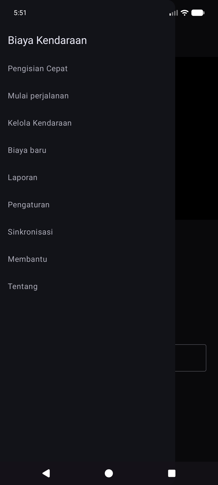

**Laci utama:** Pengisian Cepat · Mulai perjalanan · Kelola Kendaraan · Pengeluaran baru · **Laporan** · Pengaturan · Sinkronisasi · Bantuan · Tentang.

**Laci eksperimen** (Pengaturan → Tampilkan layar eksperimen): Eksperimen Penyelarasan · Eksperimen Pompa · **Impor Gambar Lama**.

**Melalui hub Laporan (bukan laci utama):** Daftar pengeluaran · Isi riwayat.

---

## Penyiapan pertama kali: Kelola Kendaraan

OCR dan **pencocokan kendaraan otomatis** berfungsi paling baik setelah Anda mendaftarkan setiap kendaraan dengan **foto dasbor referensi**, memotong odometer, dan menjalankan **Discovery** sehingga aplikasi menyimpan teks penting untuk dasbor tersebut. (Bagaimana landmark dipilih dan dicocokkan akan didokumentasikan secara lebih rinci dalam pembaruan selanjutnya.)

### Buka Kelola Kendaraan

Menu → **Kelola Kendaraan**. Pilih kendaraan (atau **Tambahkan Kendaraan Baru**).

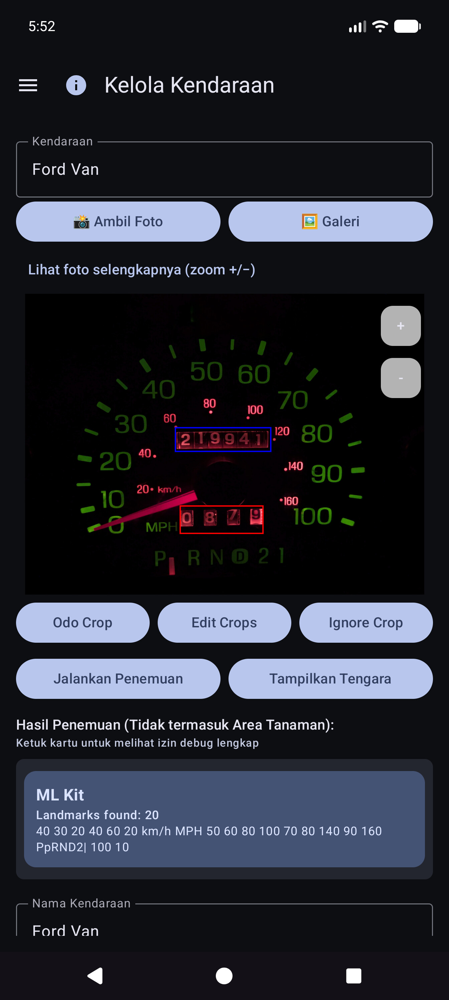

### Menambah atau mengedit kendaraan

1. Buka dropdown **Kendaraan** → pilih kendaraan atau **Tambahkan Kendaraan Baru**.
2. Ambil atau pilih **foto dasbor referensi** yang jelas (kluster instrumen lengkap, penerangan cukup, ponsel dalam posisi persegi). Gunakan **Ambil Foto** atau **Galeri**.
3. Menggambar tanaman:
   - **Odo Crop** — persegi panjang yang mengelilingi angka odometer (tombol menunjukkan **Done Odo** saat mode tersebut aktif).
   - **Abaikan Pangkas** — wilayah opsional untuk diabaikan (jam, radio, dll.).
   - **Edit Pangkas** — menyesuaikan persegi panjang yang ada.
4. Ketuk **Jalankan Penemuan** — OCR multi-mesin menemukan kata-kata penting di luar hasil panen.
5. Tinjau dengan **Tampilkan Tengara**. Gunakan **Edit OCR** ​​untuk memperbaiki kesalahan membaca atau **menambahkan** teks yang terlewat.
6. Isi **Nama Kendaraan** (wajib diisi), ditambah merek/model/tahun/plat sesuai keinginan.
7. Ketuk **Buat Kendaraan** atau **Simpan Perubahan** (membutuhkan nama + foto referensi untuk kendaraan baru).

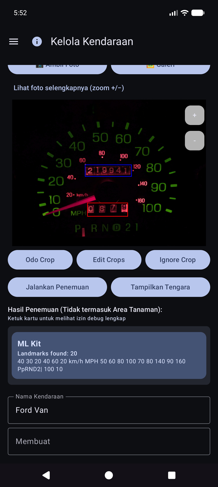

### Tengara: perbaiki hal yang terlewatkan oleh Discovery

Setelah **Tampilkan Tengara**, gulir daftar dan perbaiki nilainya. Mesin terkadang melewatkan angka kecil (misalnya jam **60** di kanan bawah cluster). Gunakan **Edit OCR** ​​untuk menambah atau memperbaikinya sehingga identitas kendaraan tetap dapat diandalkan.

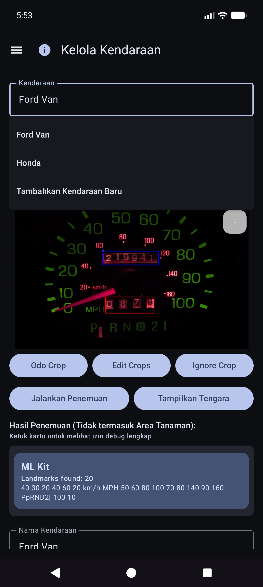

### Mengetik tanpa foto yang sempurna

Anda masih dapat menggunakan aplikasi dengan memilih kendaraan dan **mengetik** odometer, volume, dan biaya pada Isi Cepat — OCR bersifat opsional untuk setiap bidang. Impor galeri berfungsi untuk foto dasbor referensi saat Anda memilih untuk tidak memotret dalam aplikasi.

**Tips:** Setelah sinkronisasi spreadsheet, definisi kendaraan (potongan, landmark) ada di database lokal — Anda tidak perlu membuka kembali Kelola Kendaraan untuk Isi Cepat untuk menggunakannya.

---

## Pencadangan dan sinkronisasi multi-perangkat

Aplikasi ini dibuat agar **beberapa ponsel atau tablet dapat berbagi data armada yang sama**, sehingga Anda dapat menyimpan **salinan data dan foto Anda di luar perangkat**. Hal ini dilakukan dengan tujuan yang **Anda** konfigurasikan di bawah akun **Anda** atau server **Anda** yang dihosting sendiri — bukan “cloud Pengeluaran Kendaraan” milik perusahaan yang dapat dilihat orang lain.

### Apa yang berjalan di mana

| Jenis | Apa yang disimpannya | Penggunaan khas |
|------|----------------|-------------|
| **Sinkronisasi spreadsheet/tabel** | Kendaraan, pengisian bahan bakar, pengeluaran (baris dan tab) | Penggabungan multi-perangkat + pencadangan terstruktur |
| **Cadangan foto** | Gambar biner (dasbor/pompa/kwitansi/foto referensi) | Cadangan foto + pulihkan file yang hilang |

Anda dapat mengonfigurasi **beberapa tujuan** dari setiap jenis (soft cap per jenis). Pekerja manual **Sinkronkan sekarang** dan **latar belakang** menjalankan pekerja yang diaktifkan.

### Offline dulu

- **Tidak diperlukan jaringan** untuk menambahkan pengisian, pengeluaran, atau tanda terima. Semuanya disimpan **secara lokal terlebih dahulu**.
- Saat jaringan tersedia, sinkronisasi dan pencadangan foto dijalankan sebagai **tugas latar belakang** (sesuai jadwal yang Anda atur, dan saat Anda mengetuk **Sinkronkan sekarang**). Kegagalan ditampilkan sebagai teks merah di bawah baris Pengaturan dan **!** di bilah judul aplikasi.

### Hanya akun Anda

Proses masuk dan token tetap ada di perangkat untuk penyedia yang Anda pilih (Google, Microsoft, kunci S3, URL yang dihosting sendiri, dan sebagainya). Tujuan berada di bawah **kontrol penuh pengguna** — akun Google Anda, OneDrive Anda, bucket MinIO Anda, host EtherCalc Anda, dll. Tidak ada yang dibagikan dengan pengguna Pengeluaran Kendaraan lainnya melalui backend bersama.

### Target yang didukung — data (spreadsheet / tabel)

Dikonfigurasi dalam **Menu → Sinkronisasi → Sinkronisasi spreadsheet** (juga dapat dijangkau dari baris ringkasan Pengaturan). Opsi pemilih kelas satu:

| Sasaran | Catatan |
|--------|--------|
| **Google Spreadsheet** | Standar umum; tab untuk Kendaraan, Pengeluaran, dan bahan bakar per kendaraan |
| **Unggul** | Buku kerja Microsoft melalui pengikatan gaya Grafik / OneDrive |
| **EtherCalc** | Ruang spreadsheet kolaboratif yang dihosting sendiri |
| **Lainnya →** mengimplementasikan backend | **Baserow**, **NocoDB**, **Airtable**, **PocketBase**, **Supabase**, **Firebase**, **Zoho Sheet** |

Ditangguhkan/belum tanpa kepala (tercantum di bawah Lainnya tetapi belum diterapkan sepenuhnya): OnlyOffice, Collabora. Lihat juga [indeks self-host](reference/self-host/INDEX.md).

CSV **ekspor/impor** (ZIP dengan tata letak tab yang sama) tersedia dari Pengaturan sebagai cadangan portabel, terlepas dari sinkronisasi langsung.

### Target yang didukung — foto (cadangan gambar)

Dikonfigurasi pada **Menu → Sinkronisasi → Pencadangan foto** (juga dari baris ringkasan Pengaturan):

| Sasaran | Catatan |
|--------|--------|
| **Google Drive** | Folder yang Anda pilih (jelajahi atau tempel URL) |
| **OneDrive** | Akun Microsoft + awalan jalur |
| **S3** | AWS, Wasabi, Cloudflare R2, MinIO, dan titik akhir lain yang kompatibel dengan S3 |
| **Lainnya** | penyimpanan yang didukung rclone (misalnya WebDAV, SFTP, dan remote pilihan lainnya yang tersedia di pemilih dalam aplikasi) |

Siapkan lembar contekan untuk foto yang dihosting sendiri dan target tabel: [indeks host mandiri](reference/self-host/INDEX.md).

### Perilaku multi-perangkat (pendek)

- Baris digabungkan berdasarkan **Sync ID** dengan **last-write-wins** pada stempel waktu **Diperbarui**.
- Penghapusannya lembut; pengeditan yang lebih baru di perangkat lain dapat memulihkan baris.
- Memasukkan **isian yang sama dua kali** pada dua perangkat akan menghasilkan **dua baris** — hapus baris tambahan saat Anda menyadarinya.
- Lebih detail: [Sinkronkan catatan perilaku](#sync-behavior-notes) dan [SYNC_BEHAVIOR.md](reference/SYNC_BEHAVIOR.md).

### Contoh: menambahkan Google Spreadsheet (data)

1. **Menu → Sinkronisasi → Sinkronisasi spreadsheet** (atau Pengaturan → Sinkronisasi spreadsheet).

   

2. Ketuk **Tambahkan tujuan spreadsheet**.

   

3. Pilih **Google Spreadsheet**.

   

4. **Masuk dengan Google** → nama tampilan → **URL Lembar** atau **🔍** jelajahi/buat → opsi jadwal → aktifkan → simpan.
5. **Sinkronkan sekarang** sekali untuk membuat/memperbarui tab: `Kendaraan`, `Beban`, `Bahan Bakar - {nama kendaraan}`.

### Contoh: menambahkan Google Drive (foto)

1. **Menu → Sinkronisasi → Pencadangan foto** (atau Pengaturan → Pencadangan foto).

   

2. Ketuk **Tambahkan tujuan foto**.

   

3. Pilih **Google Drive**.

   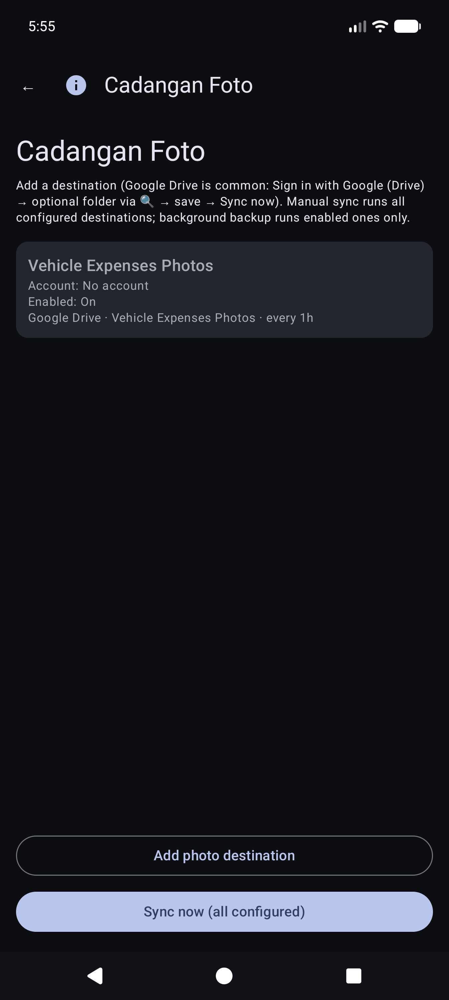

4. **Masuk dengan Google (Drive)** → URL/jelajah folder opsional → aktifkan → simpan → **Sinkronkan sekarang**.

Manual **Sinkronisasi sekarang** untuk foto sudah bisa dilakukan; pencadangan latar belakang biasanya memproses unggahan **hanya tertunda** sesuai jadwal.

### Menyinkronkan catatan perilaku

- Setelah pemutakhiran aplikasi, Anda mungkin melihat sekilas **"Memperbarui basis data setelah pemutakhiran..."** (pengisian ulang id sinkronisasi lokal).
- Jika sinkronisasi terganggu, sinkronisasi berikutnya yang **berhasil** akan digabungkan kembali dan memperbaiki tab yang jauh.
- Kegagalan: ringkasan merah pada kartu Sinkronisasi + **!** di bilah aplikasi.

---

## Pengisian Cepat (bahan bakar)

Ini adalah **layar utama** saat Anda membuka aplikasi.

### Pemilihan kendaraan (biasanya otomatis)

Anda **tidak** perlu memilih kendaraan terlebih dahulu. Saat kendaraan telah menyiapkan **tengara** di Kelola Kendaraan, Isi Cepat **secara otomatis mendeteksi kendaraan mana** dari gambar dasbor setelah Anda mengambil odometer. Anda masih dapat membuka dropdown **Kendaraan** untuk menggantinya jika diperlukan.

### Arahkan ke odometer

Tetap dalam mode odometer dan bingkai cluster. Petunjuk: *Arahkan ke odometer. Ketuk rana untuk mengambil gambar.*

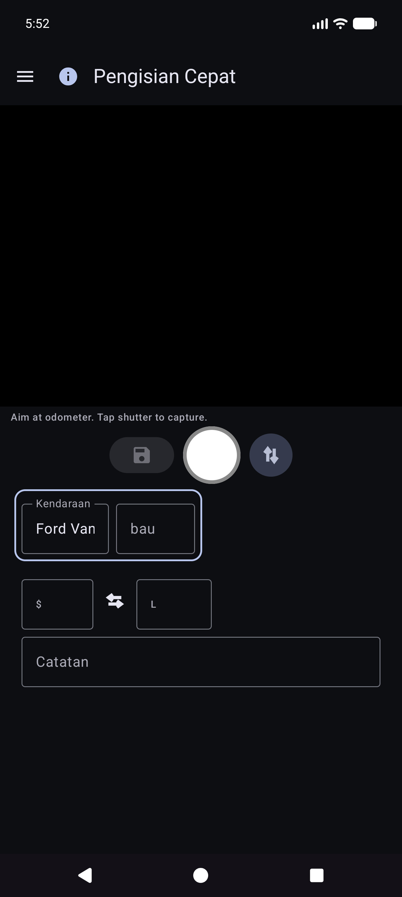

### Setelah penutup odometer

OCR mengisi **Odo** dan mencoba mencocokkan kendaraan dari landmark (tinjau keduanya jika diperlukan). Tombol utama menjadi **Coba lagi** untuk memotret ulang. Instruksi merangkum bacaan.

### Mode pompa (biaya dan volume)

1. Ketuk **↕** untuk beralih ke mode pompa: *Arahkan ke tampilan pompa (biaya/volume). Ketuk rana.*
2. Tangkap total pompa. Isi kolom biaya dan volume; gunakan **↔** jika ditukar.
3. Ketuk mata uang atau **G/L** jika diperlukan, lalu **Simpan** (disk). Bidang yang kosong akan diisi **sebagian** (masih diperbolehkan).

Anda tetap berada di Isi Cepat untuk perhentian berikutnya (kolom kosong setelah disimpan). Bekerja sepenuhnya **offline**; sinkronisasi berjalan nanti di latar belakang saat dikonfigurasi.

### Entri manual (tidak ada kamera / OCR buruk)

1. Ketuk **Odo**, **cost**, atau **volume** dan ketik nilai (potret menggunakan keyboard sistem; lanskap menggunakan keypad di layar).
2. Pilih atau konfirmasi **Kendaraan** jika deteksi otomatis tidak berjalan.
3. Simpan seperti diatas.

### Mode dan batas

- **Perbatasan hijau** di sekitar kendaraan+odo → menangkap/mengedit odometer.
- **Batas hijau** di sekitar biaya+volume → mode pompa.
- **Simpan** tetap dinonaktifkan hingga kendaraan dipilih dan setidaknya salah satu odo/biaya/volume memiliki data, dan OCR tidak lagi berjalan.

Tip di layar (di bawah baris instruksi): *Bidik = ambil · Disk = simpan · ↕ = mode odo/pompa · ↔ = biaya/volume swap.*

---

## Biaya

### Pengeluaran baru

Menu → **Pengeluaran baru**.

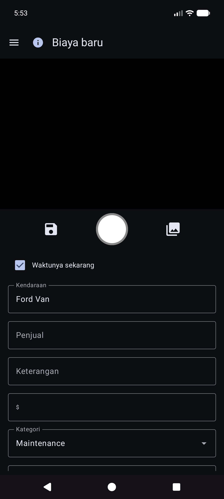

1. **Simpan** (disk), **rana** (foto resi), atau **galeri** (pilih gambar).
2. Isi **Tanggal**, **Kendaraan**, **Vendor**, **Deskripsi**, **Jumlah** (simbol mata uang dapat disadap), **Kategori**, opsional **Odometer**.
3. Tanda terima multi-halaman: ambil halaman tambahan jika UI menawarkan paging (halaman 0 adalah tanda terima utama).
4. **Simpan** untuk disimpan (lokal terlebih dahulu; pencadangan foto dan sinkronisasi spreadsheet terjadi di latar belakang saat dikonfigurasi).

### Daftar pengeluaran

Menu → **Laporan** → **Daftar pengeluaran** — menelusuri pengeluaran non-bahan bakar sebelumnya; membuka item untuk diedit.

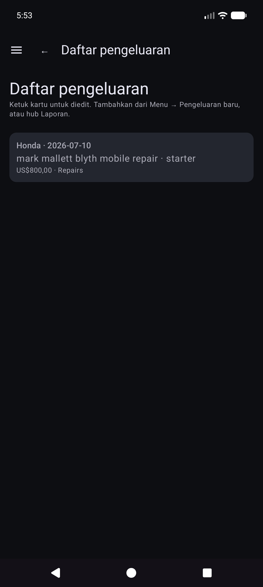

### Edit pengeluaran

Buka satu baris dari daftar. Vendor, jumlah, kategori, kendaraan, dan deskripsi yang benar. Jika tanda terima hanya ada dalam cadangan foto (tidak ada file lokal yang dapat dibaca), gunakan **Ambil gambar dari arsip** saat ditampilkan (berfungsi di seluruh tujuan foto yang dikonfigurasi).

---

## Mulai perjalanan

Menu → **Mulai perjalanan** (setelah Isi Cepat di laci). Ambil atau masukkan odometer, pilih jenis perjalanan, simpan dengan ikon **disk**. **Berhenti** adalah pintasan untuk Pribadi yang sekarang berada di lokasi GPS yang disimpan. Gunakan **ⓘ** untuk pengingat kontrol.

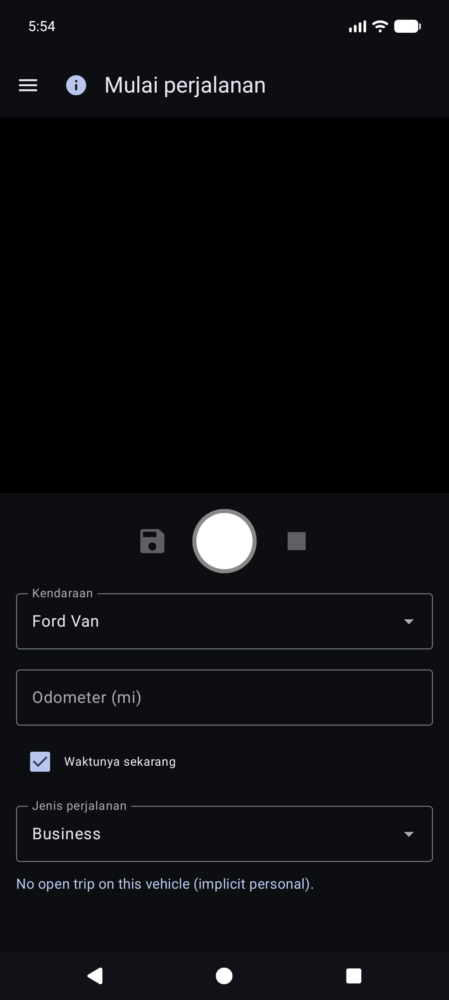

Awal perjalanan disimpan sebagai baris bahan bakar dengan **Jenis Perjalanan** (bukan pengisian normal). Mereka muncul di **Laporan → Jarak perjalanan**, bukan di Riwayat Bahan Bakar.

---

## Laporan

Menu → **Laporan** membuka hub produk (ringkasan sepanjang masa + kartu katalog). Ini adalah satu-satunya laporan produk yang muncul — tidak ada item laci “Laporan & Bagan” yang terpisah.

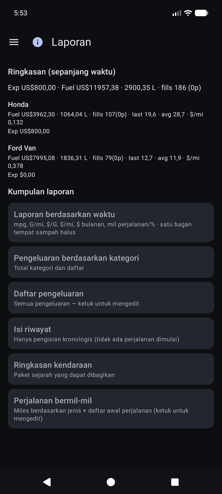

Buka kartu untuk mode kendaraan (**Semua / Masing-masing / Tunggal**), filter periode, bagan, dan bagikan (**TEKS / CSV / PDF**). Bilah atas pada anak laporan: **☰ + ←** (dan **ⓘ** saat terdaftar).

### Laporan berbasis waktu

Kartu grafik utama. Metrik opsional (mpg, volume/jarak seperti G/mi, harga satuan seperti $/G, biaya/jarak, $ bulanan, mil perjalanan, % perjalanan menurut jenis) dengan wadah **Halus** dan **skala Y independen** (sisi kiri ekonomi; uang dan keluarga perjalanan di sebelah kanan).

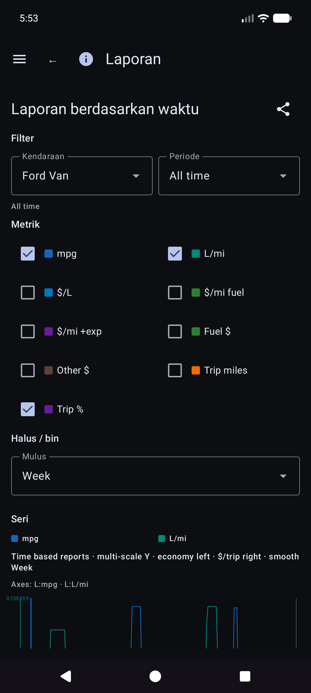

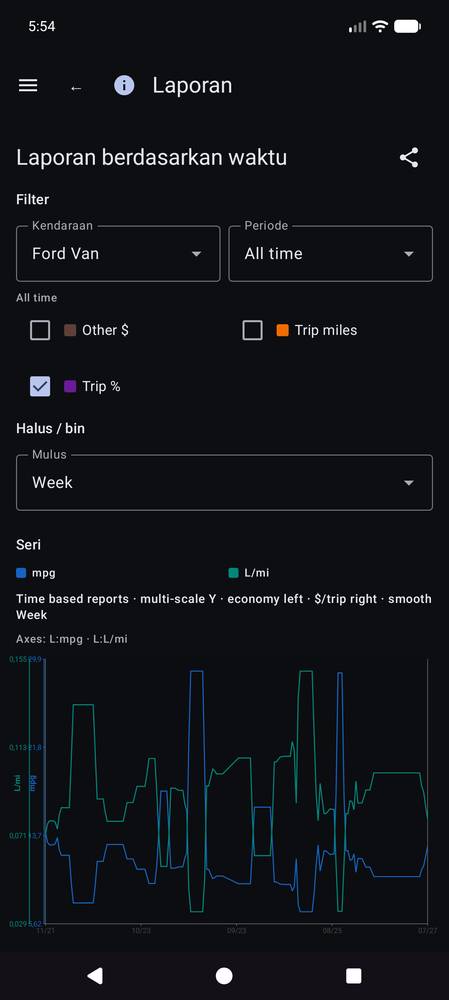

Detail matematika ekonomi: [REPORTS_METRICS.md](reference/REPORTS_METRICS.md).

### Riwayat pengisian vs Riwayat Bahan Bakar

- **Laporan → Isi riwayat** — pengisian kronologis untuk filter laporan (**hanya diisi**; tidak ada perjalanan dimulai).

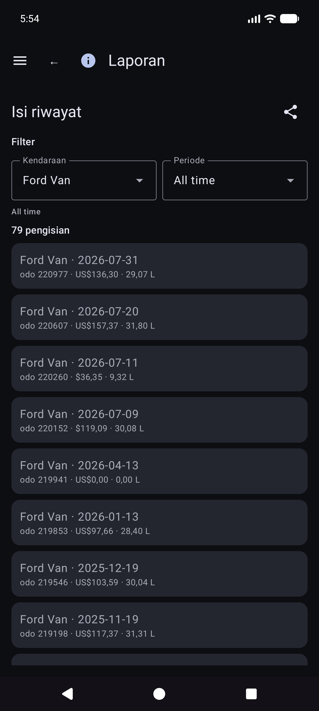

- **Riwayat Bahan Bakar** (jika ada di navigasi bangunan Anda) — inventaris pengisian per kendaraan, juga hanya diisi; ketuk satu baris untuk mengedit.

### Perjalanan mil

**Laporan → Jarak tempuh perjalanan** — jarak tempuh berdasarkan jenis, bagan, dan kronologis **daftar awal perjalanan / segmen**. Ketuk awal yang sebenarnya untuk membuka **Edit isi** untuk baris tersebut.

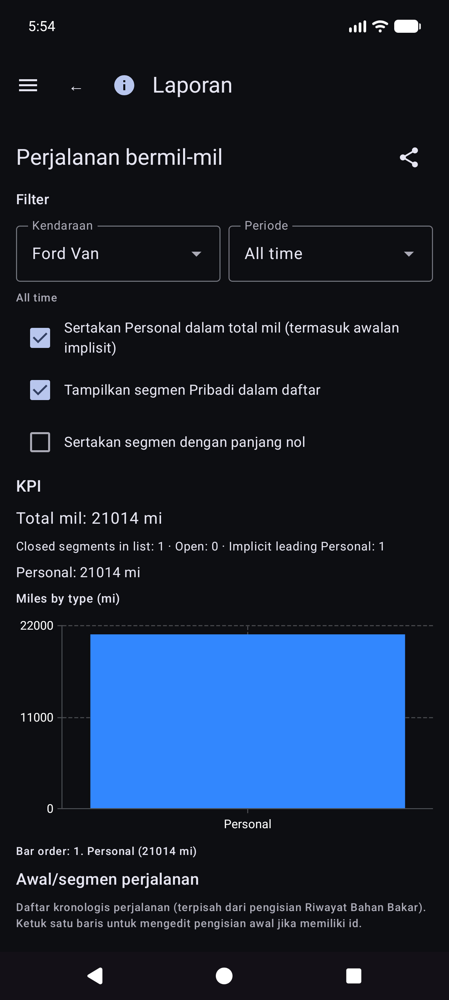

### Edit isi

Dari Riwayat pengisian, Riwayat Bahan Bakar, atau Jarak perjalanan, buka pengisian. Tata letak: kendaraan dan odometer, **mata uang sebelum biaya**, volume, catatan. Jenis perjalanan hanya muncul bila baris tersebut merupakan awal perjalanan. Lokasi memiliki ringkasan ditambah **Detail lokasi**. Foto lokal dengan identitas cloud tidak ada: **Ambil gambar dari arsip**.

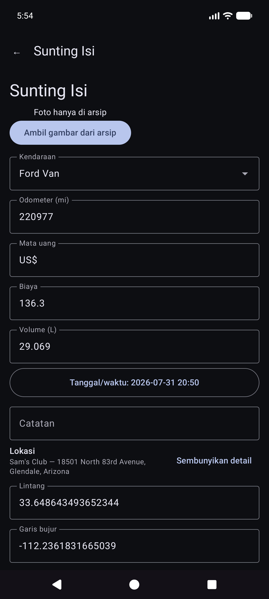

Kartu katalog lainnya mencakup pengeluaran berdasarkan kategori, ringkasan kendaraan, dan daftar pengeluaran.

Uang menggunakan mata uang setiap baris saat disetel. Total mata uang campuran menunjukkan **subtotal per mata uang** (tidak ada konversi FX senyap).

---

## Sinkronisasi

Menu → **Sinkronisasi** adalah hub untuk tujuan spreadsheet dan foto (tidak hanya terkubur di bawah Pengaturan).

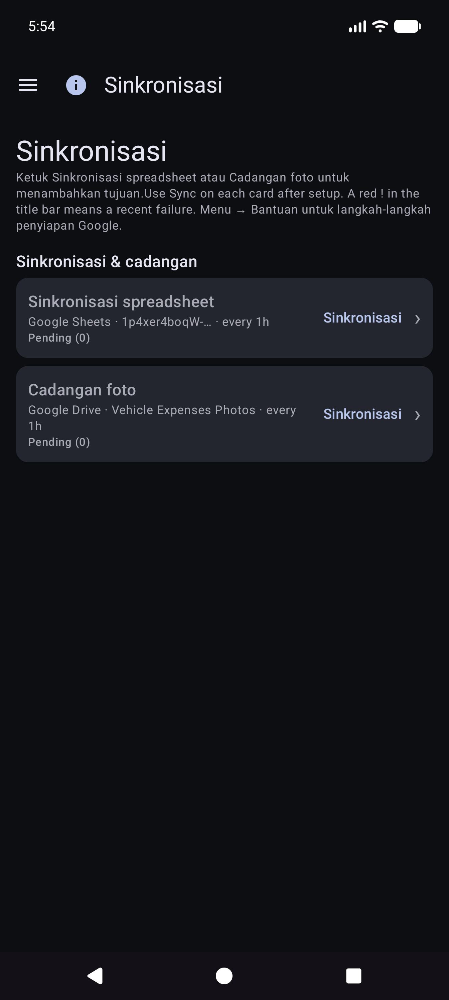

- Kartu untuk **Sinkronisasi spreadsheet** dan **Cadangan foto** dengan status pendek, **Sinkronisasi** untuk jenis itu, dan **›** ke dalam daftar tujuan.
- Buka tujuan untuk **Uji koneksi** dan **Sinkronkan sekarang (tujuan ini)** / semua dikonfigurasi.
- Kegagalan **Detail** dan tanda merah **!** di bilah judul muncul di sini.
- Penyiapan Google Spreadsheet dan Drive langkah demi langkah: [Pencadangan dan sinkronisasi multi-perangkat](#backup-dan-sinkronisasi multi-perangkat).

---

## Pengaturan (preferensi lokal)

Menu → **Pengaturan**.

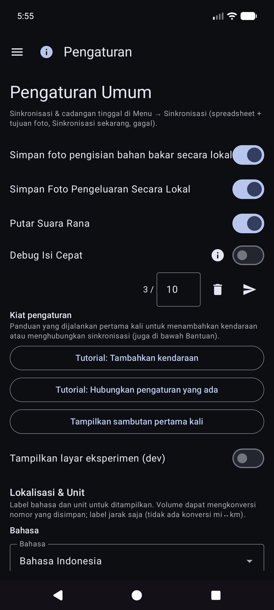

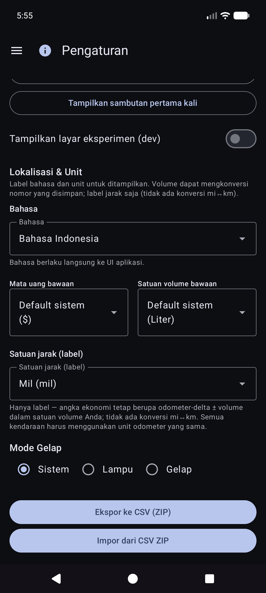

Untuk tujuan, pilih **Menu → Sinkronisasi**. Pengaturan mungkin masih menampilkan baris ringkasan yang membuka daftar yang sama.

### Preferensi lokal (umum)

- **Simpan Foto Tanda Terima Bahan Bakar** / **Simpan Foto Pengeluaran Secara Lokal** — menyimpan gambar di perangkat (dapat meminta izin Foto).
- **Putar Suara Rana**
- **Mata Uang** / **Satuan volume** — default aplikasi (sistem atau eksplisit). Mengubah satuan volume dengan data bahan bakar yang ada mungkin menawarkan dialog konversi.
- **Mode gelap**
- **Tips penyiapan** — membuka kembali tutorial sinkronisasi/kendaraan yang dijalankan pertama kali.
- **Debug Quick Fill** / **Tampilkan layar eksperimen (dev)** — lanjutan; tinggalkan untuk penggunaan sehari-hari. Layar eksperimen tidak didokumentasikan di sini.

CSV **ekspor/impor** (ZIP Kendaraan / Pengeluaran / Tab Bahan Bakar) tersedia dari Pengaturan ketika ditawarkan oleh versi saat ini.

---

## Bantuan & Tentang

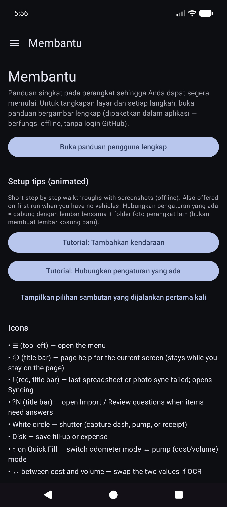

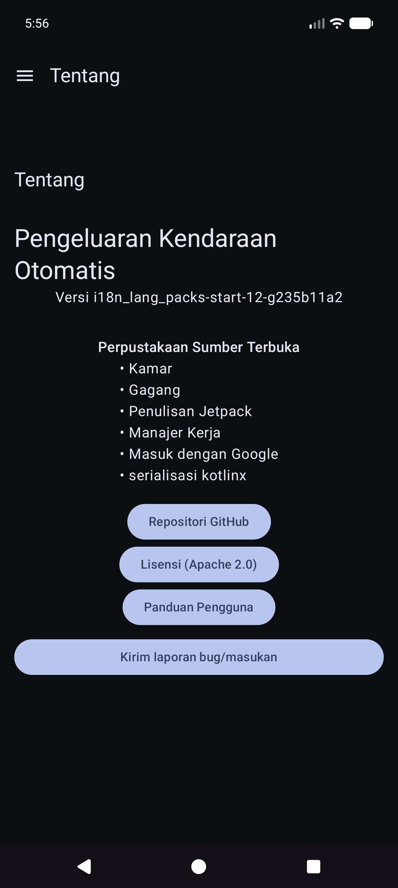

- **Bantuan** — mulai cepat di perangkat, tutorial pengaturan, tautan ke manual ini, indeks pengaturan host mandiri.
- **Tentang** — versi, lisensi, GitHub, manual ini (dibundel offline + HTML online saat dipublikasikan).

---

## Dokumen terkait

- [USER_GUIDE.md](reference/USER_GUIDE.md) — referensi ringkas
- [self-host/INDEX.md](reference/self-host/INDEX.md) — pengaturan foto/tabular yang dihosting sendiri
- [SYNC_BEHAVIOR.md](reference/SYNC_BEHAVIOR.md) — penggabungan, pemulihan, duplikat
- [REPORTS_METRICS.md](reference/REPORTS_METRICS.md) — detail metrik ekonomi