# Spese del veicolo automatizzate: manuale dell'utente

> **Modifica sorgente (Markdown).** I browser e il lettore in-app aprono il **HTML renderizzato**:
> - Web: [`docs/user-manual.html`](user-manual.html) (rigenerare con `./scripts/render-user-manual.sh`)
> - App: Guida/Informazioni → manuale completo (HTML + screenshot in bundle)
>
> Non indirizzare gli utenti finali a URL `.md` non elaborati: i browser mostrano solo testo normale.

Monitoraggio tramite fotocamera dei rifornimenti di carburante e delle spese del veicolo, con sincronizzazione multi-dispositivo opzionale e backup nei **tuoi** account cloud.

Questo è il **manuale completo** (screenshot + ogni passaggio). Sul telefono, **Menu → Aiuto** è una guida introduttiva più breve.

**Non trattato qui:** Importa vecchie immagini, Esperimento di allineamento ed Esperimento di pompaggio (strumenti per sviluppatori/avanzati).

---

## Indice

1. [Di cosa hai bisogno](#di-cosa-hai-necessario)
2. [Riepilogo delle icone](#riepilogo delle icone)
3. [Apri il menu](#apri-il-menu)
4. [Prima configurazione: Gestisci veicoli](#first-time-setup-manage-vehicles)
5. [Backup e sincronizzazione multi-dispositivo](#backup-e-sincronizzazione-multi-dispositivo)
6. [Rifornimento rapido (carburante)](#riempimento-rapido-carburante)
7. [Inizia il viaggio](#inizio-viaggio)
8. [Spese](#spese)
9. [Rapporti](#rapporti)
10. [Impostazioni (preferenze locali)](#settings-local-preferences)
11. [Sincronizzazione](#sincronizzazione)
12. [Guida e informazioni](#help--about)
13. [Documenti correlati](#documenti-correlati)

---

## Cosa ti serve

- Telefono o tablet Android.
- Per un OCR migliore: una visione chiara del **contachilometri del cruscotto** e dei **totali della pompa** (o digita i numeri a mano).
- Facoltativo: account **che controlli** per i dati del foglio di calcolo e/o il backup di foto (vedi [Backup e sincronizzazione multi-dispositivo](#backups-and-multi-device-sync)).

---

## Icone in sintesi

Questi appaiono nelle schermate principali. Conoscerli risparmia molta caccia.

| Dove | Icona/controllo | Cosa fa |
|-------|----------------|--------------|
| Barra superiore | **☰ Menù** (hamburger) | Apre il cassetto di navigazione |
| Barra superiore | **ⓘ** (aiuto della pagina) | Breve aiuto per la pagina **corrente** (accanto al menu quando disponibile) |
| Barra superiore | **`?N`** (giallo) | Domande in sospeso sulla revisione dell'importazione: apre la revisione dell'importazione |
| Barra superiore | **!** (rosso) | Recentemente si è verificato un errore in un foglio di calcolo o in una destinazione per foto: apri **Sincronizzazione** per correggere |
| Barra superiore | **☰ + ←** | I rapporti sui bambini e l'elenco delle spese mostrano insieme **menu e viceversa**; L'hub dei report è solo menu |
| Impostazioni/modifica carburante | **←** | Indietro (le impostazioni del foglio di calcolo/foto e la modifica del carburante rimangono focalizzate sullo sfondo) |
| Riempimento rapido | **Cerchio bianco** (otturatore) | Acquisisci il display del contachilometri o della pompa per OCR |
| Riempimento rapido | **Disco/Salva** | Risparmia il rifornimento (necessita di un veicolo e almeno uno di odo/volume/costo) |
| Riempimento rapido | **↕ frecce** (cambio modalità) | Alterna la **modalità contachilometri** rispetto alla **modalità pompa (costo/volume)**. Il bordo verde evidenzia il gruppo di campi attivo |
| Riempimento rapido | **↔ frecce** (tra costo e volume) | Scambia costo e volume se l'OCR li inserisce nei campi sbagliati |
| Riempimento rapido | **Zoom 1x /...** | Rapporti di zoom della fotocamera quando l'obiettivo li supporta |
| Compilazione rapida (dopo l'acquisizione) | **Aggiorna** sul pulsante principale | Elimina l'anteprima e torna alla telecamera live |
| Compilazione rapida (durante l'elaborazione) | **X** sul pulsante principale | Annulla l'acquisizione/OCR in corso |
| Spesa | **Salva** | Risparmia sulla spesa |
| Spesa | **Cerchio otturatore** | Scatta una foto della ricevuta |
| Spesa | **Galleria** | Scegli un'immagine della ricevuta dalla libreria |
| Spesa | **Riprendi** | Cancella la foto della ricevuta corrente e scatta di nuovo |
| Spesa / Gestisci veicoli | **+ / −** FAB | Ingrandisci l'anteprima della foto |
| Finestra di dialogo Punti di riferimento | **Modifica OCR** ​​| Correggi o aggiungi testo di riferimento mancato dai motori |
| Foglio di calcolo/Moduli fotografici | **🔍 Cerca** | Sfoglia Google Drive per un foglio o una cartella (dopo l'accesso) |

I simboli di valuta sui campi dei costi e **G/L** sui campi del volume sono selezionabili: apri un piccolo menu per modificare la valuta o i galloni rispetto ai litri per quella voce.

---

## Apri il menu

1. Tocca **☰** in alto a sinistra.
2. Scegli una pagina.

**Cassetto principale:** Riempimento rapido · Inizia viaggio · Gestisci veicoli · Nuova spesa · **Rapporti** · Impostazioni · Sincronizzazione · Aiuto · Informazioni.

**Cassetto degli esperimenti** (Impostazioni → Mostra schermate degli esperimenti): Esperimento di allineamento · Esperimento della pompa · **Importa vecchie immagini**.

**Tramite hub Report (non cassetto principale):** Elenco spese · Compila cronologia.

---

## Prima configurazione: gestisci veicoli

L'OCR e l'**abbinamento automatico dei veicoli** funzionano meglio dopo aver registrato ciascun veicolo con una **foto di riferimento del cruscotto**, ritagliato il contachilometri ed eseguito **Discovery** in modo che l'app memorizzi il testo di riferimento per quel trattino. (Il modo in cui i punti di riferimento vengono scelti e abbinati sarà documentato in maggior dettaglio in un aggiornamento successivo.)

### Apri Gestisci veicoli

Menu → **Gestisci veicoli**. Scegli un veicolo (o **Aggiungi nuovo veicolo**).

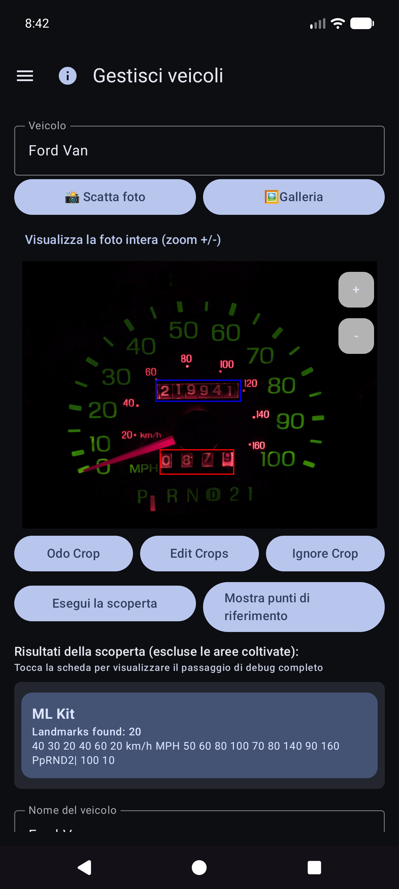

### Aggiungi o modifica un veicolo

1. Apri il menu a discesa **Veicolo** → scegli un veicolo o **Aggiungi nuovo veicolo**.
2. Scatta o scegli una **foto di riferimento** chiara del cruscotto (quadro strumenti completo, ben illuminato, telefono più o meno perpendicolare). Utilizza **Scatta foto** o **Galleria**.
3. Disegna i raccolti:
   - **Odo Crop**: rettangolo stretto attorno alle cifre del contachilometri (il pulsante mostra **Fatto Odo** mentre la modalità è attiva).
   - **Ignora ritaglio**: regione opzionale da ignorare (orologio, radio, ecc.).
   - **Modifica ritagli**: regola i rettangoli esistenti.
4. Tocca **Esegui rilevamento**: l'OCR multi-motore trova le parole chiave al di fuori delle colture.
5. Rivedi con **Mostra punti di riferimento**. Utilizza **Modifica OCR** ​​per correggere errori di lettura o **aggiungere** testo sfuggito.
6. Inserisci il **Nome del veicolo** (richiesto), più marca/modello/anno/targa come preferisci.
7. Tocca **Crea veicolo** o **Salva modifiche** (richiede nome + foto di riferimento per un nuovo veicolo).

### Punti di riferimento: correggi ciò che manca a Discovery

Dopo **Mostra punti di riferimento**, scorri l'elenco e correggi i valori. A volte nei motori mancano le cifre piccole (ad esempio l'orologio **60** in basso a destra sul quadro strumenti). Utilizza **Modifica OCR** ​​per aggiungerli o correggerli in modo che l'identità del veicolo rimanga affidabile.

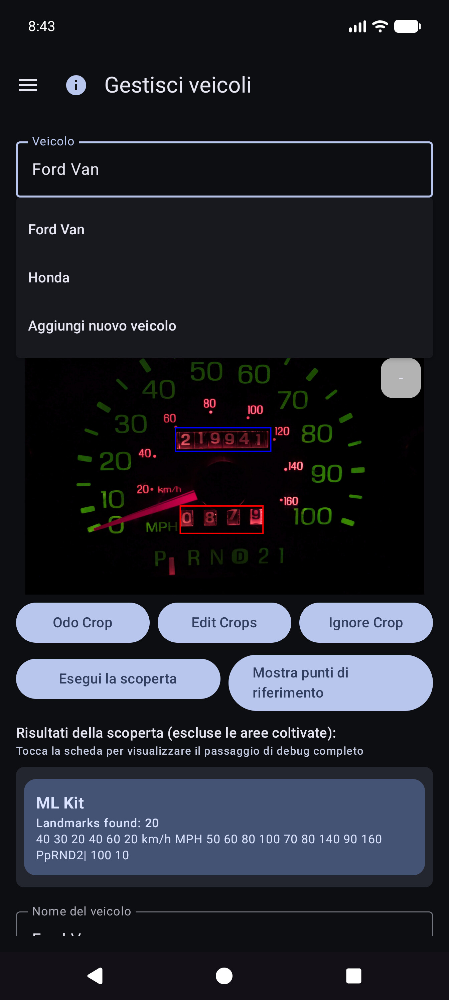

### Digitare senza una foto perfetta

Puoi comunque utilizzare l'app selezionando un veicolo e **digitando** contachilometri, volume e costo in Compilazione rapida: l'OCR è facoltativo per ogni campo. L'importazione della galleria funziona per la foto del trattino di riferimento quando preferisci non scattare in-app.

**Suggerimento:** dopo la sincronizzazione del foglio di calcolo, le definizioni dei veicoli (ritagliati, punti di riferimento) risiedono nel database locale: non è necessario riaprire Gestisci veicoli per riempimento rapido per utilizzarle.

---

## Backup e sincronizzazione multi-dispositivo

L'app è progettata in modo che **più telefoni o tablet possano condividere gli stessi dati della flotta** e tu possa conservare una **copia dei tuoi dati e delle tue foto fuori dal dispositivo**. Ciò viene fatto con le destinazioni che **tu** configuri nei **tuoi** account o nei **tuoi** server self-hosted, non in un "cloud spese veicoli" gestito dall'azienda che altre persone possono vedere.

### Cosa corre dove

| Gentile | Cosa memorizza | Uso tipico |
|------|----------------|-------------|
| **Foglio di calcolo/Sincronizzazione tabellare** | Veicoli, rifornimenti carburante, spese (righe e schede) | Unione multi-dispositivo + backup strutturato |
| **Backup foto** | Immagini binarie (trattino/pompa/ricevuta/foto di riferimento) | Backup foto + ripristino file mancanti |

Puoi configurare **più destinazioni** di ogni tipo (soft cap per tipo). Gli operatori manuali **Sincronizza ora** e **in background** eseguono quelli abilitati.

### Prima offline

- **Non è necessaria alcuna rete** per aggiungere un rifornimento, una spesa o una ricevuta. Tutto viene salvato **prima localmente**.
- Quando la rete è disponibile, la sincronizzazione e il backup delle foto vengono eseguiti come **attività in background** (secondo una pianificazione impostata e quando tocchi **Sincronizza ora**). Gli errori vengono visualizzati come testo rosso sotto le righe Impostazioni e un **!** nella barra del titolo dell'app.

### Solo i tuoi account

L'accesso e i token rimangono sul dispositivo per i provider scelti (Google, Microsoft, chiavi S3, URL self-hosted e così via). Le destinazioni sono sotto il **pieno controllo dell'utente**: il tuo account Google, il tuo OneDrive, il tuo bucket MinIO, il tuo host EtherCalc, ecc. Nulla viene condiviso con altri utenti di Spese veicolo tramite un backend condiviso.

### Obiettivi supportati: dati (foglio di calcolo/tabella)

Configurato in **Menu → Sincronizzazione → Sincronizzazione foglio di calcolo** (raggiungibile anche dalle righe di riepilogo delle Impostazioni). Opzioni di selezione di prima classe:

| Obiettivo | Note |
|--------|--------|
| **Fogli Google** | Impostazione predefinita comune; schede per veicoli, spese e carburante per veicolo |
| **Eccelle** | Cartella di lavoro Microsoft tramite rilegatura in stile Graph/OneDrive |
| **EtherCalc** | Stanze di fogli di calcolo collaborativi self-hosted |
| **Altro →** backend implementati | **Baserow**, **NocoDB**, **Airtable**, **PocketBase**, **Supabase**, **Firebase**, **Zoho Sheet** |

Differito/non ancora senza testa (elencato in Altro ma non completamente implementato): OnlyOffice, Collabora. Vedi anche [indice self-host](riferimento/self-host/INDEX.md).

CSV **esportazione/importazione** (ZIP con lo stesso layout della scheda) è disponibile da Impostazioni come backup portatile, indipendente dalla sincronizzazione live.

### Obiettivi supportati: foto (backup immagine)

Configurato in **Menu → Sincronizzazione → Backup foto** (anche dalle righe di riepilogo delle Impostazioni):

| Obiettivo | Note |
|--------|--------|
| **Google Drive** | Cartella scelta (sfoglia o incolla l'URL) |
| **OneDrive** | Account Microsoft + prefisso percorso |
| **S3** | AWS, Wasabi, Cloudflare R2, MinIO e altri endpoint compatibili con S3 |
| **Altro** | Archiviazione supportata da rclone (ad esempio WebDAV, SFTP e altri telecomandi selezionati disponibili nel selettore in-app) |

Configura i cheatsheet per foto e target tabulari ospitati autonomamente: [indice self-host](riferimento/self-host/INDEX.md).

### Comportamento multi-dispositivo (breve)

- Le righe si uniscono per **ID sincronizzazione** con **last-write-wins** sui timestamp **Aggiornati**.
- Le eliminazioni sono soft; una modifica più recente su un altro dispositivo può ripristinare una riga.
- Inserendo lo **stesso riempimento due volte** su due dispositivi si creano **due righe**: elimina quelle extra quando te ne accorgi.
- Maggiori dettagli: [Note sul comportamento di sincronizzazione](#sync-behavior-notes) e [SYNC_BEHAVIOR.md](riferimento/SYNC_BEHAVIOR.md).

### Esempio: aggiungi Fogli Google (dati)

1. **Menu → Sincronizzazione → Sincronizzazione foglio di calcolo** (o Impostazioni → Sincronizzazione foglio di calcolo).

   

2. Tocca **Aggiungi destinazione foglio di calcolo**.

   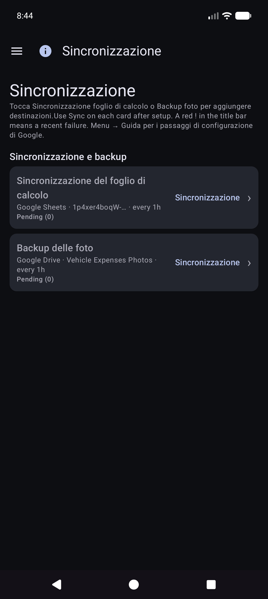

3. Scegli **Fogli Google**.

   

4. **Accedi con Google** → nome visualizzato → **URL del foglio** o **🔍** sfoglia/crea → opzioni di pianificazione → abilita → salva.
5. **Sincronizza ora** una volta per creare/aggiornare le schede: `Veicoli`, `Spese`, `Carburante - {nome del veicolo}`.

### Esempio: aggiungi Google Drive (foto)

1. **Menu → Sincronizzazione → Backup foto** (o Impostazioni → Backup foto).

   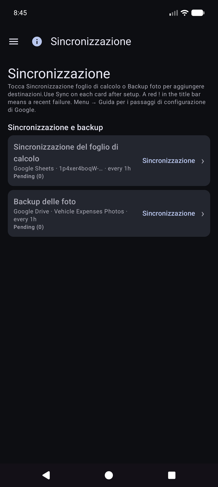

2. Tocca **Aggiungi destinazione foto**.

   

3. Scegli **Google Drive**.

   

4. **Accedi con Google (Drive)** → URL/sfoglia cartella opzionale → abilita → salva → **Sincronizza ora**.

La **Sincronizzazione manuale ora** per le foto è un passaggio completo; il backup in background in genere elabora i caricamenti **solo in attesa** in base a una pianificazione.

### Note sul comportamento di sincronizzazione

- Dopo l'aggiornamento dell'app potresti visualizzare brevemente **"Aggiornamento del database dopo l'aggiornamento..."** (backfill dell'ID di sincronizzazione locale).
- Se una sincronizzazione viene interrotta, la successiva sincronizzazione **riuscita** riunisce e ripara le schede remote.
- Guasti: riepilogo rosso sulle carte di sincronizzazione + **!** nella barra dell'app.

---

## Rifornimento rapido (carburante)

Questa è la **schermata iniziale** quando apri l'app.

### Selezione del veicolo (solitamente automatica)

**Non** è necessario ritirare prima il veicolo. Quando i veicoli hanno **punti di riferimento** impostati in Gestisci veicoli, Compilazione rapida **rileva automaticamente quale veicolo** dall'immagine del cruscotto dopo aver acquisito il contachilometri. Puoi comunque aprire il menu a discesa **Veicolo** per eseguire l'override, se necessario.

### Punta al contachilometri

Rimani in modalità contachilometri e inquadra il quadro strumenti. Istruzioni: *Mirare al contachilometri. Tocca l'otturatore per scattare.*

### Dopo l'otturatore del contachilometri

L'OCR compila **Odo** e tenta di abbinare il veicolo ai punti di riferimento (rivedi entrambi se necessario). Il pulsante principale diventa **Riprova** per ripetere la ripresa. L'istruzione riassume la lettura.

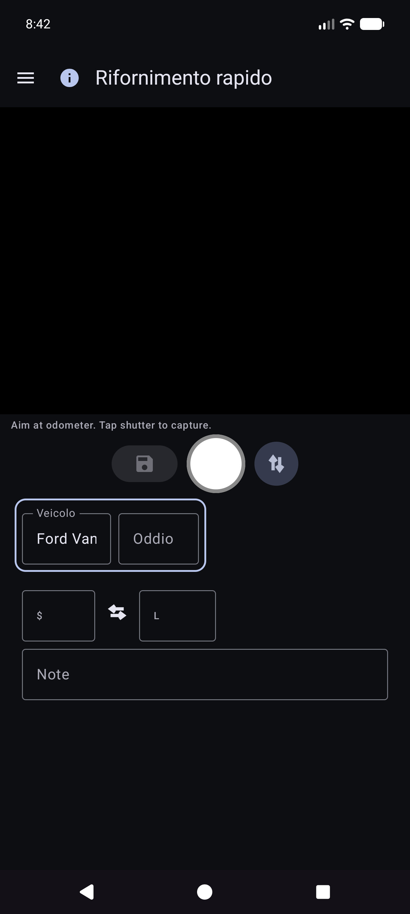

### Modalità pompa (costo e volume)

1. Toccare **↕** per passare alla modalità pompa: *Mirare al display della pompa (costo/volume). Tocca l'otturatore.*
2. Acquisire i totali della pompa. I campi costo e volume si riempiono; utilizzare **↔** se vengono scambiati.
3. Tocca valuta o **G/L** se necessario, quindi **Salva** (disco). I campi vuoti comportano un **riempimento parziale** (ancora consentito).

Rimani su Quick Fill per la tappa successiva (i campi vengono cancellati dopo il salvataggio). Lavora completamente **offline**; la sincronizzazione viene eseguita successivamente in background quando configurata.

### Inserimento manuale (nessuna fotocamera/OCR difettoso)

1. Tocca **Odo**, **costo** o **volume** e digita i valori (in verticale viene utilizzata la tastiera di sistema; in orizzontale viene utilizzata una tastiera su schermo).
2. Scegli o conferma il **Veicolo** se il rilevamento automatico non è stato eseguito.
3. Salva come sopra.

### Modi e confini

- **Bordo verde** attorno al veicolo+odo → acquisizione/modifica del contachilometri.
- **Bordo verde** attorno a costo+volume → modalità pompa.
- **Salva** rimane disabilitato finché non viene selezionato un veicolo e almeno uno tra odo/costo/volume contiene dati e l'OCR non è ancora in esecuzione.

Suggerimento sullo schermo (sotto la riga di istruzioni): *Otturatore = cattura · Disco = salva · ↕ = modalità odo/pompa · ↔ = costo/volume di scambio.*

---

## Spese

### Nuova spesa

Menù → **Nuova spesa**.

1. **Salva** (disco), **otturatore** (foto della ricevuta) o **galleria** (scegli l'immagine).
2. Compila **Data**, **Veicolo**, **Fornitore**, **Descrizione**, **Importo** (simbolo della valuta selezionabile), **Categoria**, **Contachilometri** opzionale.
3. Ricevute multipagina: acquisisci pagine aggiuntive se l'interfaccia utente offre l'impaginazione (la pagina 0 è la ricevuta principale).
4. **Salva** nell'archivio (prima in locale; il backup delle foto e la sincronizzazione dei fogli di calcolo avvengono in background quando configurati).

### Elenco spese

Menu → **Rapporti** → **Elenco spese**: sfoglia le spese passate non legate al carburante; aprire un elemento da modificare.

### Modifica la spesa

Apri una riga dall'elenco. Venditore, importo, categoria, veicolo e descrizione corretti. Se la ricevuta è solo nel backup della foto (nessun file locale leggibile), utilizza **Recupera immagine dall'archivio** quando viene visualizzata (funziona con tutte le destinazioni foto configurate).

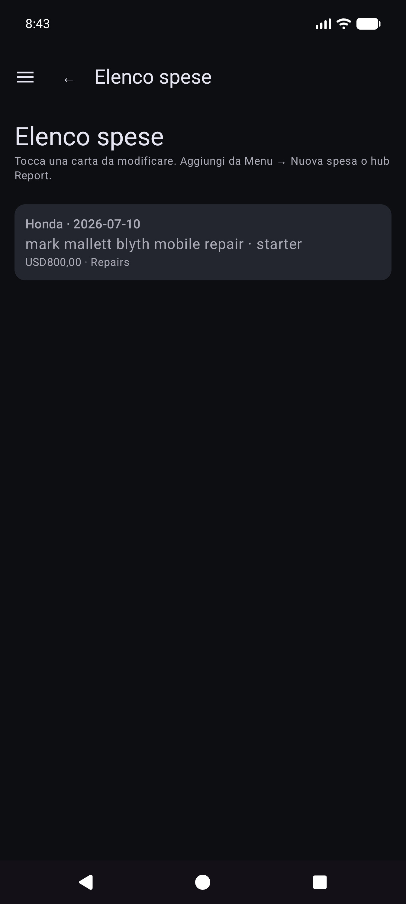

---

## Inizia il viaggio

Menu → **Inizia viaggio** (dopo la compilazione rapida nel drawer). Cattura o inserisci il contachilometri, scegli il tipo di viaggio, salva con l'icona **disco**. **Stop** è una scorciatoia per Personale ora nella posizione GPS mantenuta. Utilizza **ⓘ** per i promemoria di controllo.

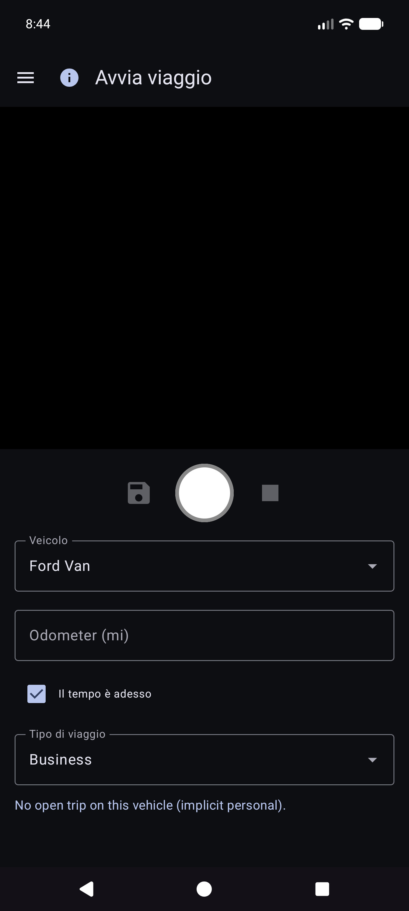

Gli inizi del viaggio vengono memorizzati come righe di carburante con un **Tipo di viaggio** (non normali rifornimenti). Appaiono in **Rapporti → Miglia di viaggio**, non in Cronologia carburante.

---

## Rapporti

Menu → **Rapporti** apre l'hub del prodotto (riepilogo storico + schede catalogo). Questa è l'unica superficie per i resoconti del prodotto: non esiste un elemento separato del cassetto "Rapporti e grafici".

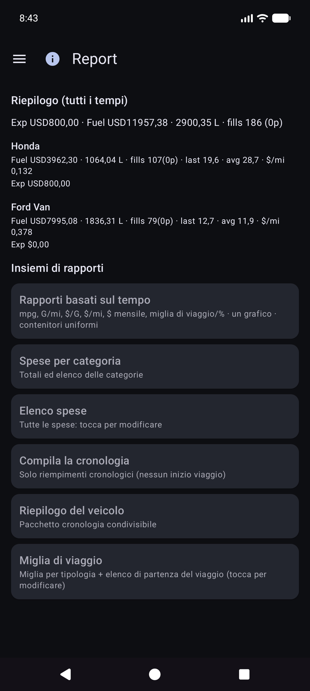

Apri una scheda per la modalità veicolo (**Tutti/Ciascuno/Singolo**), filtri periodici, grafici e condivisione (**TESTO/CSV/PDF**). Barra superiore sul rapporto figli: **☰ + ←** (e **ⓘ** se registrato).

### Rapporti basati sul tempo

La carta cartografica principale. Metriche opzionali (mpg, volume/distanza come G/mi, prezzo unitario come $/G, costo/distanza, $ mensili, miglia di viaggio, % di viaggio per tipo) con contenitori **Smooth** e **scale Y indipendenti** (economia a sinistra; denaro e famiglie di viaggio a destra).

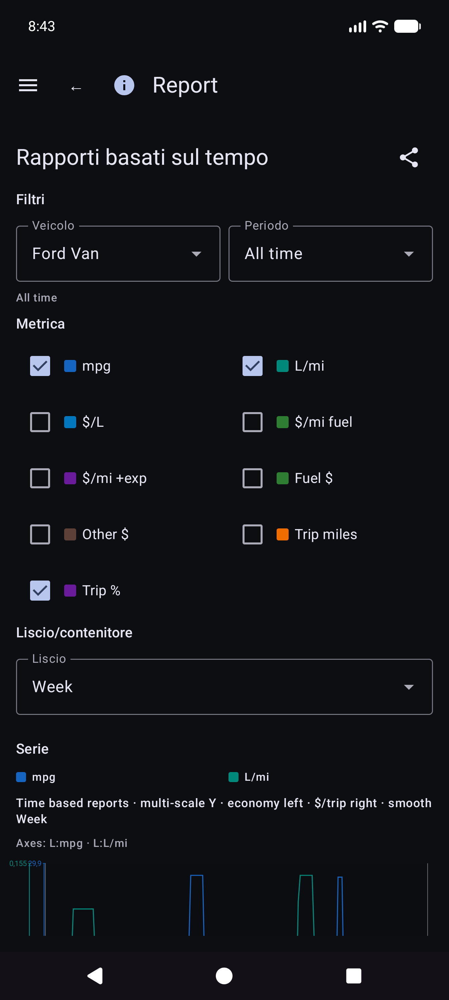

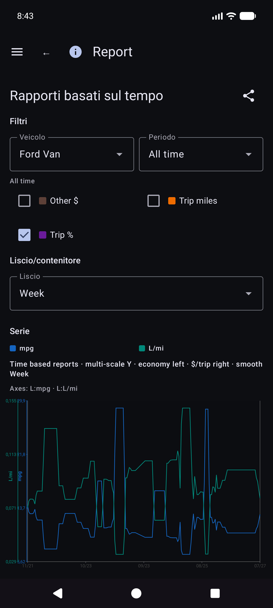

Dettagli sulla matematica economica: [REPORTS_METRICS.md](riferimento/REPORTS_METRICS.md).

### Compila la cronologia rispetto alla cronologia del carburante

- **Rapporti → Compila cronologia**: compilazioni cronologiche per i filtri dei report (**solo compilazioni**; nessun inizio viaggio).

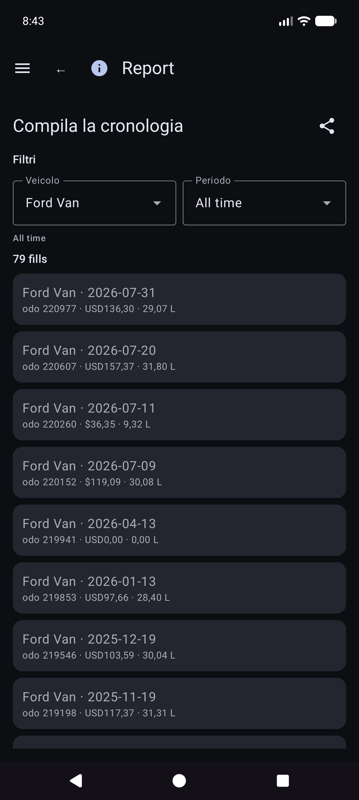

- **Cronologia carburante** (se presente nella navigazione della tua build): inventario di rifornimento per veicolo, anche solo rifornimento; tocca una riga per modificarla.

### Miglia di viaggio

**Rapporti → Miglia di viaggio**: miglia per tipo, grafici e un **elenco cronologico di inizio viaggio/segmento**. Tocca un inizio reale per aprire **Modifica riempimento** per quella riga.

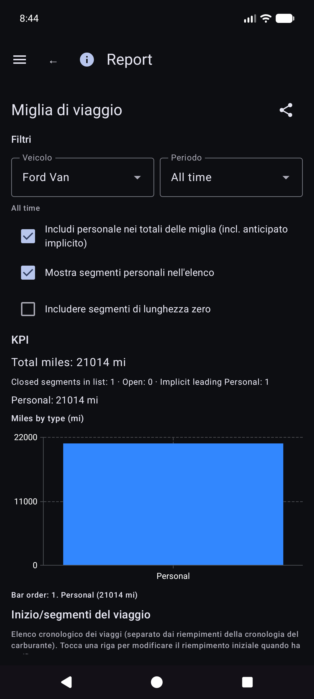

### Modifica riempimento

Da Cronologia rifornimenti, Cronologia carburante o Miglia di viaggio, aprire un rifornimento. Layout: veicolo e contachilometri, **valuta prima del costo**, volume, note. Il tipo di viaggio viene visualizzato solo quando la riga indica l'inizio di un viaggio. La posizione ha un riepilogo più **Dettagli sulla posizione**. Foto locale mancante con identità cloud: **Recupera immagine dall'archivio**.

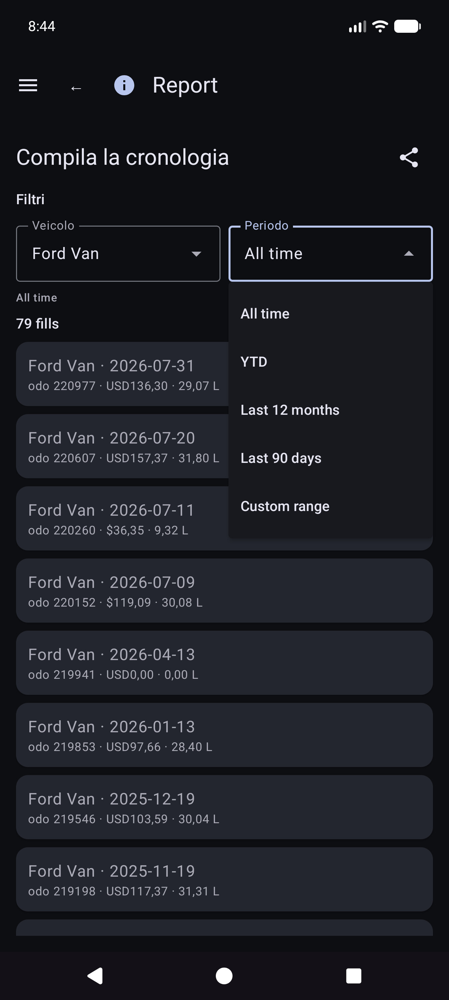

Altre schede del catalogo includono le spese per categoria, riepilogo del veicolo ed elenco delle spese.

Money utilizza la valuta di ogni riga quando impostata. I totali in valute miste mostrano **totali parziali per valuta** (nessuna conversione FX silenziosa).

---

## Sincronizzazione

Menu → **Sincronizzazione** è l'hub per fogli di calcolo e destinazioni foto (non solo sepolto in Impostazioni).

- Schede per la **Sincronizzazione dei fogli di calcolo** e il **Backup delle foto** con stato breve, **Sincronizzazione** per quel tipo e **›** nell'elenco delle destinazioni.
- Apri una destinazione per **Verifica connessione** e **Sincronizza ora (questa destinazione)**/tutto configurato.
- I **Dettagli** del fallimento e il simbolo rosso **!** nella barra del titolo finiscono qui.
- Configurazione dettagliata di Fogli Google e Drive: [Backup e sincronizzazione multi-dispositivo](#backup-e-sincronizzazione-multi-dispositivo).

---

## Impostazioni (preferenze locali)

Menu → **Impostazioni**.

Per le destinazioni, preferisci **Menu → Sincronizzazione**. Le impostazioni potrebbero comunque mostrare righe di riepilogo che aprono gli stessi elenchi.

### Preferenze locali (comuni)

- **Salva foto delle ricevute di carburante** / **Salva foto delle spese localmente**: conserva le immagini sul dispositivo (può richiedere l'autorizzazione per le foto).
- **Riproduci il suono dell'otturatore**
- **Valuta** / **Unità volume**: impostazioni predefinite dell'app (di sistema o esplicite). La modifica dell'unità di volume con i dati del carburante esistenti può offrire una finestra di dialogo di conversione.
- **Modalità oscura**
- **Suggerimenti per la configurazione**: riapri i tutorial di prima esecuzione del veicolo/sincronizzazione.
- **Debug riempimento rapido**/**Mostra schermate dell'esperimento (sviluppo)**: avanzato; lasciare fuori per l'uso quotidiano. Le schermate dell'esperimento non sono documentate qui.

CSV **esportazione/importazione** (ZIP di veicoli/spese/schede carburante) è disponibile da Impostazioni quando offerto dalla build corrente.

---

## Guida e informazioni

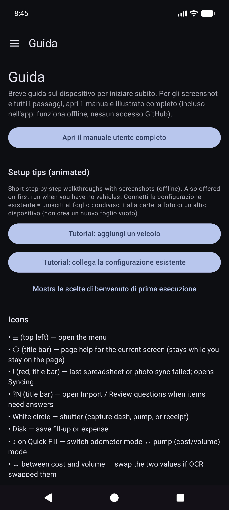

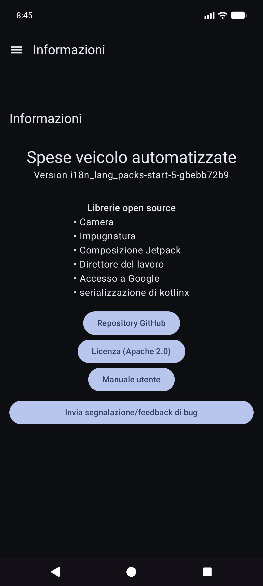

- **Guida**: avvio rapido sul dispositivo, tutorial di configurazione, collegamento a questo manuale, indice di configurazione dell'host autonomo.
- **Informazioni**: versione, licenze, GitHub, questo manuale (raggruppato offline + HTML online quando pubblicato).

---

## Documenti correlati

- [USER_GUIDE.md](riferimento/USER_GUIDE.md) — riferimento ridotto
- [self-host/INDEX.md](riferimento/self-host/INDEX.md) — configurazione foto/tabella ospitata autonomamente
- [SYNC_BEHAVIOR.md](riferimento/SYNC_BEHAVIOR.md) — unione, ripristino, duplicati
- [REPORTS_METRICS.md](riferimento/REPORTS_METRICS.md) - dettaglio dei parametri economici