# Voertuigkosten geautomatiseerd - Gebruikershandleiding

> **Bron bewerken (Markdown).** Browsers en de in-app-lezer openen de **gerenderde HTML**:
> - Web: [`docs/user-manual.html`](user-manual.html) (opnieuw genereren met `./scripts/render-user-manual.sh`)
> - App: Help / Over → volledige handleiding (gebundelde HTML + screenshots)
>
> Wijs eindgebruikers niet naar onbewerkte `.md` URL's; browsers tonen alleen platte tekst.

Camera-first tracking voor tankbeurten en voertuigkosten, met optionele synchronisatie en back-up van meerdere apparaten onder **uw** cloudaccounts.

Dit is de **volledige handleiding** (screenshots + elke stap). Aan de telefoon is **Menu → Help** een kortere handleiding om aan de slag te gaan.

**Hier niet behandeld:** Importeer oude afbeeldingen, Uitlijningsexperiment en Pompexperiment (ontwikkelaar / geavanceerde tools).

---

## Inhoudsopgave

1. [Wat je nodig hebt](#wat-je-need)
2. [Pictogrammen in één oogopslag](#icons-at-a-glance)
3. [Open het menu](#open-het-menu)
4. [Eerste installatie: Voertuigen beheren](#first-time-setup-manage-vehicles)
5. [Back-ups en synchronisatie van meerdere apparaten](#backups-and-multi-device-sync)
6. [Snel tanken (brandstof)](#quick-tanken-brandstof)
7. [Start reis](#start-reis)
8. [Uitgaven](#kosten)
9. [Rapporten](#rapporten)
10. [Instellingen (lokale voorkeuren)](#settings-local-preferences)
11. [Synchroniseren](#synchroniseren)
12. [Hulp en over](#help--over)
13. [Gerelateerde documenten](#related-docs)

---

## Wat je nodig hebt

- Android-telefoon of -tablet.
- Voor de beste OCR: een duidelijk zicht op uw **dashboardkilometerteller** en **pomptotalen** (of typ de cijfers met de hand).
- Optioneel: accounts **die u beheert** voor back-ups van spreadsheetgegevens en/of foto's (zie [Back-ups en synchronisatie van meerdere apparaten](#backups-and-multi-device-sync)).

---

## Pictogrammen in één oogopslag

Deze verschijnen op de hoofdschermen. Als je ze kent, bespaar je een hoop jacht.

| Waar | Icoon / controle | Wat het doet |
|-------|---------------|-------------|
| Bovenbalk | **☰ Menukaart** (hamburger) | Opent de navigatielade |
| Bovenbalk | **ⓘ** (paginahulp) | Korte hulp voor de **huidige** pagina (naast menu indien beschikbaar) |
| Bovenbalk | **`?N`** (geel) | In behandeling zijnde importcontrolevragen - opent Importcontrole |
| Bovenbalk | **!** (rood) | Een spreadsheet of fotobestemming is onlangs mislukt. Open **Synchroniseren** om het probleem op te lossen |
| Bovenbalk | **☰ + ←** | Rapport kinderen en onkostenlijst tonen **menu en terug** samen; Rapportenhub is alleen menu |
| Instellingen / brandstof bewerken | **←** | Terug (instellingenspreadsheet/foto en brandstofbewerking blijven teruggefocust) |
| Snel invullen | **Witte cirkel** (sluiter) | Leg kilometerteller- of pompweergave vast voor OCR |
| Snel invullen | **Schijf / Opslaan** | Bespaar de tankbeurt (heeft een voertuig nodig en minstens één van odo / volume / kosten) |
| Snel invullen | **↕ pijlen** (modusschakelaar) | Schakel tussen de **kilometertellermodus** en de **pompmodus (kosten/volume)**. Groene rand markeert de actieve veldgroep |
| Snel invullen | **↔ pijlen** (tussen kosten en volume) | Wissel kosten en volume om als OCR ze in de verkeerde velden plaatst |
| Snel invullen | **Zoom 1x / …** | Zoomverhoudingen van de camera wanneer de lens deze ondersteunt |
| Snel vullen (na vastleggen) | **Vernieuwen** op hoofdknop | Voorbeeld negeren en terugkeren naar livecamera |
| Snel vullen (tijdens verwerking) | **X** op hoofdknop | Lopende opname/OCR annuleren |
| Kosten | **Opslaan** | Bespaar de kosten |
| Kosten | **Sluitercirkel** | Maak een ontvangstfoto |
| Kosten | **Galerij** | Kies een bonafbeelding uit de bibliotheek |
| Kosten | **Herkansing** | Wis de huidige bonfoto en maak opnieuw een foto |
| Uitgaven / Voertuigen beheren | **+ / −** FAB's | Zoom in op het fotovoorbeeld |
| Dialoogvenster Oriëntatiepunten | **OCR bewerken** | Corrigeer of voeg oriëntatiepunttekst toe die de motoren hebben gemist |
| Spreadsheet / Fotoformulieren | **🔍 Zoeken** | Blader door Google Drive naar een blad of map (na inloggen) |

Valutasymbolen op kostenvelden en **G/L** op volumevelden kunnen worden aangetikt: open een klein menu om de valuta of gallons versus liters voor die invoer te wijzigen.

---

## Open het menu

1. Tik linksboven op **☰**.
2. Kies een pagina.

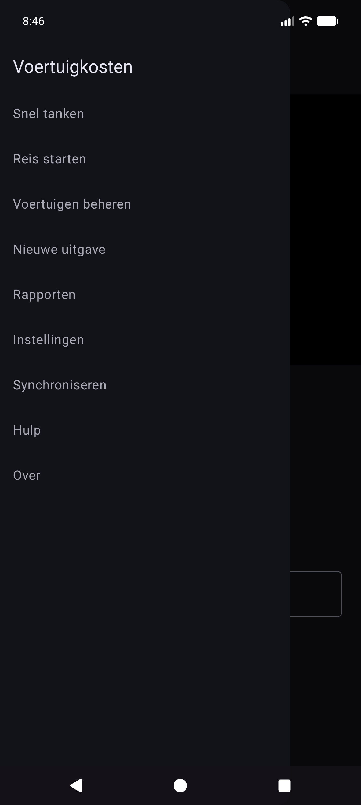

**Hoofdlade:** Snel tanken · Start reis · Beheer voertuigen · Nieuwe uitgaven · **Rapporten** · Instellingen · Synchroniseren · Help · Info.

**Experimentlade** (Instellingen → Experimentschermen tonen): Uitlijningsexperiment · Pompexperiment · **Oude afbeeldingen importeren**.

**Via Rapportenhub (niet hoofdlade):** Onkostenlijst · Vulgeschiedenis.

---

## Eerste installatie: voertuigen beheren

OCR en **automatische voertuigmatching** werken het beste nadat u elk voertuig registreert met een **referentiedashboardfoto**, de kilometerteller bijsnijdt en **Discovery** uitvoert, zodat de app oriëntatiepunttekst voor dat dashboard opslaat. (Hoe oriëntatiepunten worden gekozen en op elkaar afgestemd, zal in een latere update gedetailleerder worden gedocumenteerd.)

### Open Voertuigen beheren

Menu → **Voertuigen beheren**. Kies een voertuig (of **Nieuw voertuig toevoegen**).

### Een voertuig toevoegen of bewerken

1. Open de vervolgkeuzelijst **Voertuig** → kies een voertuig of **Nieuw voertuig toevoegen**.
2. Maak of kies een duidelijke **referentiedashboardfoto** (volledig instrumentenpaneel, goed verlicht, telefoon ongeveer recht gericht). Gebruik **Maak foto** of **Galerij**.
3. Teken gewassen:
   - **Odo Crop** — rechthoek strak rond de kilometertellercijfers (knop toont **Klaar Odo** terwijl die modus actief is).
   - **Bijsnijden negeren** — optionele regio om te negeren (klok, radio, enz.).
   - **Bijsnijden bewerken** — bestaande rechthoeken aanpassen.
4. Tik op **Ontdekking uitvoeren** — OCR met meerdere motoren vindt oriëntatiewoorden buiten de uitsneden.
5. Beoordeel met **Mijlpalen weergeven**. Gebruik **OCR bewerken** om verkeerd gelezen tekst te corrigeren of **toe te voegen** gemiste tekst.
6. Vul **Voertuignaam** in (vereist), plus merk/model/jaar/kenteken zoals u wilt.
7. Tik op **Voertuig aanmaken** of **Wijzigingen opslaan** (vereist naam + referentiefoto voor een nieuw voertuig).

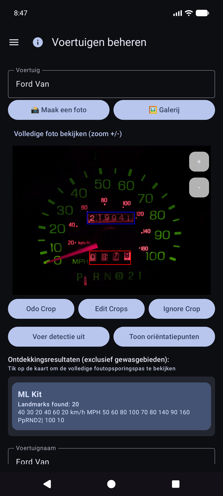

### Bezienswaardigheden: herstel wat Discovery heeft gemist

Blader na **Oriëntatiepunten weergeven** door de lijst en corrigeer de waarden. Motoren missen soms kleine cijfers (bijvoorbeeld een klok **60** rechtsonder in het cluster). Gebruik **OCR bewerken** om ze toe te voegen of te corrigeren, zodat de voertuigidentiteit betrouwbaar blijft.

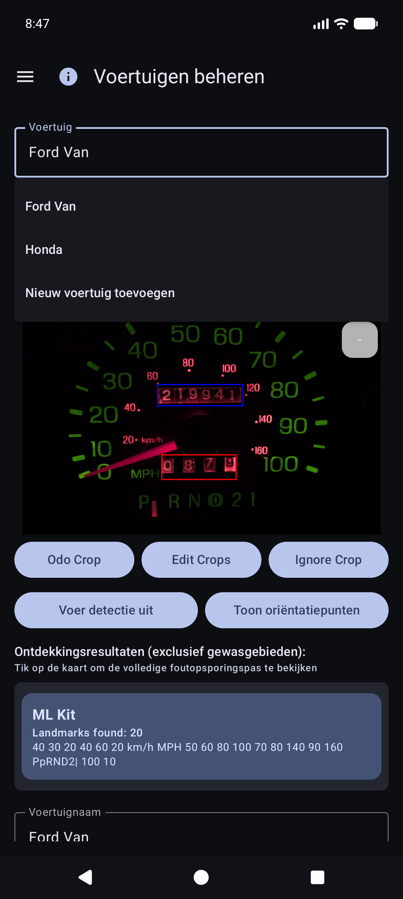

### Typen zonder een perfecte foto

U kunt de app nog steeds gebruiken door een voertuig te selecteren en de kilometerteller, het volume en de kosten te **typen** in Snel invullen. OCR is optioneel voor elk veld. Galerijimport werkt voor de referentiedashfoto als u liever niet in de app fotografeert.

**Tip:** Na de spreadsheetsynchronisatie staan ​​voertuigdefinities (gewassen, oriëntatiepunten) in de lokale database. U hoeft Voertuigen beheren voor Snel vullen niet opnieuw te openen om ze te gebruiken.

---

## Back-ups en synchronisatie van meerdere apparaten

De app is zo gebouwd dat **meerdere telefoons of tablets dezelfde wagenparkgegevens kunnen delen**, en dat u een **kopie van uw gegevens en foto's buiten het apparaat kunt bewaren**. Dat wordt gedaan met bestemmingen die **u** configureert onder **uw** accounts of **uw** zelfgehoste servers – niet een door het bedrijf beheerde “Voertuigkostenwolk” die andere mensen kunnen zien.

### Wat loopt waar

| Soort | Wat het opslaat | Typisch gebruik |
|------|---------------|------------|
| **Spreadsheet-/tabelsynchronisatie** | Voertuigen, tankbeurten, uitgaven (rijen en tabbladen) | Samenvoegen van meerdere apparaten + gestructureerde back-up |
| **Fotoback-up** | Binaire afbeeldingen (streepje/pomp/bon/referentiefoto's) | Fotoback-up + ontbrekende bestanden herstellen |

U kunt **meerdere bestemmingen** van elk type configureren (soft cap per type). Handmatige **Nu synchroniseren** en **achtergrond**-werknemers voeren de ingeschakelde werkrollen uit.

### Eerst offline

- **Er is geen netwerk vereist** om een tankbeurt, uitgave of bon toe te voegen. Alles wordt **eerst lokaal** opgeslagen.
- Wanneer het netwerk beschikbaar is, worden synchronisatie en fotoback-up uitgevoerd als **achtergrondtaken** (volgens een schema dat u instelt en wanneer u op **Nu synchroniseren** tikt). Fouten worden weergegeven als rode tekst onder de rijen Instellingen en een **!** in de titelbalk van de app.

### Alleen jouw accounts

Inloggen en tokens blijven op het apparaat staan voor de providers die u kiest (Google, Microsoft, S3-sleutels, zelf-gehoste URL's, enzovoort). Bestemmingen staan ​​onder **volledige controle van de gebruiker**: uw Google-account, uw OneDrive, uw MiniIO-bucket, uw EtherCalc-host, enz. Er wordt niets gedeeld met andere Vehicle Expenses-gebruikers via een gedeelde backend.

### Ondersteunde doelen — gegevens (spreadsheet/tabel)

Geconfigureerd onder **Menu → Synchroniseren → Spreadsheetsynchronisatie** (ook bereikbaar via de samenvattingsrijen van Instellingen). Eersteklas pickeropties:

| Doel | Opmerkingen |
|--------|--------|
| **Google Spreadsheets** | Gemeenschappelijke standaard; tabbladen voor voertuigen, kosten en brandstof per voertuig |
| **Excel** | Microsoft-werkmap via binding in Graph/OneDrive-stijl |
| **EtherCalc** | Zelf-gehoste samenwerkende spreadsheetruimtes |
| **Andere →** geïmplementeerde backends | **Baserow**, **NocoDB**, **Airtable**, **PocketBase**, **Supabase**, **Firebase**, **Zoho Sheet** |

Uitgesteld / nog niet headless (vermeld onder Overige maar nog niet volledig geïmplementeerd): OnlyOffice, Collabora. Zie ook [self-host index](referentie/self-host/INDEX.md).

CSV **exporteren/importeren** (ZIP met dezelfde tabbladindeling) is via Instellingen beschikbaar als draagbare back-up, onafhankelijk van livesynchronisatie.

### Ondersteunde doelen — foto's (back-up van afbeeldingen)

Geconfigureerd onder **Menu → Synchroniseren → Fotoback-up** (ook vanuit de overzichtsrijen van Instellingen):

| Doel | Opmerkingen |
|--------|--------|
| **Google Drive** | Map die u kiest (blader of plak URL) |
| **OneDrive** | Microsoft-account + padvoorvoegsel |
| **S3** | AWS, Wasabi, Cloudflare R2, MinIO en andere S3-compatibele eindpunten |
| **Anders** | door rclone ondersteunde opslag (bijv. WebDAV, SFTP en andere beheerde afstandsbedieningen beschikbaar in de in-app-kiezer) |

Stel cheatsheets in voor zelfgehoste foto- en tabeldoelen: [self-host index](reference/self-host/INDEX.md).

### Gedrag op meerdere apparaten (kort)

- Rijen worden samengevoegd op **Sync-ID** met **last-write-wins** op **Bijgewerkte** tijdstempels.
- Verwijderingen zijn zacht; een nieuwere bewerking op een ander apparaat kan een rij herstellen.
- Als u **twee keer dezelfde vulling** invoert op twee apparaten, worden er **twee rijen** gemaakt. Verwijder de extra rijen wanneer u dit opmerkt.
- Meer details: [Opmerkingen over synchronisatiegedrag](#sync-behavior-notes) en [SYNC_BEHAVIOR.md](referentie/SYNC_BEHAVIOR.md).

### Voorbeeld: Google Spreadsheets toevoegen (gegevens)

1. **Menu → Synchroniseren → Spreadsheetsynchronisatie** (of Instellingen → Spreadsheetsynchronisatie).

   

2. Tik op **Spreadsheetbestemming toevoegen**.

   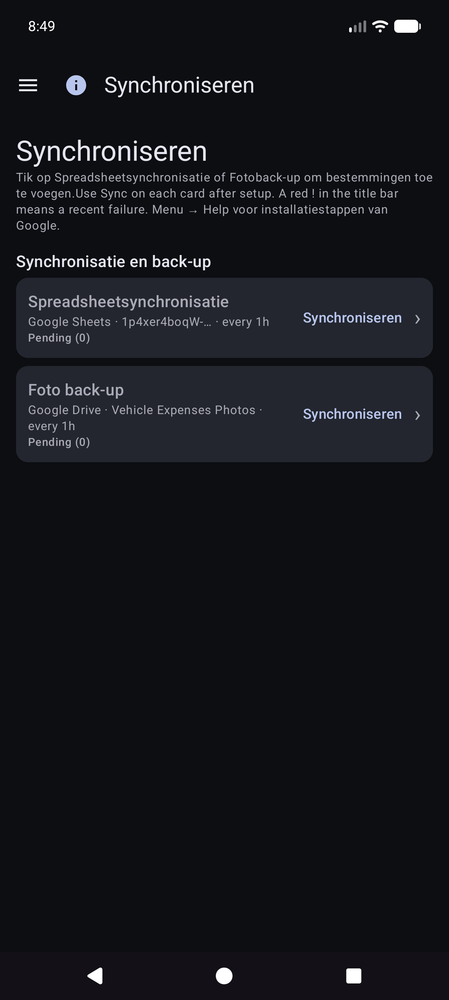

3. Kies **Google Spreadsheets**.

   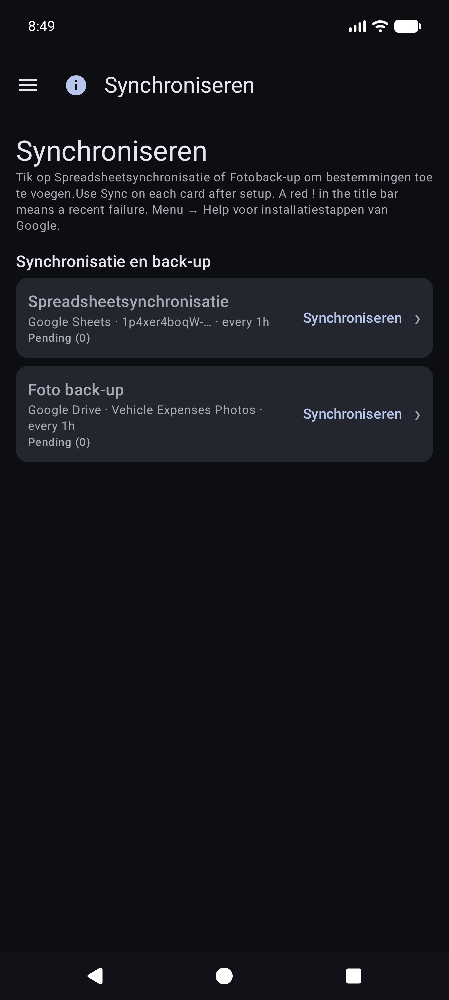

4. **Aanmelden met Google** → weergavenaam → **Blad-URL** of **🔍** bladeren/maken → planningsopties → inschakelen → opslaan.
5. **Nu synchroniseren** één keer om tabbladen te maken/bij te werken: `Voertuigen`, `Uitgaven`, `Brandstof - {voertuignaam}`.

### Voorbeeld: Google Drive toevoegen (foto's)

1. **Menu → Synchroniseren → Fotoback-up** (of Instellingen → Fotoback-up).

   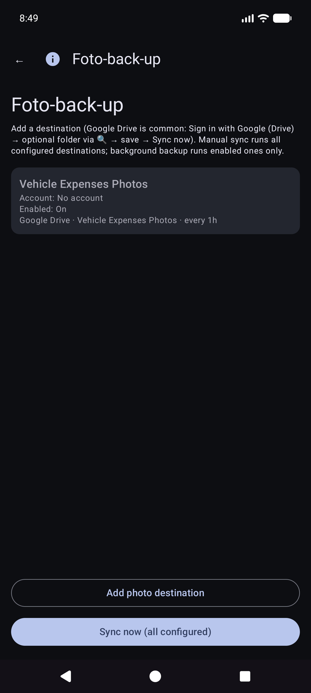

2. Tik op **Fotobestemming toevoegen**.

   

3. Kies **Google Drive**.

   

4. **Aanmelden met Google (Drive)** → optionele map-URL/bladeren → inschakelen → opslaan → **Nu synchroniseren**.

Handmatig **Nu synchroniseren** voor foto's is een volledige doorgang; back-up op de achtergrond verwerkt uploads die alleen in behandeling zijn doorgaans volgens een schema.

### Gedragsnotities synchroniseren

- Na de app-upgrade ziet u mogelijk kort **“Database bijwerken na upgrade...”** (lokale synchronisatie-ID-aanvulling).
- Als een synchronisatie wordt onderbroken, worden de volgende **succesvolle** synchronisaties opnieuw samengevoegd en worden externe tabbladen gerepareerd.
- Mislukkingen: rood overzicht op Kaarten synchroniseren + **!** in de app-balk.

---

## Snel tanken (brandstof)

Dit is het **startscherm** wanneer u de app opent.

### Voertuigselectie (meestal automatisch)

U hoeft **niet** eerst het voertuig te kiezen. Wanneer voor voertuigen **oriëntatiepunten** zijn ingesteld in Voertuigen beheren, detecteert Snel invullen **automatisch welk voertuig** op de dashboardafbeelding nadat u de kilometerteller hebt vastgelegd. U kunt indien nodig nog steeds de vervolgkeuzelijst **Voertuig** openen om deze te overschrijven.

### Richt op de kilometerteller

Blijf in de kilometertellermodus en kader het cluster in. Instructie: * Richt op de kilometerteller. Tik op de sluiter om vast te leggen.*

### Na de kilometertellersluiter

OCR vult **Odo** en probeert het voertuig te matchen op basis van oriëntatiepunten (bekijk beide indien nodig). De hoofdknop wordt **Opnieuw proberen** om opnieuw te schieten. Instructie vat de lezing samen.

### Pompmodus (kosten en volume)

1. Tik op **↕** om naar de pompmodus te schakelen: *Richt op het pompdisplay (kosten/volume). Tik op sluiter.*
2. Registreer de pomptotalen. Kosten- en volumevelden vullen; gebruik **↔** als ze worden verwisseld.
3. Tik indien nodig op valuta of **G/L** en vervolgens op **Opslaan** (schijf). Lege velden worden **gedeeltelijk gevuld** (nog steeds toegestaan).

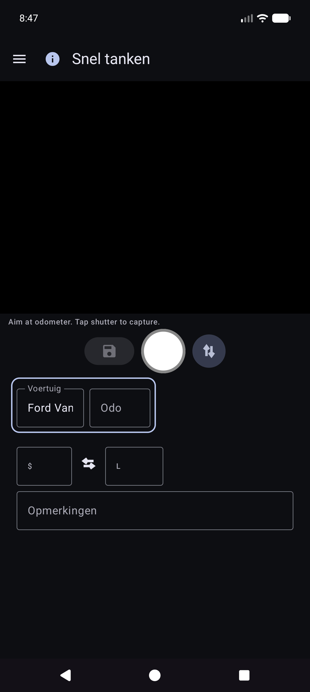

Je blijft op Quick Fill voor de volgende stop (velden worden gewist na opslaan). Werk volledig **offline**; synchronisatie wordt later op de achtergrond uitgevoerd indien geconfigureerd.

### Handmatige invoer (geen camera / slechte OCR)

1. Tik op **Odo**, **kosten** of **volume** en typ waarden (staand gebruikt het systeemtoetsenbord; liggend gebruikt een toetsenbord op het scherm).
2. Kies of bevestig het **Voertuig** als de automatische detectie niet is uitgevoerd.
3. Bewaar zoals hierboven.

### Modi en randen

- **Groene rand** rond voertuig+odo → kilometerteller vastleggen/bewerken.
- **Groene rand** rond kosten+volume → pompmodus.
- **Opslaan** blijft uitgeschakeld totdat een voertuig is geselecteerd en ten minste één van odo/kosten/volume gegevens heeft, en OCR niet nog steeds actief is.

Tip op het scherm (onder de instructieregel): *Sluiter = vastleggen · Schijf = opslaan · ↕ = odo/pompmodus · ↔ = kosten/volume omwisselen.*

---

## Kosten

### Nieuwe uitgave

Menu → **Nieuwe uitgave**.

1. **Opslaan** (schijf), **sluiter** (bonfoto) of **galerij** (kies afbeelding).
2. Vul **Datum**, **Voertuig**, **Verkoper**, **Beschrijving**, **Bedrag** (valutasymbool tikbaar), **Categorie**, optioneel **Kilometerteller** in.
3. Ontvangsten van meerdere pagina's: leg extra pagina's vast als de gebruikersinterface paging aanbiedt (pagina 0 is de primaire ontvangst).
4. **Opslaan** om op te slaan (eerst lokaal; fotoback-up en spreadsheetsynchronisatie gebeuren op de achtergrond indien geconfigureerd).

### Onkostenlijst

Menu → **Rapporten** → **Onkostenlijst** — blader door de niet-brandstofkosten; open een item om te bewerken.

### Onkosten bewerken

Open een rij uit de lijst. Correcte leverancier, bedrag, categorie, voertuig en beschrijving. Als de kassabon alleen in een fotoback-up staat (geen leesbaar lokaal bestand), gebruik dan **Afbeelding ophalen uit archief** wanneer deze wordt weergegeven (werkt op geconfigureerde fotobestemmingen).

---

## Begin reis

Menu → **Start rit** (na Quick Fill in de lade). Leg de kilometerteller vast of voer deze in, kies het rittype en sla op met het **schijf**-pictogram. **Stop** is een snelkoppeling voor Persoonlijk nu op de vastgehouden GPS-locatie. Gebruik **ⓘ** voor controleherinneringen.

Tripstarts worden opgeslagen als brandstofrijen met een **Triptype** (geen normale tankbeurten). Ze verschijnen onder **Rapporten → Ritmijlen**, niet onder Brandstofgeschiedenis.

---

## Rapporten

Menu → **Rapporten** opent de producthub (overzicht aller tijden + cataloguskaarten). Dit is het enige oppervlak met productrapporten; er is geen afzonderlijk lade-item 'Rapporten en grafieken'.

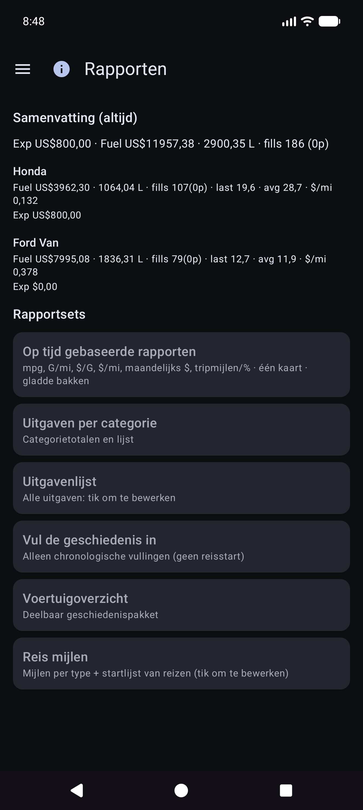

Open een kaart voor de voertuigmodus (**Alles / Elk / Enkel**), periodefilters, grafieken en delen (**TEKST / CSV / PDF**). Bovenste balk op rapport kinderen: **☰ + ←** (en **ⓘ** indien geregistreerd).

### Tijdgebaseerde rapporten

De hoofdkaartkaart. Optionele statistieken (mpg, volume/afstand zoals G/mi, eenheidsprijs zoals $/G, kosten/afstand, maandelijks $, ritmijlen, rit% per type) met **Vloeiende** bakken en **onafhankelijke Y-schalen** (economie links; geld- en reisfamilies aan de rechterkant).

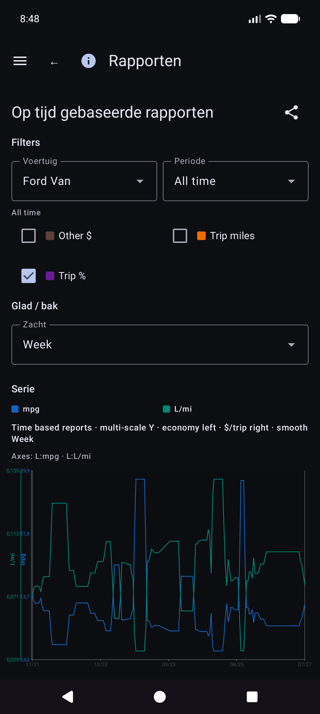

Details van economische wiskunde: [REPORTS_METRICS.md](referentie/REPORTS_METRICS.md).

### Vul geschiedenis versus brandstofgeschiedenis

- **Rapporten → Vulgeschiedenis** — chronologische vullingen voor de rapportfilters (**alleen vullingen**; er wordt geen reis gestart).

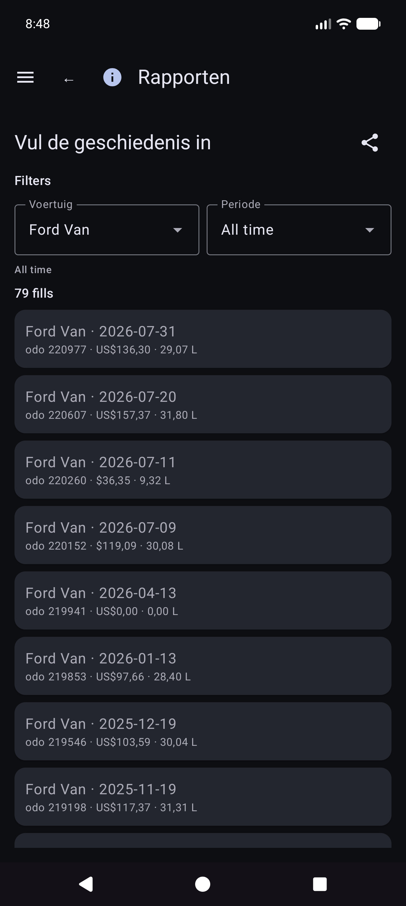

- **Brandstofgeschiedenis** (indien aanwezig in de navigatie van uw build) — vul de inventaris per voertuig, vult ook alleen; tik op een rij om te bewerken.

### Tripmijlen

**Rapporten → Ritmijlen** — mijlen per type, grafieken en een chronologische **reisstart-/segmentlijst**. Tik op een echt begin om **Opvulling bewerken** voor die rij te openen.

### Vulling bewerken

Open een tankbeurt vanuit Vulgeschiedenis, Brandstofgeschiedenis of Ritmijlen. Indeling: voertuig en kilometerteller, **valuta vóór kosten**, volume, aantekeningen. Het reistype wordt alleen weergegeven als de rij een reisbegin is. Locatie heeft een samenvatting plus **Locatiedetails**. Ontbrekende lokale foto met cloudidentiteit: **Afbeelding ophalen uit archief**.

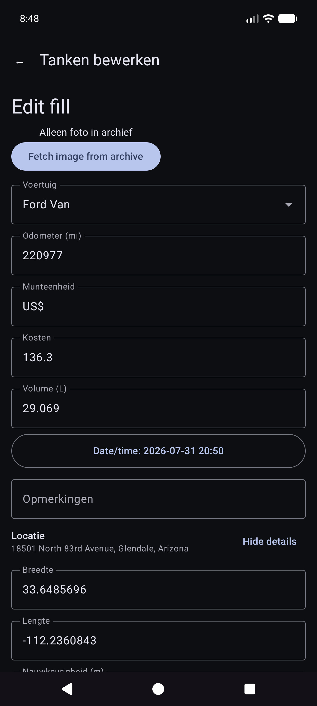

Andere cataloguskaarten omvatten uitgaven per categorie, voertuigoverzicht en uitgavenlijst.

Geld gebruikt de valuta van elke rij wanneer deze is ingesteld. Totalen voor gemengde valuta tonen **subtotalen per valuta** (geen stille valutaconversie).

---

## Synchroniseren

Menu → **Synchroniseren** is de hub voor spreadsheet- en fotobestemmingen (niet alleen verborgen onder Instellingen).

- Kaarten voor **Spreadsheetsynchronisatie** en **Fotoback-up** met korte status, **Synchronisatie** voor dat soort, en **›** in de bestemmingslijst.
- Open een bestemming voor **Testverbinding** en **Synchroniseer nu (deze bestemming)** / allemaal geconfigureerd.
- Fout **Details** en de rode **!** in de titelbalk komen hier terecht.
- Stapsgewijze installatie van Google Spreadsheets en Drive: [Back-ups en synchronisatie van meerdere apparaten] (#backups-and-multi-device-sync).

---

## Instellingen (lokale voorkeuren)

Menu → **Instellingen**.

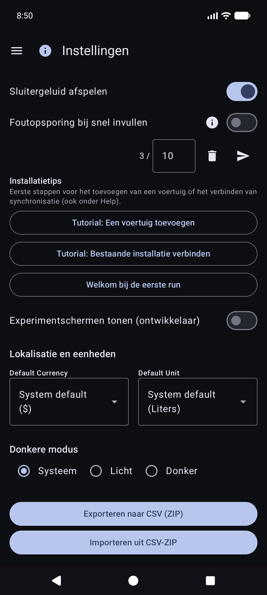

Voor bestemmingen geeft u de voorkeur aan **Menu → Synchroniseren**. Instellingen tonen mogelijk nog steeds samenvattingsrijen die dezelfde lijsten openen.

### Lokale voorkeuren (algemeen)

- **Foto's van brandstofbonnen opslaan** / **Onkostenfoto's lokaal opslaan** — bewaar afbeeldingen op het apparaat (kan om toestemming voor foto's vragen).
- **Speel sluitergeluid af**
- **Valuta** / **Volume-eenheid** — standaardinstellingen van de app (systeem of expliciet). Het wijzigen van de volume-eenheid met bestaande brandstofgegevens kan een conversiedialoog bieden.
- **Donkere modus**
- **Installatietips** — heropen eerst zelfstudies over voertuigen/synchronisatie.
- **Debug Quick Fill** / **Experimentschermen weergeven (dev)** — geavanceerd; laat staan ​​voor dagelijks gebruik. Experimentschermen worden hier niet gedocumenteerd.

CSV **exporteren/importeren** (ZIP van tabbladen Voertuigen / Uitgaven / Brandstof) is beschikbaar via Instellingen wanneer dit wordt aangeboden door de huidige build.

---

## Hulp en informatie

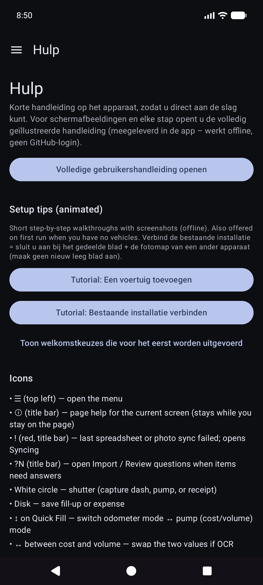

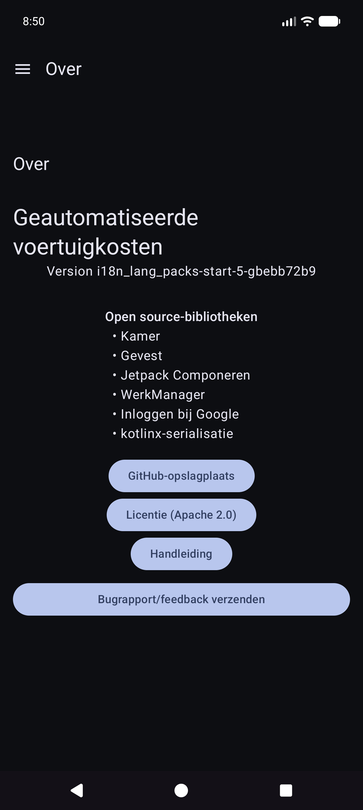

- **Help** — snelle start op het apparaat, installatiehandleidingen, link naar deze handleiding, index voor zelfhostinstallatie.
- **Over** — versie, licenties, GitHub, deze handleiding (offline gebundeld + online HTML indien gepubliceerd).

---

## Gerelateerde documenten

- [USER_GUIDE.md](referentie/USER_GUIDE.md) — verkorte referentie
- [self-host/INDEX.md](referentie/self-host/INDEX.md) — zelf-gehoste foto/tabelconfiguratie
- [SYNC_BEHAVIOR.md](referentie/SYNC_BEHAVIOR.md) — samenvoegen, herstellen, duplicaten
- [REPORTS_METRICS.md](referentie/REPORTS_METRICS.md) — detail van de economische statistieken