# Wydatki pojazdu zautomatyzowane — instrukcja obsługi

> **Edytuj źródło (Markdown).** Przeglądarki i czytnik w aplikacji otwierają **renderowany kod HTML**:
> - Sieć: [`docs/user-manual.html`](user-manual.html) (regeneruj za pomocą `./scripts/render-user-manual.sh`)
> - Aplikacja: Pomoc / Informacje → pełna instrukcja (w pakiecie HTML + zrzuty ekranu)
>
> Nie kieruj użytkowników końcowych do nieprzetworzonych adresów URL w formacie `.md` — przeglądarki wyświetlają tylko zwykły tekst.

Śledzenie za pomocą kamery tankowań paliwa i wydatków na pojazd, z opcjonalną synchronizacją wielu urządzeń i tworzeniem kopii zapasowych w ramach **twoich** kont w chmurze.

To jest **pełna instrukcja** (zrzuty ekranu + każdy krok). W telefonie **Menu → Pomoc** to krótszy przewodnik wprowadzający.

**Nie ujęte tutaj:** Importuj stare zdjęcia, eksperyment z wyrównaniem i eksperyment z pompą (narzędzia programistyczne / zaawansowane).

---

## Spis treści

1. [Czego potrzebujesz](#czego-potrzebujesz)
2. [Ikony w skrócie](#icons-at-a-glance)
3. [Otwórz menu](#open-the-menu)
4. [Konfiguracja po raz pierwszy: Zarządzaj pojazdami](#first-time-setup-manage-vehicles)
5. [Kopie zapasowe i synchronizacja wielu urządzeń](#backups-and-multi-device-sync)
6. [Szybkie tankowanie (paliwo)](#szybkie tankowanie-paliwo)
7. [Rozpocznij podróż](#start-podróż)
8. [Wydatki](#wydatki)
9. [Raporty](#raporty)
10. [Ustawienia (preferencje lokalne)](#settings-local-preferences)
11. [Synchronizacja](#synchronizacja)
12. [Pomoc i informacje](#help--about)
13. [Powiązane dokumenty](#lated-docs)

---

## Czego potrzebujesz

- Telefon lub tablet z Androidem.
- Aby uzyskać najlepszy OCR: wyraźny widok **licznika przebiegu na desce rozdzielczej** i **sumy pomp** (lub wpisz liczby ręcznie).
- Opcjonalnie: konta **kontrolowane** na potrzeby danych z arkuszy kalkulacyjnych i/lub tworzenia kopii zapasowych zdjęć (zobacz [Kopie zapasowe i synchronizacja wielu urządzeń](#backups-and-multi-device-sync)).

---

## Ikony w skrócie

Pojawiają się one na ekranach głównych. Znajomość ich oszczędza wiele polowań.

| Gdzie | Ikona / kontrola | Co to robi |
|-------|----------------|----------------------------|
| Górny pasek | **☰ Menu** (hamburger) | Otwiera szufladę nawigacji |
| Górny pasek | **ⓘ** (pomoc strony) | Krótka pomoc dla **bieżącej** strony (obok menu, jeśli jest dostępne) |
| Górny pasek | **`?N`** (żółty) | Oczekujące pytania dotyczące przeglądu importu — otwiera Przegląd importu |
| Górny pasek | **!** (czerwony) | Ostatnio nie powiodło się miejsce docelowe arkusza kalkulacyjnego lub zdjęcia — otwórz **Synchronizacja**, aby naprawić |
| Górny pasek | **☰ + ←** | Raportuj listę dzieci i wydatków, wyświetlając jednocześnie **menu i tył**; Centrum raportów jest dostępne tylko w menu |
| Ustawienia / edycja paliwa | **←** | Wstecz (ustawienia arkusza kalkulacyjnego/edycji zdjęć i paliwa pozostają skupione na tle) |
| Szybkie wypełnienie | **Białe kółko** (migawka) | Przechwytywanie licznika przebiegu lub wyświetlacza pompy dla OCR |
| Szybkie wypełnienie | **Dysk / Zapisz** | Zaoszczędź na tankowaniu (potrzebuje pojazdu i co najmniej jednego odo / objętości / kosztu) |
| Szybkie wypełnienie | **↕ strzałki** (przełącznik trybu) | Przełącz **tryb licznika kilometrów** vs **tryb pompy (koszt/objętość)**. Zielona ramka podświetla aktywną grupę pól |
| Szybkie wypełnienie | **↔ strzałki** (pomiędzy kosztem a wolumenem) | Zamień koszt i wolumen, jeśli OCR umieści je w niewłaściwych polach |
| Szybkie wypełnienie | **Powiększenie 1x / …** | Współczynniki zoomu aparatu, gdy obiektyw je obsługuje |
| Szybkie wypełnienie (po przechwyceniu) | **Odśwież** na głównym przycisku | Odrzuć podgląd i wróć do kamery na żywo |
| Szybkie wypełnianie (podczas przetwarzania) | **X** na głównym przycisku | Anuluj trwające przechwytywanie/OCR |
| Wydatek | **Zapisz** | Oszczędzaj wydatki |
| Wydatek | **Koło migawki** | Zrób zdjęcie paragonu |
| Wydatek | **Galeria** | Wybierz obraz paragonu z biblioteki |
| Wydatek | **Powtórz** | Usuń bieżące zdjęcie paragonu i zrób zdjęcie ponownie |
| Wydatki / Zarządzaj pojazdami | **+ / −** FAB-y | Powiększ podgląd zdjęcia |
| Okno dialogowe punktów orientacyjnych | **Edytuj OCR** ​​| Popraw lub dodaj charakterystyczny tekst, który przeoczyły silniki |
| Arkusz kalkulacyjny / formularze fotograficzne | **🔍 Szukaj** | Przeglądaj Dysk Google w poszukiwaniu arkusza lub folderu (po zalogowaniu) |

Symbole walut w polach kosztu i **G/L** w polach wolumenu można dotknąć: otwórz małe menu, aby zmienić walutę lub galony na litry dla tego wpisu.

---

## Otwórz menu

1. Stuknij **☰** w lewym górnym rogu.
2. Wybierz stronę.

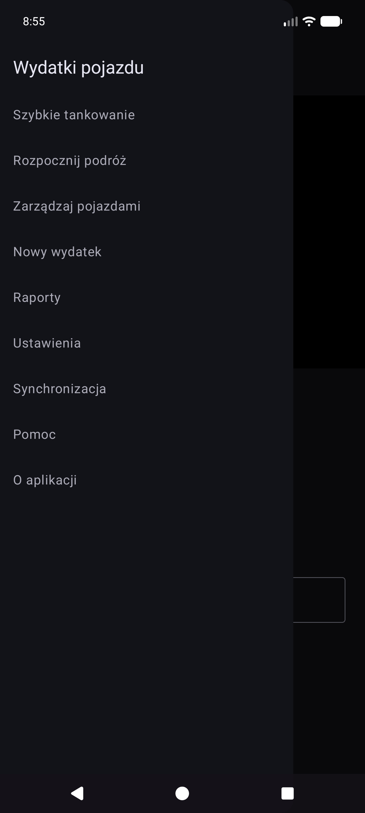

**Główna szuflada:** Szybkie uzupełnianie · Rozpocznij podróż · Zarządzaj pojazdami · Nowy wydatek · **Raporty** · Ustawienia · Synchronizacja · Pomoc · Informacje.

**Szuflada eksperymentów** (Ustawienia → Pokaż ekrany eksperymentów): Eksperyment z wyrównaniem · Eksperyment z pompą · **Importuj stare zdjęcia**.

**Za pośrednictwem centrum raportów (nie głównej szuflady):** Lista wydatków · Historia wypełnień.

---

## Pierwsza konfiguracja: Zarządzaj pojazdami

OCR i **automatyczne dopasowywanie pojazdów** działają najlepiej po zarejestrowaniu każdego pojazdu za pomocą **referencyjnego zdjęcia deski rozdzielczej**, przycięciu licznika przebiegu i uruchomieniu **Discovery**, aby aplikacja zapisała charakterystyczny tekst dla tego myślnika. (Sposób wybierania i dopasowywania punktów orientacyjnych zostanie szczegółowo udokumentowany w późniejszej aktualizacji.)

### Otwórz opcję Zarządzaj pojazdami

Menu → **Zarządzaj pojazdami**. Wybierz pojazd (lub **Dodaj nowy pojazd**).

### Dodaj lub edytuj pojazd

1. Otwórz menu rozwijane **Pojazd** → wybierz pojazd lub **Dodaj nowy pojazd**.
2. Zrób lub wybierz wyraźne **referencyjne zdjęcie deski rozdzielczej** (pełny zestaw wskaźników, dobrze oświetlony, telefon mniej więcej ustawiony prosto). Użyj **Zrób zdjęcie** lub **Galeria**.
3. Narysuj uprawy:
   - **Odo Crop** — prostokąt ściśle otaczający cyfry licznika kilometrów (przycisk pokazuje **Gotowe Odo**, gdy ten tryb jest aktywny).
   - **Ignore Crop** — opcjonalny region do zignorowania (zegar, radio itp.).
   - **Edytuj uprawy** — dostosuj istniejące prostokąty.
4. Kliknij **Uruchom Discovery** — wielosilnikowy OCR znajduje charakterystyczne słowa poza uprawami.
5. Recenzja z opcją **Pokaż punkty orientacyjne**. Użyj opcji **Edytuj OCR**, aby naprawić błędy odczytane lub **dodać** pominięty tekst.
6. Wypełnij **Nazwa pojazdu** (wymagane) oraz markę/model/rok/tablicę rejestracyjną, według własnego uznania.
7. Kliknij **Utwórz pojazd** lub **Zapisz zmiany** (wymagana nazwa i zdjęcie referencyjne dla nowego pojazdu).

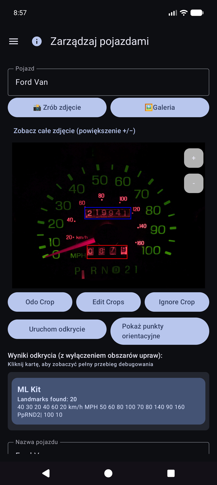

### Zabytki: napraw to, co przeoczyło Discovery

Po **Pokaż punkty orientacyjne** przewiń listę i popraw wartości. Silnikom czasami brakuje małych cyfr (na przykład zegara **60** w prawym dolnym rogu zestawu wskaźników). Użyj **Edytuj OCR**, aby je dodać lub naprawić, aby tożsamość pojazdu pozostała niezawodna.

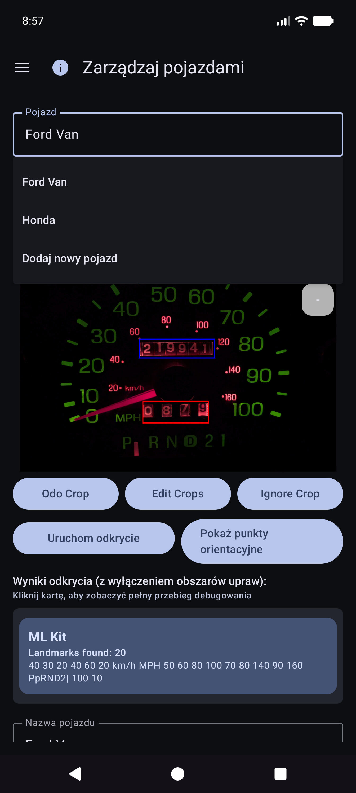

### Pisanie bez idealnego zdjęcia

Nadal możesz korzystać z aplikacji, wybierając pojazd i **wpisując** licznik przebiegu, objętość i koszt w Szybkim wypełnieniu — OCR jest opcjonalny w przypadku każdego pola. Import galerii działa w przypadku zdjęcia referencyjnego, jeśli nie chcesz robić zdjęć w aplikacji.

**Wskazówka:** po zsynchronizowaniu arkusza kalkulacyjnego definicje pojazdów (uprawy, punkty orientacyjne) znajdują się w lokalnej bazie danych — nie musisz ponownie otwierać opcji Zarządzaj pojazdami w celu szybkiego wypełnienia, aby z nich skorzystać.

---

## Kopie zapasowe i synchronizacja wielu urządzeń

Aplikacja została stworzona w taki sposób, aby **kilka telefonów lub tabletów mogło współużytkować te same dane floty** i abyś mógł zachować **kopię swoich danych i zdjęć poza urządzeniem**. Odbywa się to za pomocą miejsc docelowych **które** konfigurujesz w ramach **swoich** kont lub **swoich** serwerów hostowanych samodzielnie — a nie prowadzonej przez firmę „chmurze wydatków na pojazdy”, którą widzą inne osoby.

### Co dokąd biegnie

| Miły | Co przechowuje | Typowe zastosowanie |
|------|----------------|------------|
| **Synchronizacja arkusza kalkulacyjnego/tabelarycznego** | Pojazdy, tankowania, wydatki (wiersze i zakładki) | Scalanie wielu urządzeń + uporządkowana kopia zapasowa |
| **Kopia zapasowa zdjęć** | Obrazy binarne (kreska/pompa/paragon/zdjęcia referencyjne) | Kopia zapasowa zdjęć + przywracanie brakujących plików |

Możesz skonfigurować **wiele miejsc docelowych** każdego rodzaju (miękki limit na typ). Ręczni pracownicy **Synchronizuj teraz** i **w tle** uruchamiają włączone.

### Najpierw offline

- **Do dodania uzupełnienia, wydatku lub rachunku nie jest wymagana żadna sieć**. Wszystko jest zapisywane **najpierw lokalnie**.
- Gdy sieć jest dostępna, synchronizacja i tworzenie kopii zapasowych zdjęć działają jako **zadania w tle** (zgodnie z ustawionym harmonogramem i po dotknięciu **Synchronizuj teraz**). Błędy są wyświetlane jako czerwony tekst w wierszach Ustawienia i **!** na pasku tytułu aplikacji.

### Tylko Twoje konta

Logowanie i tokeny pozostają na urządzeniu dla wybranych dostawców (Google, Microsoft, klucze S3, własne adresy URL itp.). Miejsca docelowe znajdują się pod **pełną kontrolą użytkownika** — Twoim kontem Google, Twoim OneDrive, Twoim wiadra MinIO, Twoim hostem EtherCalc itp. Nic nie jest udostępniane innym użytkownikom wydatków na pojazdy poprzez współdzielony backend.

### Obsługiwane cele — dane (arkusz kalkulacyjny / tabela)

Skonfigurowane w **Menu → Synchronizacja → Synchronizacja arkusza kalkulacyjnego** (dostępne również z wierszy podsumowania Ustawień). Opcje pickera najwyższej klasy:

| Cel | Notatki |
|------------|------------|
| **Arkusze Google** | Wspólne ustawienie domyślne; zakładki Pojazdy, Wydatki i paliwo na pojazd |
| **Excel** | Skoroszyt Microsoft za pośrednictwem powiązania w stylu Graph/OneDrive |
| **EtherCalc** | Własne pokoje do współpracy z arkuszami kalkulacyjnymi |
| **Inne →** zaimplementowane backendy | **Baserow**, **NocoDB**, **Airtable**, **PocketBase**, **Supabase**, **Firebase**, **Arkusz Zoho** |

Odroczone / jeszcze nie wdrożone (wymienione w sekcji Inne, ale nie w pełni wdrożone): OnlyOffice, Collabora. Zobacz także [indeks samodzielnego hostowania] (reference/self-host/INDEX.md).

CSV **eksport/import** (ZIP o tym samym układzie zakładek) jest dostępny w Ustawieniach jako przenośna kopia zapasowa, niezależna od synchronizacji na żywo.

### Obsługiwane cele — zdjęcia (kopia zapasowa obrazu)

Skonfigurowane w **Menu → Synchronizacja → Kopia zapasowa zdjęć** (również z wierszy podsumowania Ustawień):

| Cel | Notatki |
|------------|------------|
| **Dysk Google** | Wybrany folder (przejrzyj lub wklej adres URL) |
| **OneDrive** | Konto Microsoft + prefiks ścieżki |
| **S3** | AWS, Wasabi, Cloudflare R2, MinIO i inne punkty końcowe kompatybilne z S3 |
| **Inne** | pamięć masowa wspierana przez rclone (np. WebDAV, SFTP i inne wybrane piloty dostępne w selektorze w aplikacji) |

Skonfiguruj ściągawki dla hostowanych samodzielnie zdjęć i celów tabelarycznych: [indeks samodzielnego hostowania](referencja/self-host/INDEX.md).

### Zachowanie na wielu urządzeniach (krótkie)

- Wiersze łączą się według **ID synchronizacji** z **wygranymi ostatniego zapisu** na **zaktualizowanych** znacznikach czasu.
- Usunięcia są miękkie; nowsza edycja na innym urządzeniu może przywrócić wiersz.
- Dwukrotne wprowadzenie **tego samego wypełnienia** na dwóch urządzeniach powoduje utworzenie **dwóch wierszy** — jeśli zauważysz, usuń dodatek.
- Więcej szczegółów: [Notatki dotyczące zachowania synchronizacji](#sync-behaviour-notes) i [SYNC_BEHAVIOR.md](reference/SYNC_BEHAVIOR.md).

### Przykład: dodaj Arkusze Google (dane)

1. **Menu → Synchronizacja → Synchronizacja arkusza kalkulacyjnego** (lub Ustawienia → Synchronizacja arkusza kalkulacyjnego).

   

2. Stuknij **Dodaj miejsce docelowe arkusza kalkulacyjnego**.

   

3. Wybierz **Arkusze Google**.

   

4. **Zaloguj się przez Google** → nazwa wyświetlana → **URL arkusza** lub **🔍** przeglądaj/utwórz → opcje harmonogramu → włącz → zapisz.
5. **Zsynchronizuj teraz** raz, aby utworzyć/zaktualizować zakładki: `Pojazdy`, `Wydatki`, `Paliwo - {nazwa pojazdu}`.

### Przykład: dodaj Dysk Google (zdjęcia)

1. **Menu → Synchronizacja → Kopia zapasowa zdjęć** (lub Ustawienia → Kopia zapasowa zdjęć).

   

2. Stuknij **Dodaj miejsce docelowe zdjęcia**.

   

3. Wybierz **Dysk Google**.

   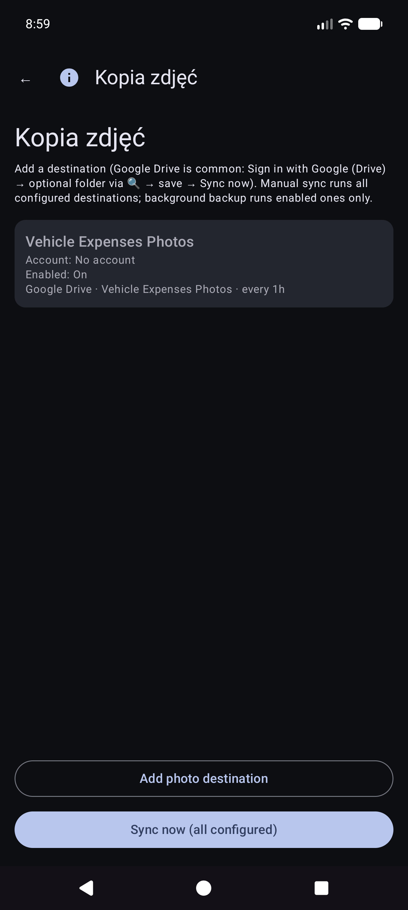

4. **Zaloguj się za pomocą Google (Dysk)** → opcjonalny adres URL folderu/przeglądaj → włącz → zapisz → **Synchronizuj teraz**.

Ręczna **Synchronizacja teraz** zdjęć jest pełna; kopia zapasowa w tle zazwyczaj przetwarza **tylko oczekujące** przesyłanie zgodnie z harmonogramem.

### Synchronizuj notatki dotyczące zachowania

- Po aktualizacji aplikacji może pojawić się na krótko komunikat **„Aktualizacja bazy danych po aktualizacji…”** (uzupełnianie lokalnego identyfikatora synchronizacji).
- Jeśli synchronizacja zostanie przerwana, następna **udana** synchronizacja ponownie połączy i naprawi zdalne karty.
- Awarie: czerwone podsumowanie na kartach Synchronizacji + ***!** na pasku aplikacji.

---

## Szybkie tankowanie (paliwo)

To jest **ekran główny** po otwarciu aplikacji.

### Wybór pojazdu (zwykle automatyczny)

**Nie** musisz najpierw wybierać pojazd. Gdy pojazdy mają skonfigurowane **punkty orientacyjne** w Zarządzaj pojazdami, funkcja Szybkie wypełnianie **automatycznie wykrywa, który pojazd** na podstawie obrazu tablicy rozdzielczej po zarejestrowaniu licznika przebiegu. W razie potrzeby możesz nadal otworzyć menu rozwijane **Pojazd**, aby je zastąpić.

### Wyceluj w licznik kilometrów

Pozostań w trybie licznika kilometrów i wykadruj klaster. Instrukcja: * Celuj w licznik kilometrów. Kliknij migawkę, aby uchwycić.*

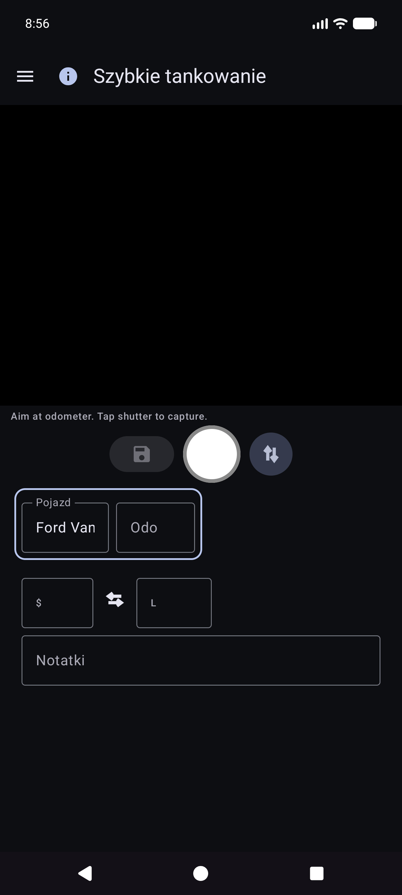

### Za migawką licznika kilometrów

OCR wypełnia **Odo** i próbuje dopasować pojazd na podstawie punktów orientacyjnych (w razie potrzeby przejrzyj oba). Główny przycisk zmieni się na **Ponów próbę**, aby ponownie wykonać zdjęcie. Instrukcja podsumowuje lekturę.

### Tryb pompy (koszt i objętość)

1. Naciśnij **↕**, aby przejść do trybu pompy: *Celuj na wyświetlacz pompy (koszt/objętość). Kliknij migawkę.*
2. Zbierz sumy pomp. Wypełnienie pól kosztu i wolumenu; użyj **↔**, jeśli są zamienione.
3. W razie potrzeby dotknij waluty lub **G/L**, a następnie **Zapisz** (dysk). Puste pola powodują **częściowe wypełnienie** (nadal dozwolone).

Pozostaniesz na opcji Szybkie wypełnianie do następnego przystanku (pola zostaną usunięte po zapisaniu). Pracuj w pełni **offline**; synchronizacja będzie działać później w tle, jeśli zostanie skonfigurowana.

### Wpis ręczny (brak kamery / zły OCR)

1. Stuknij **Odo**, **koszt** lub **objętość** i wpisz wartości (w trybie pionowym używana jest klawiatura systemowa; pozioma korzysta z klawiatury ekranowej).
2. Wybierz lub potwierdź **Pojazd**, jeśli automatyczne wykrywanie nie zostało uruchomione.
3. Zapisz jak wyżej.

### Tryby i granice

- **Zielona ramka** wokół pojazdu+odo → przechwytywanie/edycja licznika przebiegu.
- **Zielona ramka** wokół kosztu+objętości → trybu pompy.
- **Zapisywanie** pozostaje wyłączone do czasu wybrania pojazdu i co najmniej jednego z danych/kosztu/objętości zawiera dane, a OCR nie jest nadal uruchomiony.

Wskazówka ekranowa (poniżej linii instrukcji): *Migawka = przechwytywanie · Dysk = zapisywanie · ↕ = tryb odo/pompy · ↔ = koszt wymiany/objętość.*

---

## Wydatki

### Nowy wydatek

Menu → **Nowy wydatek**.

1. **Zapisz** (dysk), **migawka** (zdjęcie paragonu) lub **galeria** (wybierz obraz).
2. Wypełnij **Data**, **Pojazd**, **Sprzedawca**, **Opis**, **Kwota** (możliwość dotknięcia symbolu waluty), **Kategoria**, opcjonalnie **Przebieg**.
3. Paragony wielostronicowe: przechwytuj dodatkowe strony, jeśli interfejs użytkownika oferuje stronicowanie (strona 0 to paragon podstawowy).
4. **Zapisz** w sklepie (najpierw lokalnie; kopie zapasowe zdjęć i synchronizacja arkuszy kalkulacyjnych odbywają się w tle, jeśli są skonfigurowane).

### Lista wydatków

Menu → **Raporty** → **Lista wydatków** — przeglądaj dotychczasowe wydatki pozapaliwowe; otwórz element do edycji.

### Edytuj wydatek

Otwórz wiersz z listy. Popraw dostawcę, kwotę, kategorię, pojazd i opis. Jeśli paragon znajduje się tylko w kopii zapasowej zdjęcia (nie ma czytelnego pliku lokalnego), po wyświetleniu użyj opcji **Pobierz obraz z archiwum** (działa we wszystkich skonfigurowanych lokalizacjach docelowych zdjęć).

---

## Rozpocznij podróż

Menu → **Rozpocznij podróż** (po wejściu do szuflady Szybkie wypełnienie). Przechwytuj lub wprowadź licznik przebiegu, wybierz typ podróży, zapisz za pomocą ikony **dysku**. **Stop** to skrót do Osobistego znajdujący się teraz w zatrzymanej lokalizacji GPS. Użyj **ⓘ**, aby wyświetlić przypomnienia o kontroli.

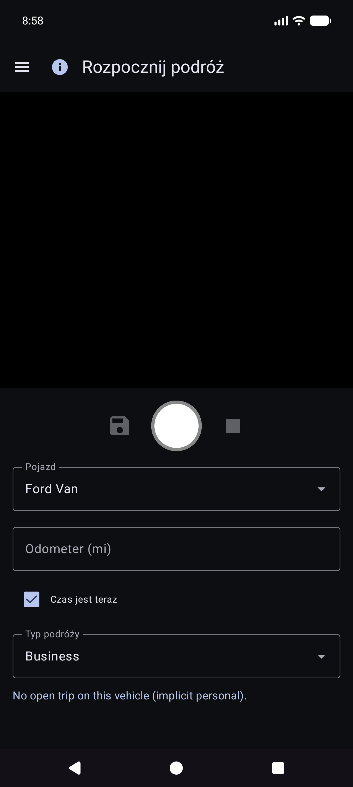

Rozpoczęcie podróży jest zapisywane jako wiersze paliwa z **Typem podróży** (nie normalne tankowania). Pojawiają się one w obszarze **Raporty → Mile podróży**, a nie w Historii paliwa.

---

## Raporty

Menu → **Raporty** otwiera centrum produktów (podsumowanie wszechczasów + karty katalogowe). Jest to jedyna powierzchnia raportów o produktach — nie ma osobnej pozycji w szufladzie „Raporty i wykresy”.

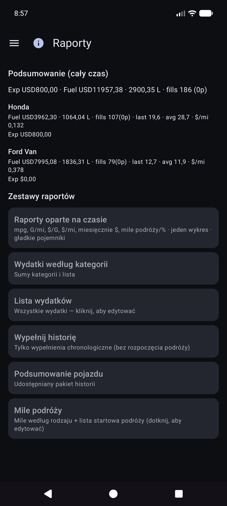

Otwórz kartę trybu pojazdu (**Wszystkie / Każdy / Pojedynczy**), filtrów okresowych, wykresów i udostępniania (**TEKST / CSV / PDF**). Górny pasek na raportach podrzędnych: **☰ + ←** (oraz **ⓘ** po zarejestrowaniu).

### Raporty oparte na czasie

Główna karta wykresu. Opcjonalne wskaźniki (mpg, objętość/odległość, np. G/mi, cena jednostkowa, np. $/G, koszt/odległość, miesięczne $, mile podróży, % podróży według rodzaju) z **gładkimi** pojemnikami i **niezależnymi skalami Y** (po lewej stronie ekonomicznej, po prawej rodziny pieniędzy i podróży).

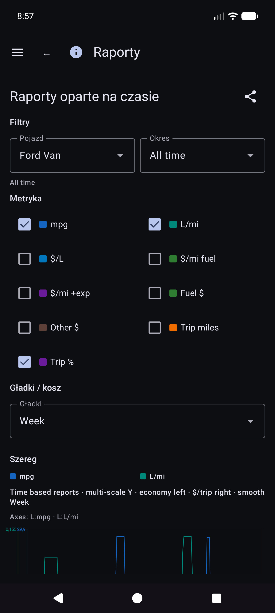

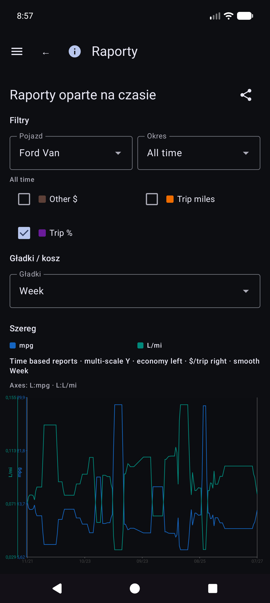

Szczegóły matematyki ekonomicznej: [REPORTS_METRICS.md](reference/REPORTS_METRICS.md).

### Historia napełnienia a historia paliwa

- **Raporty → Historia wypełnień** — chronologiczne wypełnienia filtrów raportów (**tylko wypełnienia**; brak startów podróży).

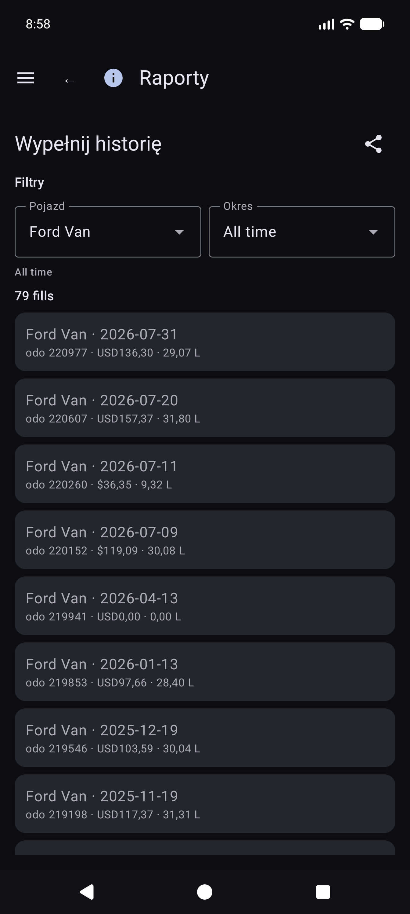

- **Historia paliwa** (jeśli jest dostępna w nawigacji Twojej kompilacji) — inwentaryzacja napełnienia według pojazdu, również tylko napełnienia; dotknij wiersza, który chcesz edytować.

### Mile podróży

**Raporty → Mile podróży** – mile według rodzaju, wykresy i chronologiczna **lista początków/odcinków podróży**. Kliknij prawdziwy początek, aby otworzyć **Edytuj wypełnienie** dla tego wiersza.

### Edytuj wypełnienie

W Historii wypełnień, Historii paliwa lub Mile podróży otwórz wypełnienie. Układ: pojazd i licznik kilometrów, **waluta przed kosztami**, objętość, notatki. Typ podróży pojawia się tylko wtedy, gdy wiersz jest początkiem podróży. Lokalizacja zawiera podsumowanie oraz **Szczegóły lokalizacji**. Brakuje lokalnego zdjęcia z tożsamością w chmurze: **Pobierz obraz z archiwum**.

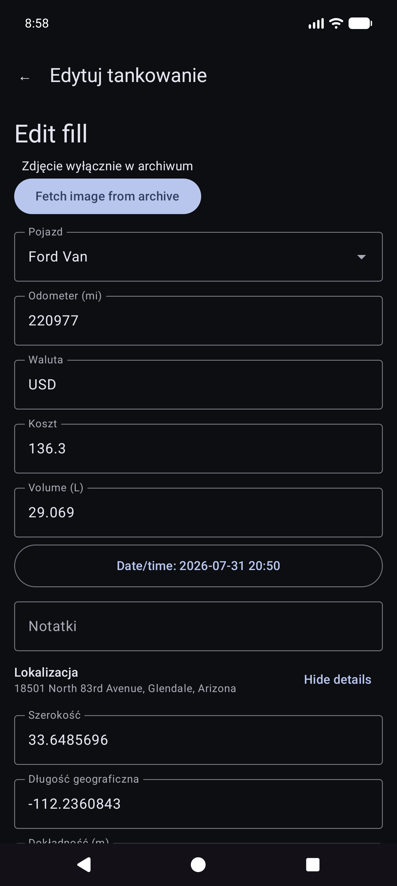

Inne karty katalogowe obejmują wydatki według kategorii, podsumowanie pojazdu i listę wydatków.

Jeśli opcja Money jest ustawiona, używana jest waluta każdego wiersza. Sumy w walutach mieszanych pokazują **sumy częściowe dla poszczególnych walut** (bez cichego przeliczania walut).

---

## Synchronizacja

Menu → **Synchronizacja** to centrum miejsc docelowych arkuszy kalkulacyjnych i zdjęć (nie tylko ukryte w Ustawieniach).

- Karty do **Synchronizacji arkusza kalkulacyjnego** i **Kopia zapasowa zdjęć** ze statusem krótkim, **Synchronizacja** dla tego rodzaju i **›** do listy miejsc docelowych.
- Otwórz miejsce docelowe dla **Połączenia testowego** i **Synchronizuj teraz (to miejsce docelowe)** / wszystko skonfigurowane.
- Awaria **Szczegóły** i czerwone **!** na pasku tytułu lądują tutaj.
- Szczegółowa konfiguracja Arkuszy Google i Dysku Google: [Kopie zapasowe i synchronizacja wielu urządzeń](#backups-and-multi-device-sync).

---

## Ustawienia (preferencje lokalne)

Menu → **Ustawienia**.

W przypadku miejsc docelowych wybierz **Menu → Synchronizacja**. Ustawienia mogą nadal wyświetlać wiersze podsumowań otwierające te same listy.

### Lokalne preferencje (wspólne)

- **Zapisuj zdjęcia rachunków za paliwo** / **Zapisuj zdjęcia wydatków lokalnie** — przechowuj zdjęcia na urządzeniu (może poprosić o pozwolenie na Zdjęcia).
- **Odtwórz dźwięk migawki**
- **Waluta** / **Jednostka objętości** — domyślne ustawienia aplikacji (systemowe lub jawne). Zmiana jednostki objętości przy użyciu istniejących danych dotyczących paliwa może spowodować wyświetlenie okna dialogowego konwersji.
- **Tryb ciemny**
- **Wskazówki dotyczące konfiguracji** — ponownie otwórz samouczki dotyczące pierwszego uruchomienia pojazdu/synchronizacji.
- **Debuguj szybkie wypełnianie** / **Pokaż ekrany eksperymentów (dev)** – zaawansowane; pozostawić do codziennego użytku. Ekrany eksperymentów nie są tutaj udokumentowane.

CSV **eksport/import** (kod pocztowy pojazdów / wydatków / zakładek paliwa) jest dostępny w Ustawieniach, jeśli jest dostępny w bieżącej wersji.

---

## Pomoc i informacje

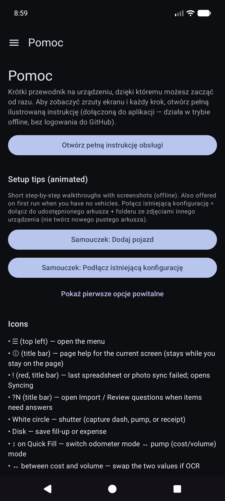

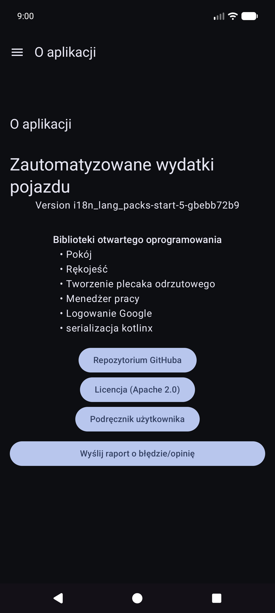

- **Pomoc** — szybki start na urządzeniu, samouczki dotyczące konfiguracji, łącze do tej instrukcji, indeks konfiguracji samodzielnego hosta.
- **O** — wersja, licencje, GitHub, ten podręcznik (w pakiecie offline + HTML online po opublikowaniu).

---

## Powiązane dokumenty

- [USER_GUIDE.md](reference/USER_GUIDE.md) — skrócone odwołanie
- [self-host/INDEX.md](reference/self-host/INDEX.md) — konfiguracja zdjęć/tabeli na własnym serwerze
- [SYNC_BEHAVIOR.md](reference/SYNC_BEHAVIOR.md) — scalanie, odzyskiwanie, duplikaty
- [REPORTS_METRICS.md](reference/REPORTS_METRICS.md) — szczegóły wskaźników ekonomicznych