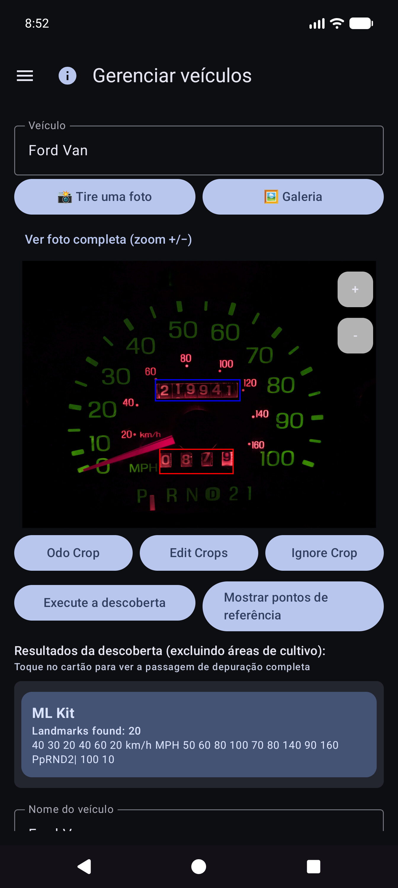
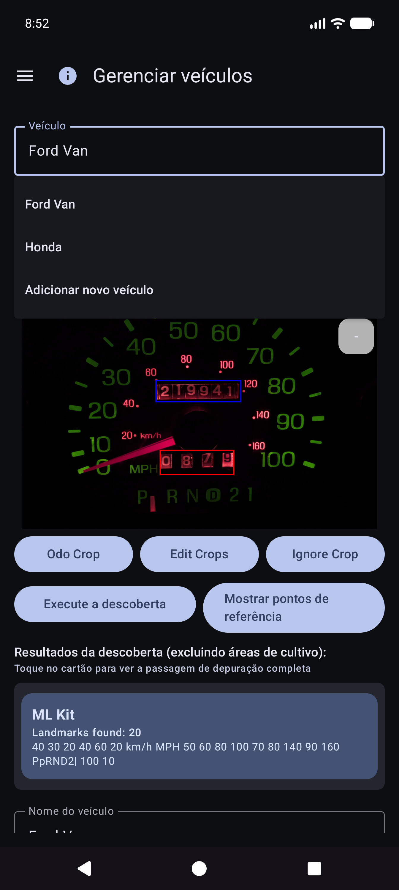
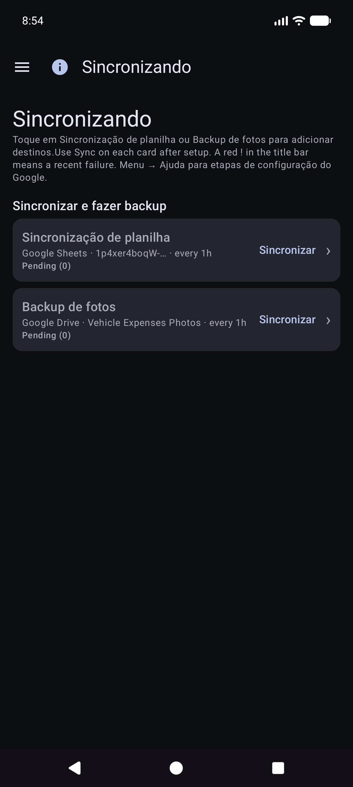
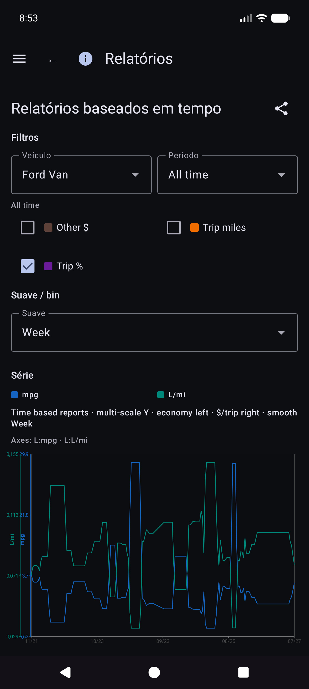
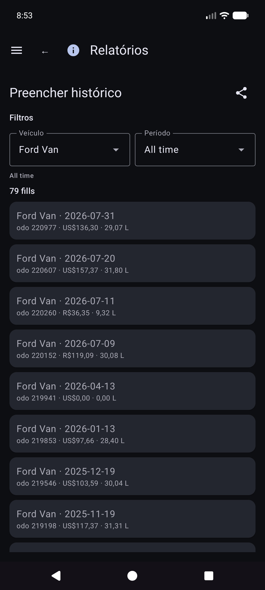
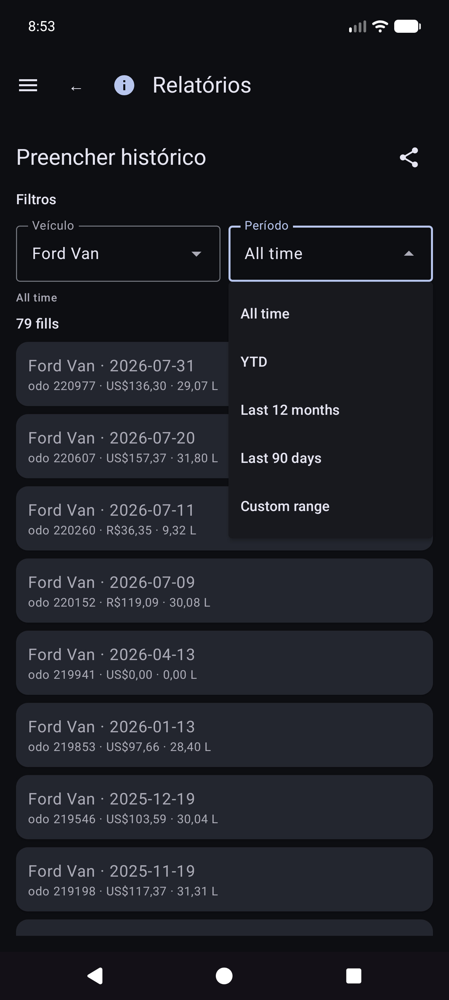
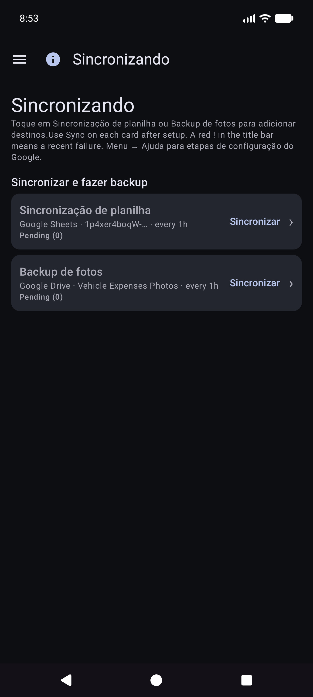
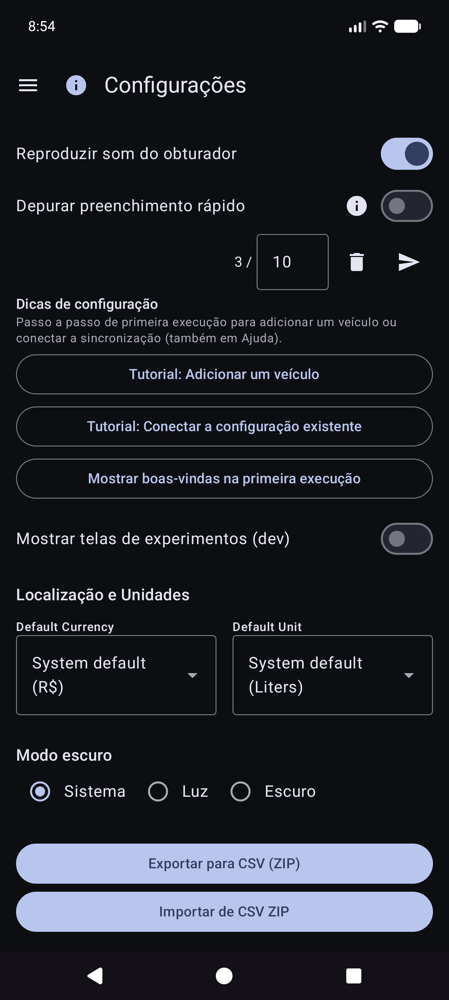
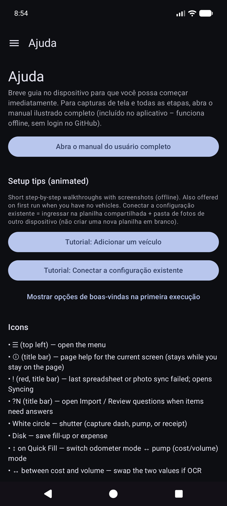

# Despesas de Veículos Automatizadas — Manual do Usuário

> **Editar fonte (Markdown).** Os navegadores e o leitor no aplicativo abrem o **HTML renderizado**:
> - Web: [`docs/user-manual.html`](user-manual.html) (regenerar com `./scripts/render-user-manual.sh`)
> - Aplicativo: Ajuda / Sobre → manual completo (HTML + capturas de tela incluídas)
>
> Não direcione os usuários finais para URLs `.md` brutos — os navegadores mostram apenas texto simples.

Rastreamento com câmera para abastecimentos de combustível e despesas de veículos, com sincronização opcional de vários dispositivos e backup em **suas** contas na nuvem.

Este é o **manual completo** (capturas de tela + todas as etapas). No telefone, **Menu → Ajuda** é um guia de primeiros passos mais curto.

**Não abordado aqui:** Importar imagens antigas, experimento de alinhamento e experimento de bomba (desenvolvedor/ferramentas avançadas).

---

## Índice

1. [O que você precisa](#o que você precisa)
2. [Resumo dos ícones](#icons-at-a-glance)
3. [Abra o menu](#open-the-menu)
4. [Configuração inicial: Gerenciar veículos](#first-time-setup-manage-vehicles)
5. [Backups e sincronização de vários dispositivos](#backups-and-multi-device-sync)
6. [Abastecimento rápido (combustível)](#abastecimento rápido de combustível)
7. [Iniciar viagem](#start-trip)
8. [Despesas](#despesas)
9. [Relatórios](#relatórios)
10. [Configurações (preferências locais)](#settings-local-preferences)
11. [Sincronizando](#syncing)
12. [Ajuda e Sobre](#help--about)
13. [Documentos relacionados](#documentos-relacionados)

---

## O que você precisa

- Telefone ou tablet Android.
- Para obter o melhor OCR: uma visão clara do **odômetro do painel** e dos **totais da bomba** (ou digite os números manualmente).
- Opcional: contas **que você controla** para dados de planilhas e/ou backup de fotos (consulte [Backups e sincronização de vários dispositivos](#backups-and-multi-device-sync)).

---

## Ícones em resumo

Eles aparecem nas telas principais. Conhecê-los economiza muita caça.

| Onde | Ícone / controle | O que faz |
|-------|----------------|-------------|
| Barra superior | **☰ Cardápio** (hambúrguer) | Abre a gaveta de navegação |
| Barra superior | **ⓘ** (ajuda da página) | Breve ajuda para a página **atual** (ao lado do menu, quando disponível) |
| Barra superior | **`?N`** (amarelo) | Perguntas pendentes de revisão de importação — abre Revisão de importação |
| Barra superior | **!** (vermelho) | Uma planilha ou destino de foto falhou recentemente. Abra **Sincronizando** para corrigir |
| Barra superior | **☰ + ←** | Relatório de filhos e lista de despesas mostram **menu e voltar** juntos; O hub de relatórios é apenas menu |
| Configurações / edição de combustível | **←** | Voltar (planilha/foto de configurações e edição de combustível permanecem focados) |
| Preenchimento rápido | **Círculo branco** (obturador) | Capture odômetro ou exibição da bomba para OCR |
| Preenchimento rápido | **Disco / Salvar** | Salvar o abastecimento (precisa de veículo e pelo menos um de odo/volume/custo) |
| Preenchimento rápido | **↕ setas** (interruptor de modo) | Alternar entre **modo hodômetro** e **modo bomba (custo/volume)**. Borda verde destaca grupo de campo ativo |
| Preenchimento rápido | **↔ setas** (entre custo e volume) | Troque custo e volume se o OCR os colocar nos campos errados |
| Preenchimento rápido | **Zoom 1x /…** | Taxas de zoom da câmera quando a lente as suporta |
| Preenchimento rápido (após captura) | **Atualizar** no botão principal | Descartar visualização e retornar à câmera ao vivo |
| Preenchimento rápido (durante o processamento) | **X** no botão principal | Cancelar captura/OCR em andamento |
| Despesa | **Salvar** | Economize nas despesas |
| Despesa | **Círculo do obturador** | Tire uma foto do recibo |
| Despesa | **Galeria** | Escolha uma imagem de recibo da biblioteca |
| Despesa | **Refazer** | Limpe a foto do recibo atual e fotografe novamente |
| Despesar / Gerenciar Veículos | **+ / −** FABs | Amplie a visualização da foto |
| Diálogo de pontos de referência | **Editar OCR** ​​| Corrija ou adicione texto de referência que os motores perderam |
| Planilha/Formulários fotográficos | **🔍 Pesquisa** | Procure uma planilha ou pasta no Google Drive (após fazer login) |

Os símbolos de moeda nos campos de custo e **G/L** nos campos de volume podem ser tocados: abra um pequeno menu para alterar a moeda ou galões versus litros para essa entrada.

---

## Abra o menu

1. Toque em **☰** no canto superior esquerdo.
2. Escolha uma página.

**Gaveta principal:** Preenchimento rápido · Iniciar viagem · Gerenciar veículos · Novas despesas · **Relatórios** · Configurações · Sincronização · Ajuda · Sobre.

**Gaveta de experimentos** (Configurações → Mostrar telas de experimentos): Experimento de alinhamento · Experimento de bombeamento · **Importar fotos antigas**.

**Via hub de Relatórios (não na gaveta principal):** Lista de despesas · Preencher histórico.

---

## Configuração inicial: Gerenciar veículos

OCR e a **correspondência automática de veículos** funcionam melhor depois que você registra cada veículo com uma **foto de referência do painel**, corta o hodômetro e executa o **Discovery** para que o aplicativo armazene o texto de referência para esse painel. (A forma como os pontos de referência são escolhidos e combinados será documentada com mais detalhes em uma atualização posterior.)

### Abrir Gerenciar Veículos

Menu → **Gerenciar Veículos**. Escolha um veículo (ou **Adicionar novo veículo**).

### Adicione ou edite um veículo

1. Abra o menu suspenso **Veículo** → escolha um veículo ou **Adicionar novo veículo**.
2. Capture ou escolha uma **foto de referência do painel** nítida (conjunto de instrumentos completo, bem iluminado, telefone quase quadrado). Use **Tirar foto** ou **Galeria**.
3. Desenhe colheitas:
   - **Odo Crop** — retângulo firmemente ao redor dos dígitos do hodômetro (o botão mostra **Done Odo** enquanto esse modo está ativo).
   - **Ignore Crop** — região opcional a ser ignorada (relógio, rádio, etc.).
   - **Editar cortes** — ajuste os retângulos existentes.
4. Toque em **Executar descoberta** — o OCR multimecanismo encontra palavras de referência fora dos recortes.
5. Revise com **Mostrar pontos de referência**. Use **Editar OCR** ​​para corrigir erros de leitura ou **adicionar** texto que foi perdido.
6. Preencha **Nome do veículo** (obrigatório), além de marca/modelo/ano/placa conforme desejar.
7. Toque em **Criar veículo** ou **Salvar alterações** (requer nome + foto de referência para um novo veículo).

### Marcos: corrija o que o Discovery perdeu

Depois de **Mostrar pontos de referência**, role a lista e corrija os valores. Às vezes, os motores perdem dígitos pequenos (por exemplo, um relógio **60** no canto inferior direito do cluster). Use **Editar OCR** ​​para adicioná-los ou corrigi-los para que a identidade do veículo permaneça confiável.

### Digitando sem uma foto perfeita

Você ainda pode usar o aplicativo selecionando um veículo e **digitando** odômetro, volume e custo no Preenchimento rápido – o OCR é opcional para todos os campos. A importação da galeria funciona para a foto do painel de referência quando você prefere não fotografar no aplicativo.

**Dica:** após a sincronização da planilha, as definições de veículos (cultivos, pontos de referência) ficam no banco de dados local — você não precisa reabrir Gerenciar veículos para preenchimento rápido para usá-las.

---

## Backups e sincronização de vários dispositivos

O aplicativo foi desenvolvido para que **vários telefones ou tablets possam compartilhar os mesmos dados da frota** e para que você possa manter uma **cópia de seus dados e fotos fora do dispositivo**. Isso é feito com destinos que **você** configura em **suas** contas ou em **seus** servidores auto-hospedados — e não em uma “nuvem de despesas de veículos” administrada pela empresa que outras pessoas possam ver.

### O que funciona onde

| Tipo | O que armazena | Uso típico |
|------|----------------|------------|
| **Planilha/sincronização tabular** | Veículos, abastecimento de combustível, despesas (linhas e guias) | Mesclagem de vários dispositivos + backup estruturado |
| **Backup de fotos** | Imagens binárias (traço/bomba/recibo/fotos de referência) | Backup de fotos + restauração de arquivos ausentes |

Você pode configurar **vários destinos** de cada tipo (limitação flexível por tipo). Os trabalhadores manuais **Sincronizem agora** e **em segundo plano** executam os ativados.

### Off-line primeiro

- **Nenhuma rede é necessária** para adicionar preenchimento, despesa ou recibo. Tudo é salvo **localmente primeiro**.
- Quando a rede está disponível, a sincronização e o backup de fotos são executados como **tarefas em segundo plano** (de acordo com uma programação definida por você e ao tocar em **Sincronizar agora**). As falhas aparecem como texto vermelho nas linhas Configurações e um **!** na barra de título do aplicativo.

### Somente suas contas

O login e os tokens permanecem no dispositivo para os provedores que você escolher (Google, Microsoft, chaves S3, URLs auto-hospedados e assim por diante). Os destinos estão sob **controle total do usuário** — sua conta do Google, seu OneDrive, seu bucket MinIO, seu host EtherCalc, etc. Nada é compartilhado com outros usuários do Vehicle Expenses por meio de um back-end compartilhado.

### Alvos suportados — dados (planilha / tabular)

Configurado em **Menu → Sincronização → Sincronização de planilha** (também acessível nas linhas de resumo das configurações). Opções de selecionador de primeira classe:

| Alvo | Notas |
|--------|--------|
| **Planilhas Google** | Inadimplência comum; guias para veículos, despesas e combustível por veículo |
| **Excelente** | Pasta de trabalho da Microsoft por meio de vinculação estilo Graph/OneDrive |
| **EtherCalc** | Salas de planilhas colaborativas auto-hospedadas |
| **Outros →** backends implementados | **Baserow**, **NocoDB**, **Airtable**, **PocketBase**, **Supabase**, **Firebase**, **Zoho Sheet** |

Adiado/ainda não decapitado (listado em Outros, mas não totalmente implementado): OnlyOffice, Collabora. Consulte também [índice de auto-host](referência/self-host/INDEX.md).

CSV **exportar/importar** (ZIP do mesmo layout de guia) está disponível em Configurações como um backup portátil, independente da sincronização ao vivo.

### Alvos suportados — fotos (backup de imagem)

Configurado em **Menu → Sincronização → Backup de fotos** (também nas linhas de resumo de configurações):

| Alvo | Notas |
|--------|--------|
| **Google Drive** | Pasta que você escolher (navegar ou colar URL) |
| **OneDrive** | Conta da Microsoft + prefixo do caminho |
| **S3** | AWS, Wasabi, Cloudflare R2, MinIO e outros endpoints compatíveis com S3 |
| **Outros** | armazenamento apoiado por rclone (por exemplo, WebDAV, SFTP e outros controles remotos selecionados disponíveis no seletor no aplicativo) |

Configure cheatsheets para fotos auto-hospedadas e alvos tabulares: [índice de auto-host](reference/self-host/INDEX.md).

### Comportamento de vários dispositivos (curto)

- As linhas são mescladas por **Sync ID** com **last-write-wins** em carimbos de data/hora **Atualizados**.
- As exclusões são suaves; uma edição mais recente em outro dispositivo pode restaurar uma linha.
- Inserir o **mesmo preenchimento duas vezes** em dois dispositivos cria **duas linhas** — exclua o extra quando você perceber.
- Mais detalhes: [Notas de comportamento de sincronização](#sync-behavior-notes) e [SYNC_BEHAVIOR.md](reference/SYNC_BEHAVIOR.md).

### Exemplo: adicionar Planilhas Google (dados)

1. **Menu → Sincronização → Sincronização de planilha** (ou Configurações → Sincronização de planilha).

   

2. Toque em **Adicionar destino da planilha**.

   

3. Escolha **Planilhas Google**.

   

4. **Faça login com o Google** → nome de exibição → **URL da planilha** ou **🔍** navegar/criar → opções de agendamento → ativar → salvar.
5. **Sincronize agora** uma vez para criar/atualizar guias: `Veículos`, `Despesas`, `Combustível - {nome do veículo}`.

### Exemplo: adicionar Google Drive (fotos)

1. **Menu → Sincronização → Backup de fotos** (ou Configurações → Backup de fotos).

   

2. Toque em **Adicionar destino da foto**.

   

3. Escolha **Google Drive**.

   

4. **Faça login com o Google (Drive)** → URL da pasta opcional/navegar → ativar → salvar → **Sincronizar agora**.

Manual **Sincronizar agora** para fotos é um passe completo; o backup em segundo plano normalmente processa uploads **somente pendentes** de acordo com uma programação.

### Notas de comportamento de sincronização

- Após a atualização do aplicativo, você poderá ver brevemente **“Atualizando banco de dados após atualização…”** (preenchimento de ID de sincronização local).
- Se uma sincronização for interrompida, a próxima sincronização **bem-sucedida** mesclará novamente e reparará as guias remotas.
- Falhas: resumo vermelho nos cartões de sincronização + **!** na barra de aplicativos.

---

## Abastecimento rápido (combustível)

Esta é a **tela inicial** quando você abre o aplicativo.

### Seleção de veículo (geralmente automática)

Você **não** precisa escolher o veículo primeiro. Quando os veículos têm **pontos de referência** configurados em Gerenciar veículos, o Preenchimento rápido **detecta automaticamente qual veículo** na imagem do painel após você capturar o hodômetro. Você ainda pode abrir o menu suspenso **Veículo** para substituir, se necessário.

### Mire no hodômetro

Fique no modo hodômetro e enquadre o cluster. Instrução: * Mire no hodômetro. Toque no obturador para capturar.*

### Após o obturador do hodômetro

OCR preenche **Odo** e tenta combinar o veículo com os pontos de referência (revise ambos, se necessário). O botão principal se torna **Tentar novamente** para filmar novamente. A instrução resume a leitura.

### Modo bomba (custo e volume)

1. Toque em **↕** para alternar para o modo de bomba: *Observe a exibição da bomba (custo/volume). Toque no obturador.*
2. Capture os totais da bomba. Preenchimento dos campos custo e volume; use **↔** se eles forem trocados.
3. Toque em moeda ou **G/L** se necessário e em **Salvar** (disco). Campos vazios fazem um **preenchimento parcial** (ainda permitido).

Você permanece no Preenchimento Rápido para a próxima parada (campos limpos após salvar). Trabalhe totalmente **off-line**; a sincronização é executada posteriormente em segundo plano quando configurada.

### Entrada manual (sem câmera/OCR ruim)

1. Toque em **Odo**, **custo** ou **volume** e digite os valores (o retrato usa o teclado do sistema; o paisagem usa um teclado na tela).
2. Escolha ou confirme **Veículo** caso a detecção automática não tenha sido executada.
3. Salve como acima.

### Modos e fronteiras

- **Borda verde** ao redor do veículo+odo → captura/edição do hodômetro.
- **Borda verde** em torno de custo+volume → modo de bomba.
- **Salvar** permanece desativado até que um veículo seja selecionado e pelo menos um de odo/custo/volume tenha dados e o OCR ainda não esteja em execução.

Dica na tela (abaixo da linha de instruções): *Obturador = capturar · Disco = salvar · ↕ = modo odo/bomba · ↔ = custo/volume de troca.*

---

## Despesas

### Nova despesa

Menu → **Nova despesa**.

1. **Salvar** (disco), **obturador** (foto de recibo) ou **galeria** (escolher imagem).
2. Preencha **Data**, **Veículo**, **Fornecedor**, **Descrição**, **Valor** (símbolo de moeda tocável), **Categoria**, opcional **Odômetro**.
3. Recibos de várias páginas: capture páginas adicionais se a IU oferecer paginação (a página 0 é o recibo principal).
4. **Salvar** na loja (local primeiro; o backup de fotos e a sincronização da planilha acontecem em segundo plano quando configurados).

### Lista de despesas

Menu → **Relatórios** → **Lista de despesas** — navegue pelas despesas anteriores não relacionadas ao combustível; abra um item para editar.

### Editar despesa

Abra uma linha da lista. Fornecedor correto, quantidade, categoria, veículo e descrição. Se o recibo estiver apenas no backup de fotos (sem arquivo local legível), use **Buscar imagem do arquivo** quando mostrado (funciona em destinos de fotos configurados).

---

## Iniciar viagem

Menu → **Iniciar viagem** (após Preenchimento Rápido na gaveta). Capture ou insira o hodômetro, escolha o tipo de viagem e salve com o ícone **disco**. **Parar** é um atalho para Pessoal agora na localização GPS mantida. Use **ⓘ** para lembretes de controle.

Os inícios da viagem são armazenados como linhas de combustível com um **Tipo de viagem** (não abastecimentos normais). Eles aparecem em **Relatórios → Milhas de viagem**, e não em Histórico de combustível.

---

## Relatórios

Menu → **Relatórios** abre o hub do produto (resumo de todos os tempos + fichas de catálogo). Esta é a única superfície de relatórios de produtos – não há nenhum item de gaveta “Relatórios e Gráficos” separado.

Abra um cartão para modo veículo (**Todos / Cada / Único**), filtros de período, gráficos e compartilhamento (**TEXTO / CSV / PDF**). Barra superior nos filhos do relatório: **☰ + ←** (e **ⓘ** quando registrado).

### Relatórios baseados em tempo

O cartão gráfico principal. Métricas opcionais (mpg, volume/distância como G/mi, preço unitário como $/G, custo/distância, $ mensais, milhas de viagem, % de viagem por tipo) com compartimentos **Smooth** e **escalas Y independentes** (economia à esquerda; dinheiro e famílias de viagem à direita).

Detalhes da matemática econômica: [REPORTS_METRICS.md](reference/REPORTS_METRICS.md).

### Histórico de preenchimento versus histórico de combustível

- **Relatórios → Histórico de preenchimentos** — preenchimentos cronológicos para os filtros do relatório (**somente preenchimentos**; nenhuma viagem começa).

- **Histórico de Combustível** (se presente na navegação da sua construção) — inventário de abastecimento por veículo, também apenas abastecimentos; toque em uma linha para editar.

### Milhas de viagem

**Relatórios → Milhas de viagem** — milhas por tipo, gráficos e uma **lista cronológica de início/segmento de viagem**. Toque em um início real para abrir **Editar preenchimento** dessa linha.

### Editar preenchimento

Em Histórico de abastecimento, Histórico de combustível ou Milhas de viagem, abra um preenchimento. Layout: veículo e hodômetro, **moeda antes do custo**, volume, notas. O tipo de viagem aparece somente quando a linha é um início de viagem. A localização tem um resumo mais **Detalhes da localização**. Foto local ausente com identidade na nuvem: **Buscar imagem do arquivo**.

Outros cartões de catálogo incluem despesas por categoria, resumo do veículo e lista de despesas.

O Money usa a moeda de cada linha quando definida. Os totais em moedas mistas mostram **subtotais por moeda** (sem conversão FX silenciosa).

---

## Sincronizando

Menu → **Sincronização** é o centro para destinos de planilhas e fotos (não apenas enterrado em Configurações).

- Cartões para **Sincronização de planilhas** e **Backup de fotos** com status curto, **Sincronização** para esse tipo e **›** na lista de destinos.
- Abra um destino para **Testar conexão** e **Sincronizar agora (este destino)** / tudo configurado.
- Falha **Detalhes** e o vermelho **!** na barra de título aparecem aqui.
- Configuração passo a passo do Planilhas Google e do Drive: [Backups e sincronização de vários dispositivos](#backups-and-multi-device-sync).

---

## Configurações (preferências locais)

Menu → **Configurações**.

Para destinos, prefira **Menu → Sincronização**. As configurações ainda podem mostrar linhas de resumo que abrem as mesmas listas.

### Preferências locais (comuns)

- **Salvar fotos de recibos de combustível** / **Salvar fotos de despesas localmente** — mantenha as imagens no dispositivo (pode solicitar permissão para fotos).
- **Reproduzir som do obturador**
- **Moeda** / **Unidade de volume** — padrões do aplicativo (sistema ou explícito). Alterar a unidade de volume com dados de combustível existentes pode oferecer uma caixa de diálogo de conversão.
- **Modo escuro**
- **Dicas de configuração** — reabra os tutoriais de sincronização/veículo de primeira execução.
- **Preenchimento rápido de depuração** / **Mostrar telas de experimentos (dev)** — avançado; deixe para uso diário. As telas de experimento não estão documentadas aqui.

CSV **exportar/importar** (ZIP das guias Veículos / Despesas / Combustível) está disponível em Configurações quando oferecido pela versão atual.

---

## Ajuda e sobre

- **Ajuda** — início rápido no dispositivo, tutoriais de configuração, link para este manual, índice de configuração do próprio host.
- **Sobre** — versão, licenças, GitHub, este manual (empacotado offline + HTML online quando publicado).

---

## Documentos relacionados

- [USER_GUIDE.md](reference/USER_GUIDE.md) — referência condensada
- [self-host/INDEX.md](reference/self-host/INDEX.md) — configuração de foto/tabular auto-hospedada
- [SYNC_BEHAVIOR.md](reference/SYNC_BEHAVIOR.md) — mesclagem, recuperação, duplicatas
- [REPORTS_METRICS.md](reference/REPORTS_METRICS.md) — detalhe das métricas econômicas