# Автоматизированные расходы на транспортные средства — Руководство пользователя

> **Изменить исходный код (Markdown).** Браузеры и встроенные в приложения программы чтения открывают **обработанный HTML**:
> - Интернет: [`docs/user-manual.html`](user-manual.html) (восстановить с помощью `./scripts/render-user-manual.sh`)
> - Приложение: Помощь/О программе → полное руководство (в комплекте HTML + скриншоты)
>
> Не указывайте конечным пользователям необработанные URL-адреса `.md` — браузеры отображают только обычный текст.

Отслеживание заправок топливом и расходов на транспортное средство с помощью камеры с дополнительной синхронизацией нескольких устройств и резервным копированием в **ваших** облачных учетных записях.

Это **полное руководство** (скриншоты + каждый шаг). На телефоне **Меню → Справка** — это краткое руководство по началу работы.

**Здесь не рассматривается:** Импорт старых изображений, эксперимент по выравниванию и эксперимент с насосом (инструменты для разработчиков/расширенные инструменты).

---

## Содержание

1. [Что вам нужно](#что-вам-нужно)
2. [Краткий обзор значков](#icons-at-a-glance)
3. [Открыть меню](#open-the-menu)
4. [Первоначальная настройка: Управление транспортными средствами](#first-time-setup-manage-vehicles)
5. [Резервное копирование и синхронизация нескольких устройств](#backups-and-multi-device-sync)
6. [Быстрая заправка (топливо)](#быстрая заправка-топливо)
7. [Начать поездку](#start-trip)
8. [Расходы](#расходы)
9. [Отчеты](#отчеты)
10. [Настройки (локальные настройки)](#settings-local-preferences)
11. [Синхронизация](#синхронизация)
12. [Помощь и информация](#help--about)
13. [Связанные документы](#related-docs)

---

## Что вам нужно

- Телефон или планшет на базе Android.
– Для лучшего распознавания: четкое представление **одометра** на приборной панели** и **общих показателей насоса** (или введите цифры от руки).
– Необязательно: учетные записи **вы контролируете** для резервного копирования данных электронных таблиц и/или фотографий (см. [Резервные копии и синхронизация нескольких устройств](#backups-and-multi-device-sync)).

---

## Иконки с первого взгляда

Они появляются на главных экранах. Знание их экономит много охоты.

| Где | Значок/управление | Что он делает |
|-------|----------------|--------------|
| Верхняя панель | **☰ Меню** (гамбургер) | Открывает панель навигации |
| Верхняя панель | **ⓘ** (справка по странице) | Краткая справка по **текущей** странице (рядом с меню, если оно доступно) |
| Верхняя панель | **`?N`** (желтый) | Ожидающие вопросы по обзору импорта — открывается Обзор импорта |
| Верхняя панель | **!** (красный) | Недавно произошла ошибка с электронной таблицей или местом назначения фотографий — откройте **Синхронизация**, чтобы исправить |
| Верхняя панель | **☰ + ←** | Отчет о детях и список расходов показывают **меню и обратно** вместе; Центр отчетов доступен только в меню |
| Настройки/редактирование топлива | ** ←** | Назад (таблица настроек/редактирование фотографий и топлива остаются в фокусе) |
| Быстрое заполнение | **Белый круг** (затвор) | Захват показаний одометра или насоса для оптического распознавания символов |
| Быстрое заполнение | **Диск/Сохранить** | Сохраните заправку (нужен автомобиль и хотя бы один из параметров одо/объем/стоимость) |
| Быстрое заполнение | **↕стрелки** (переключатель режима) | Переключите **режим одометра** на **режим насоса (стоимость/объем)**. Зеленая рамка выделяет активную группу полей |
| Быстрое заполнение | **↔ стрелки** (между стоимостью и объемом) | Стоимость и объем свопа, если OCR поместит их в неправильные поля |
| Быстрое заполнение | **Увеличение 1x / …** | Коэффициенты масштабирования камеры, если объектив их поддерживает |
| Быстрое заполнение (после захвата) | **Обновить** на главной кнопке | Отменить предварительный просмотр и вернуться к прямой трансляции |
| Быстрое заполнение (во время обработки) | **X** на главной кнопке | Отменить текущий захват/распознавание текста |
| Расход | **Сохранить** | Экономьте расходы |
| Расход | **Круг затвора** | Сфотографировать чек |
| Расход | **Галерея** | Выберите изображение чека из библиотеки |
| Расход | **Пересдать** | Очистите текущую фотографию чека и сделайте снимок снова |
| Расходы / Управление транспортными средствами | **+ / −** ФАБ | Увеличить предварительный просмотр фотографии |
| Диалоговое окно «Достопримечательности» | **Изменить распознавание текста** | Исправьте или добавьте текст ориентира, который пропустили двигатели |
| Электронная таблица / Фотоформы | **🔍 Поиск** | Найдите на Google Диске лист или папку (после входа в систему) |

Символы валюты в полях стоимости и **G/L** в полях объема можно нажимать: откройте небольшое меню, чтобы изменить валюту или галлоны на литры для этой записи.

---

## Открыть меню

1. Нажмите **☰** в левом верхнем углу.
2. Выберите страницу.

**Основной ящик:** Быстрое заполнение · Начало поездки · Управление транспортными средствами · Новые расходы · **Отчеты** · Настройки · Синхронизация · Справка · О программе.

**Ящик экспериментов** (Настройки → Показать экраны экспериментов): Эксперимент по выравниванию · Эксперимент с насосом · **Импорт старых изображений**.

**Через центр отчетов (не в главном ящике):** Список расходов · Заполнить историю.

---

## Первоначальная настройка: Управление транспортными средствами

Оптическое распознавание символов и **автоматическое сопоставление транспортных средств** работают лучше всего после того, как вы зарегистрируете каждое транспортное средство с помощью **эталонной фотографии приборной панели**, обрежете одометр и запустите **Discovery**, чтобы приложение сохранило текст ориентира для этого приборного щитка. (Как выбираются и сопоставляются ориентиры, будет более подробно описано в последующих обновлениях.)

### Открыть управление транспортными средствами

Меню → **Управление транспортными средствами**. Выберите автомобиль (или **Добавить новый автомобиль**).

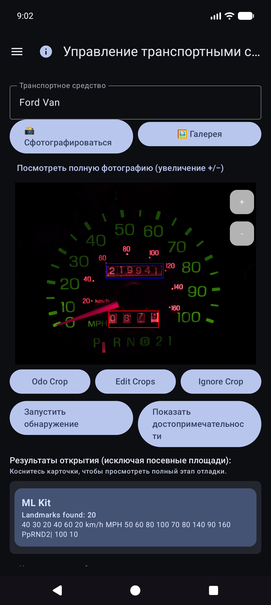

### Добавить или изменить автомобиль

1. Откройте раскрывающийся список **Транспортное средство** → выберите транспортное средство или выберите **Добавить новое транспортное средство**.
2. Сделайте или выберите четкое **эталонное фото приборной панели** (полная комбинация приборов, хорошо освещенная, телефон примерно в квадрате). Используйте **Сделать фото** или **Галерею**.
3. Рисуем посевы:
   - **Обрезка Odo** — прямоугольник вокруг цифр одометра (кнопка показывает **Done Odo**, пока этот режим активен).
   - **Игнорировать обрезку** — необязательная область для игнорирования (часы, радио и т. д.).
   - **Редактировать обрезки** — откорректируйте существующие прямоугольники.
4. Нажмите **Запустить Discovery** — многоядерное распознавание текста находит ключевые слова за пределами полей.
5. Просмотрите с помощью **Показать достопримечательности**. Используйте **Редактировать OCR**, чтобы исправить ошибки при прочтении или **добавить** текст, который был пропущен.
6. Введите **Название автомобиля** (обязательно), а также марку/модель/год/табличку по своему усмотрению.
7. Нажмите **Создать автомобиль** или **Сохранить изменения** (для нового автомобиля требуется имя + эталонное фото).

### Ориентиры: исправьте то, что пропустил Discovery

После **Показать ориентиры** прокрутите список и исправьте значения. Движки иногда пропускают маленькие цифры (например, часы **60** в правом нижнем углу кластера). Используйте **Редактировать OCR**, чтобы добавить или исправить их, чтобы идентичность автомобиля оставалась достоверной.

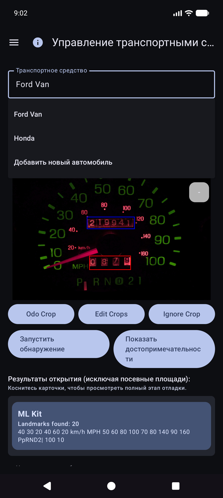

### Печатаю без идеального фото

Вы по-прежнему можете использовать приложение, выбрав автомобиль и **введя** одометр, объем и стоимость в поле «Быстрое заполнение» — распознавание текста не является обязательным для каждого поля. Импорт галереи работает для эталонной фотографии, если вы предпочитаете не снимать в приложении.

**Совет.** После синхронизации таблиц определения транспортных средств (культуры, ориентиры) сохраняются в локальной базе данных — вам не нужно повторно открывать «Управление транспортными средствами для быстрого заполнения», чтобы использовать их.

---

## Резервные копии и синхронизация нескольких устройств

Приложение создано таким образом, чтобы **несколько телефонов или планшетов могли использовать одни и те же данные о парке**, и чтобы вы могли хранить **копии своих данных и фотографий на устройстве**. Это делается с помощью пунктов назначения, которые **вы** настраиваете под **вашими** учетными записями или **вашими** автономными серверами, а не управляемым компанией «облаком транспортных расходов», которое могут видеть другие люди.

### Что и где работает

| Вид | Что он хранит | Типичное использование |
|------|----------------|-------------|
| **Синхронизация таблиц/таблиц** | Транспортные средства, заправки, расходы (строки и вкладки) | Объединение нескольких устройств + структурированное резервное копирование |
| **Резервное фото** | Двоичные изображения (тире/насос/чек/эталонные фотографии) | Резервное копирование фотографий + восстановление отсутствующих файлов |

Вы можете настроить **несколько пунктов назначения** каждого типа (мягкое ограничение для каждого типа). Включенные рабочие процессы **Синхронизировать сейчас** и **фоновые** выполняются вручную.

### Сначала офлайн

- **Чтобы добавить пополнение, расход или квитанцию, сеть не требуется**. Все сохраняется **сначала локально**.
- Когда сеть доступна, синхронизация и резервное копирование фотографий выполняются как **фоновые задачи** (по установленному вами расписанию и при нажатии **Синхронизировать сейчас**). Сбои отображаются красным текстом под строками настроек и знаком **!** в строке заголовка приложения.

### Только ваши аккаунты

Вход и токены остаются на устройстве для выбранных вами поставщиков (Google, Microsoft, ключи S3, локальные URL-адреса и т. д.). Направления находятся под **полным контролем пользователя** — ваша учетная запись Google, ваш OneDrive, ваш контейнер MinIO, ваш хост EtherCalc и т. д. Никакие данные не передаются другим пользователям Vehicle Expenses через общий бэкэнд.

### Поддерживаемые цели — данные (табличные/табличные)

Настраивается в разделе **Меню → Синхронизация → Синхронизация таблиц** (также доступно из строк сводки настроек). Первоклассные варианты выбора:

| Цель | Заметки |
|--------|--------|
| **Google Таблицы** | Общее значение по умолчанию; вкладки «Транспортные средства», «Расходы» и «Топливо для каждого автомобиля» |
| **Эксель** | Книга Microsoft через привязку в стиле Graph/OneDrive |
| **ЭфирКальк** | Автономные комнаты для совместной работы с электронными таблицами |
| **Другое →** реализованные серверные части | **Baserow**, **NocoDB**, **Airtable**, **PocketBase**, **Supabase**, **Firebase**, **Zoho Sheet** |

Отложено/еще не обезглавлено (перечислено в разделе «Другое», но не полностью реализовано): OnlyOffice, Collabora. См. также [индекс собственного хоста](reference/self-host/INDEX.md).

**Экспорт/импорт** CSV (ZIP того же макета вкладки) доступен в настройках в качестве портативной резервной копии, независимой от синхронизации в реальном времени.

### Поддерживаемые цели — фотографии (резервное копирование изображений)

Настраивается в разделе **Меню → Синхронизация → Резервное копирование фотографий** (также из строк сводки настроек):

| Цель | Заметки |
|--------|--------|
| **Google Диск** | Выбранная вами папка (просмотрите или вставьте URL-адрес) |
| **OneDrive** | Учетная запись Microsoft + префикс пути |
| **С3** | AWS, Wasabi, Cloudflare R2, MinIO и другие конечные точки, совместимые с S3 |
| **Другое** | хранилище на базе rclone (например, WebDAV, SFTP и другие тщательно подобранные удаленные устройства, доступные в средстве выбора в приложении) |

Шпаргалки по настройке для автономных фотографий и табличных целей: [self-host index](reference/self-host/INDEX.md).

### Поведение на нескольких устройствах (коротко)

– Строки объединяются по **Идентификатору синхронизации** с **последней записью** по временным меткам **Обновлено**.
- Удаление мягкое; новое редактирование на другом устройстве может восстановить строку.
– При вводе **одной и той же заливки дважды** на двух устройствах создаются **две строки** — удалите лишнюю, как только заметите.
- Более подробная информация: [Примечания к поведению синхронизации](#sync-behavior-notes) и [SYNC_BEHAVIOR.md](reference/SYNC_BEHAVIOR.md).

### Пример: добавить Google Таблицы (данные)

1. **Меню → Синхронизация → Синхронизация таблиц** (или Настройки → Синхронизация таблиц).

   

2. Нажмите **Добавить место назначения для электронной таблицы**.

   

3. Выберите **Google Таблицы**.

   

4. **Войдите в систему с помощью Google** → отображаемое имя → **URL листа** или **🔍** просмотр/создание → параметры расписания → включить → сохранить.
5. **Синхронизируйте** один раз, чтобы создать/обновить вкладки: `Транспортные средства`, `Расходы`, `Топливо - {название автомобиля}`.

### Пример: добавить Google Диск (фотографии)

1. **Меню → Синхронизация → Резервная копия фотографий** (или Настройки → Резервная копия фотографий).

   

2. Нажмите **Добавить место для фото**.

   

3. Выберите **Google Диск**.

   

4. **Войдите в систему с помощью Google (Диск)** → URL-адрес дополнительной папки/обзор → включить → сохранить → **Синхронизировать сейчас**.

Ручная настройка **Синхронизировать сейчас** для фотографий — это полный проход; Фоновое резервное копирование обычно обрабатывает **только ожидающие** загрузки по расписанию.

### Примечания о поведении синхронизации

- После обновления приложения вы можете ненадолго увидеть сообщение ** «Обновление базы данных после обновления…»** (заполнение локального идентификатора синхронизации).
- Если синхронизация прервана, следующая **успешная** синхронизация повторно объединяется и восстанавливает удаленные вкладки.
- Сбои: красная сводка по синхронизации карточек + **!** на панели приложения.

---

## Быстрая заправка (топливо)

Это **главный экран**, когда вы открываете приложение.

### Выбор автомобиля (обычно автоматический)

Вам **не** нужно сначала выбирать автомобиль. Если в разделе «Управление транспортными средствами» для транспортных средств установлены **ориентиры**, функция «Быстрое заполнение» **автоматически определяет транспортное средство** по изображению приборной панели после того, как вы зафиксируете показания одометра. Вы по-прежнему можете открыть раскрывающийся список **Транспортное средство** и изменить его, если это необходимо.

### Цельтесь в одометр

Оставайтесь в режиме одометра и кадрируйте кластер. Инструкция: *Целься в одометр. Нажмите кнопку спуска затвора, чтобы сделать снимок.*

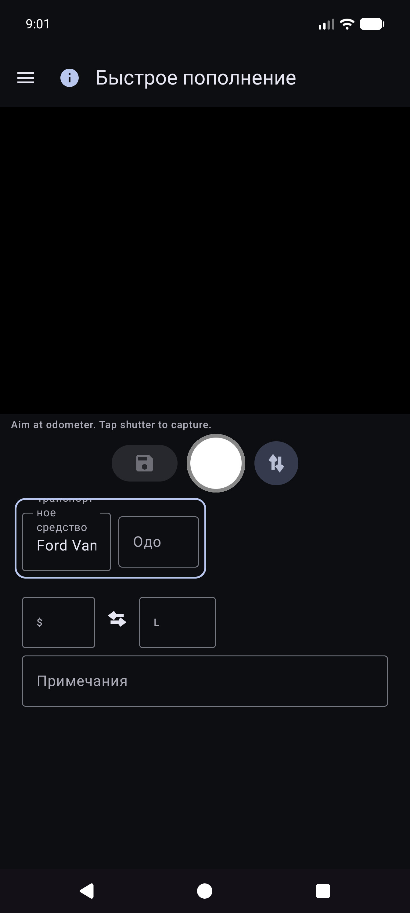

### После шторки одометра

OCR заполняет **Odo** и пытается сопоставить транспортное средство с ориентирами (при необходимости просмотрите оба). Основная кнопка становится **Повторить**, чтобы повторить съемку. Инструкция подводит итог прочитанному.

### Режим помпы (стоимость и объем)

1. Нажмите **↕**, чтобы переключиться в режим помпы: *Наведите курсор на дисплей помпы (стоимость/объем). Нажмите затвор.*
2. Соберите общие данные по насосу. Поля стоимости и объема заполняются; используйте **↔**, если они поменялись местами.
3. Нажмите валюту или **G/L**, если необходимо, затем **Сохранить** (диск). Пустые поля требуют **частичного заполнения** (по-прежнему разрешено).

Вы остаетесь в режиме быстрого заполнения до следующей остановки (поля очищаются после сохранения). Работайте полностью **офлайн**; синхронизация запускается позже в фоновом режиме, если она настроена.

### Ручной ввод (нет камеры/плохое распознавание символов)

1. Нажмите **Одо**, **стоимость** или **объем** и введите значения (в книжной ориентации используется системная клавиатура; в альбомной ориентации — экранная клавиатура).
2. Выберите или подтвердите **Автомобиль**, если автоматическое обнаружение не запустилось.
3. Сохраните, как указано выше.

### Режимы и границы

- **Зеленая рамка** вокруг автомобиля+одо → запись/редактирование одометра.
- **Зеленая рамка** вокруг стоимости+объема → режим пампинга.
- **Сохранение** остается отключенным до тех пор, пока не будет выбрано транспортное средство и хотя бы один из параметров odo/cost/volume не будет содержать данные, а OCR не будет работать.

Подсказка на экране (под строкой инструкций): *Затвор = захват · Диск = сохранение · ↕ = режим одо/насоса · ↔ = стоимость/объем замены.*

---

## Расходы

### Новый расход

Меню → **Новый расход**.

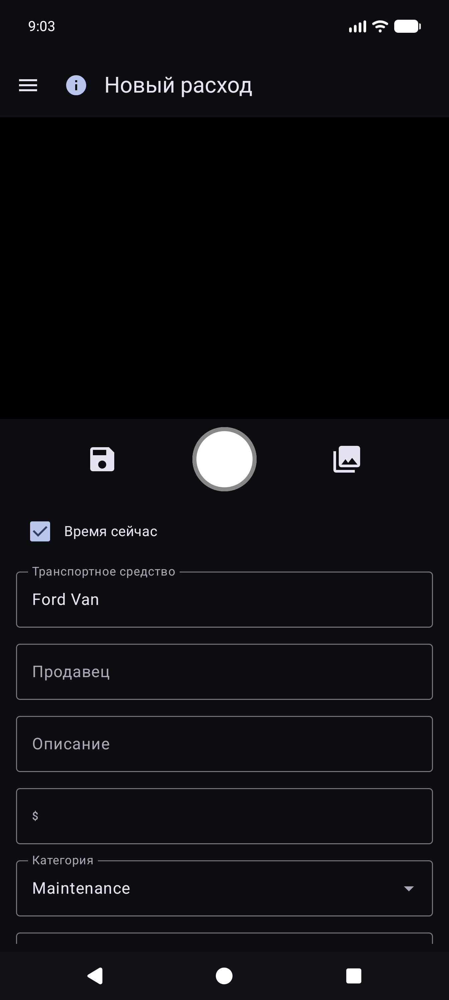

1. **Сохранить** (диск), **затвор** (фото квитанции) или **галерея** (выбрать изображение).
2. Заполните поля **Дата**, **Транспортное средство**, **Поставщик**, **Описание**, **Сумма** (нажимаемый символ валюты), **Категория**, необязательно **Одометр**.
3. Многостраничные квитанции: захватывайте дополнительные страницы, если пользовательский интерфейс предлагает пейджинг (страница 0 — это основная квитанция).
4. **Сохранить** в хранилище (сначала локально; при настройке резервное копирование фотографий и синхронизация таблиц выполняются в фоновом режиме).

### Список расходов

Меню → **Отчеты** → **Список расходов** — просмотр прошлых расходов, не связанных с топливом; откройте элемент для редактирования.

### Редактировать расходы

Откройте строку из списка. Правильный поставщик, сумма, категория, транспортное средство и описание. Если квитанция находится только в резервной копии фотографии (нет читаемого локального файла), используйте **Извлечь изображение из архива**, когда она отображается (работает для всех настроенных мест назначения фотографий).

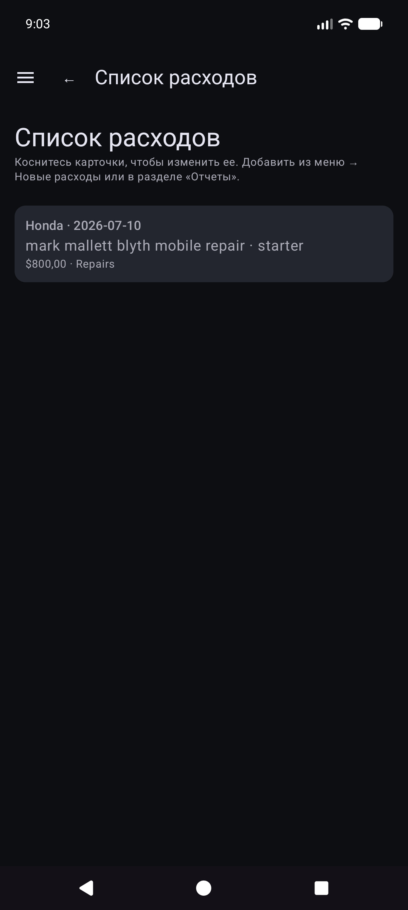

---

## Начать поездку

Меню → **Начать поездку** (после быстрого заполнения ящика). Снимите или введите одометр, выберите тип поездки, сохраните с помощью значка **диска**. **Стоп** — это ярлык для личного режима, который теперь находится в сохраненном местоположении GPS. Используйте **ⓘ** для контрольных напоминаний.

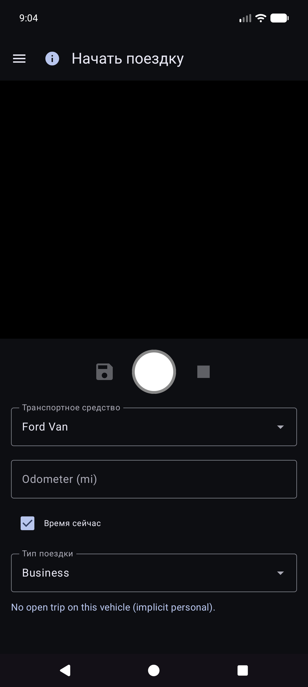

Начало поездки сохраняется в виде строк топлива с **Тип поездки** (не обычные заправки). Они отображаются в разделе **Отчеты → Мили за поездку**, а не в разделе «История топлива».

---

## Отчеты

Меню → **Отчеты** открывает центр продуктов (сводка за все время + карточки каталога). Это единственная поверхность с отчетами о продуктах — отдельного элемента «Отчеты и диаграммы» нет.

Откройте карточку для режима автомобиля (**Все / Каждый / Один**), фильтров по периодам, диаграмм и публикации (**ТЕКСТ / CSV / PDF**). Верхняя панель отчета о детях: **☰ + ←** (и **ⓘ** при регистрации).

### Отчеты по времени

Основная карточка диаграммы. Дополнительные показатели (миль на галлон, объем/расстояние, например Г/миля, цена за единицу, например доллары/Г, стоимость/расстояние, ежемесячные доллары, мили поездки, % поездки по типу) с **Плавными** ячейками и **независимыми шкалами Y** (экономика слева; деньги и группы поездок справа).

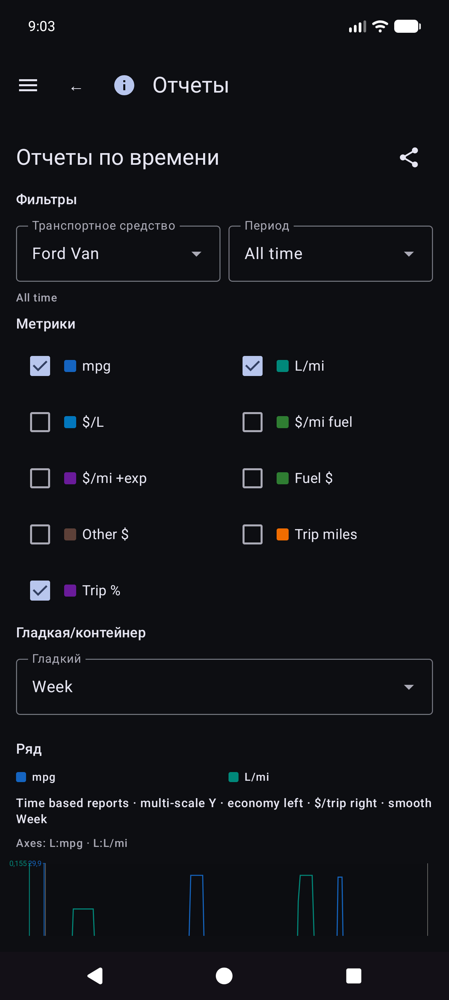

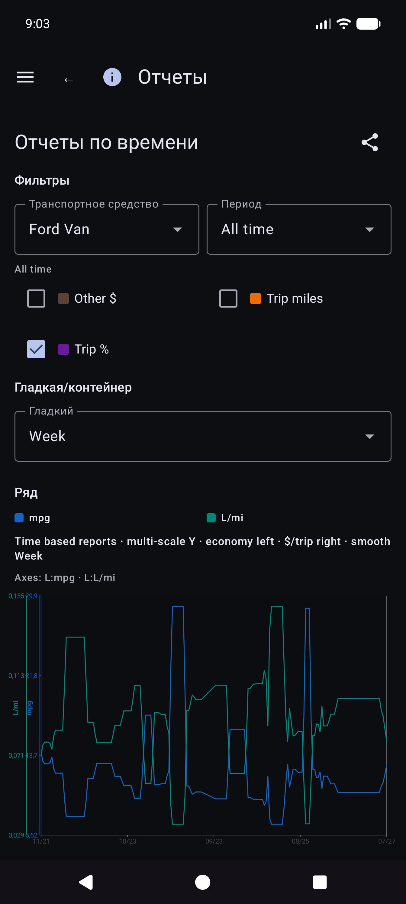

Подробности экономической математики: [REPORTS_METRICS.md](ссылка/REPORTS_METRICS.md).

### История заправок и история топлива

- **Отчеты → История пополнений** — хронологическое заполнение фильтров отчета (**только заполнение**; рейс не начинается).

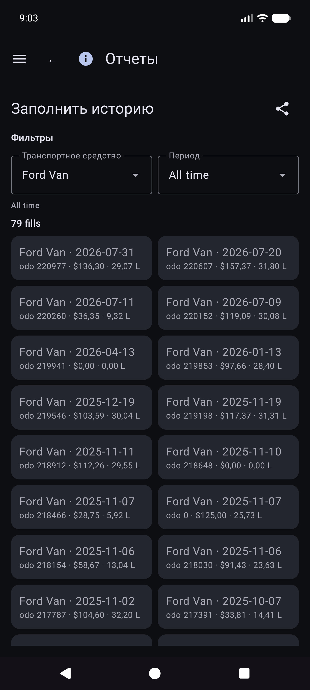

- **История топлива** (если присутствует в навигации вашей сборки) — инвентарь заправок для каждого автомобиля, также только заправки; коснитесь строки для редактирования.

### Мили за поездку

**Отчеты → Мили за поездку** — мили по типам, диаграммы и хронологический **список начала/сегментов поездки**. Нажмите на начало, чтобы открыть **Редактировать заливку** для этой строки.

### Редактировать заливку

В разделе «История заправок», «История топлива» или «Мили за поездку» откройте заправку. Макет: автомобиль и одометр, **валюта до стоимости**, объем, примечания. Тип поездки отображается только в том случае, если в строке указано начало поездки. Местоположение содержит сводку и **Сведения о местоположении**. Отсутствует локальное фото с облачным идентификатором: **Получите изображение из архива**.

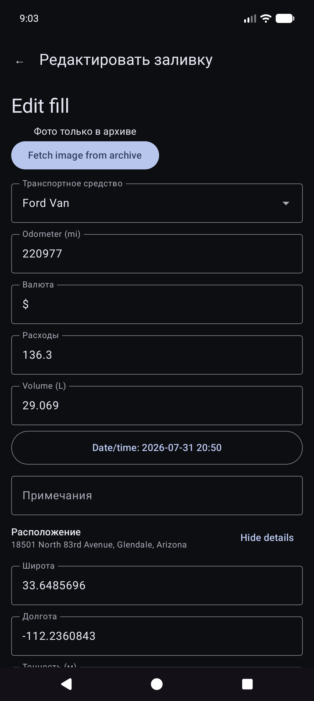

Другие карточки каталога включают расходы по категориям, сводную информацию об автомобиле и список расходов.

Деньги используют валюту каждой строки, если она установлена. В итоговых суммах для смешанных валют отображаются **промежуточные итоги по каждой валюте** (без автоматической конвертации валют).

---

## Синхронизация

Меню → **Синхронизация** — это центр для электронных таблиц и фотографий (не только скрытых в настройках).

- Карточки для **Синхронизация электронных таблиц** и **Резервное копирование фотографий** с кратким статусом, **Синхронизация** для этого типа и **>>** в список назначений.
– Откройте пункт назначения для **Проверить соединение** и **Синхронизировать сейчас (этот пункт назначения)** / все настроено.
- Ошибка **Подробнее** и красный **!** в строке заголовка находятся здесь.
– Пошаговая настройка Google Таблиц и Диска: [Резервные копии и синхронизация нескольких устройств](#backups-and-multi-device-sync).

---

## Настройки (локальные настройки)

Меню → **Настройки**.

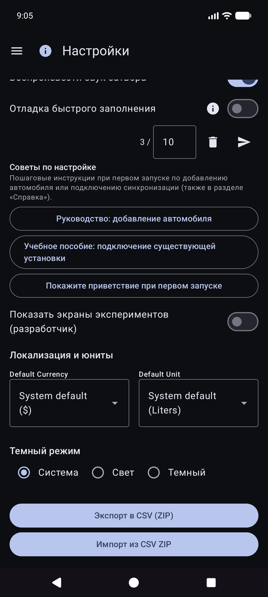

В качестве пунктов назначения выберите **Меню → Синхронизация**. В настройках по-прежнему могут отображаться строки сводки, открывающие одни и те же списки.

### Местные настройки (общие)

- **Сохранять фотографии квитанций за топливо** / **Сохранить фотографии расходов локально** — сохраняйте изображения на устройстве (может запросить разрешение на использование фотографий).
- **Включить звук затвора**
- **Валюта** / **Единица объема** — настройки приложения по умолчанию (системные или явные). При изменении единицы объема с использованием существующих данных о топливе может открыться диалоговое окно преобразования.
- **Тёмный режим**
- **Советы по настройке** — повторно откройте обучающие материалы по первому запуску автомобиля/синхронизации.
- **Быстрое заполнение отладки** / **Показать экраны экспериментов (разработчик)** — расширенный; оставьте для ежедневного использования. Экраны экспериментов здесь не описаны.

CSV **экспорт/импорт** (ZIP-архив вкладок «Транспортные средства/Расходы/Топливо») доступен в настройках, если он доступен в текущей сборке.

---

## Помощь и информация

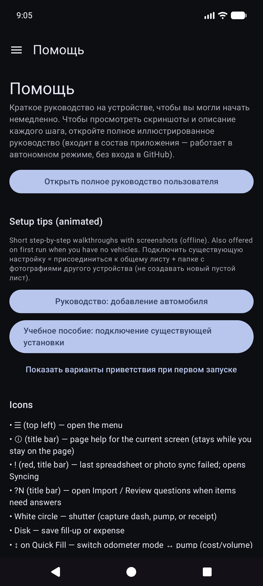

- **Справка** — краткое руководство на устройстве, руководства по настройке, ссылка на это руководство, указатель самостоятельной настройки хоста.
- **О программе** — версия, лицензии, GitHub, данное руководство (в комплекте офлайн + онлайн HTML при публикации).

---

## Связанные документы

- [USER_GUIDE.md](reference/USER_GUIDE.md) — сжатая ссылка
- [self-host/INDEX.md](reference/self-host/INDEX.md) — самостоятельная настройка фотографий/таблиц.
- [SYNC_BEHAVIOR.md](reference/SYNC_BEHAVIOR.md) — объединение, восстановление, дубликаты
- [REPORTS_METRICS.md](reference/REPORTS_METRICS.md) — подробные показатели экономических показателей