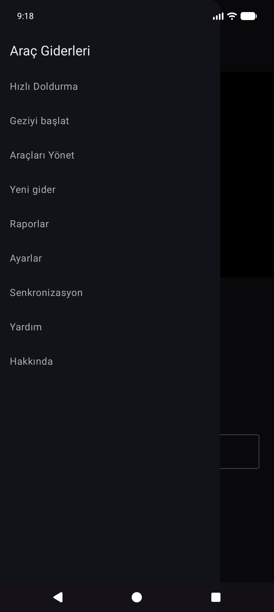
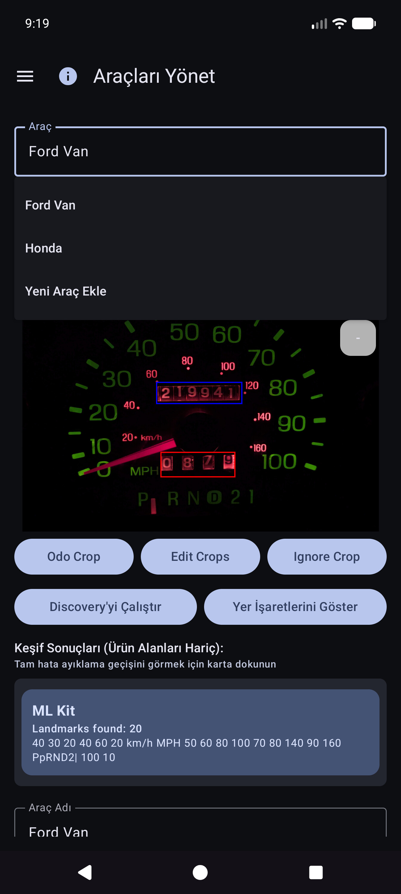
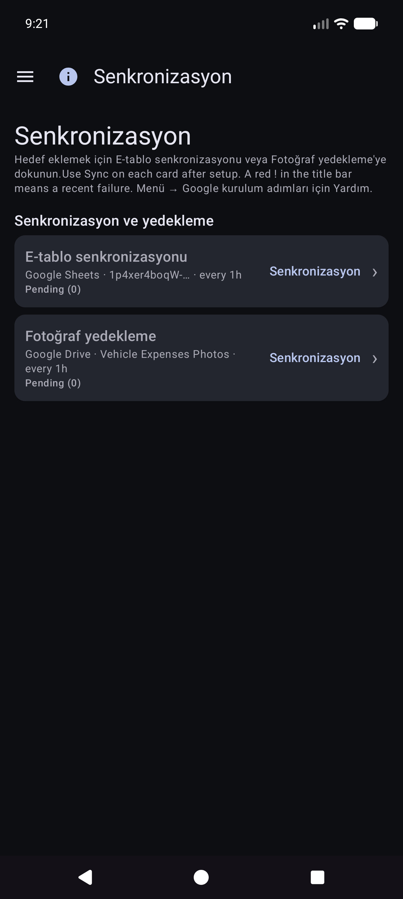
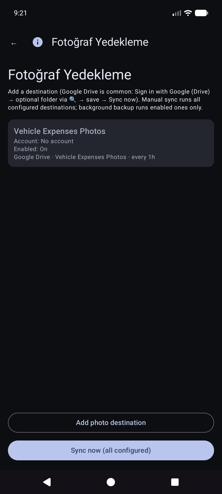
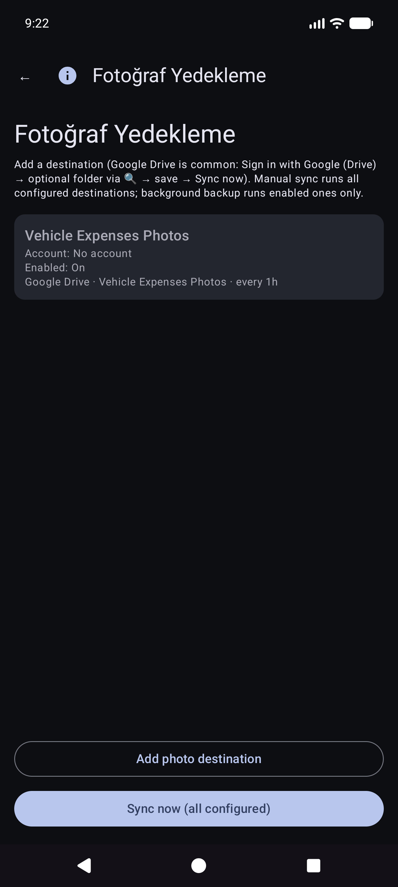
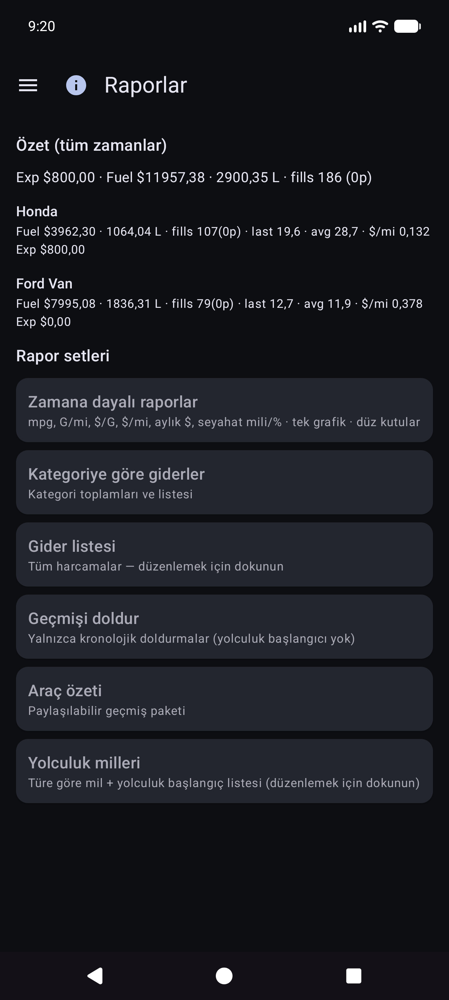
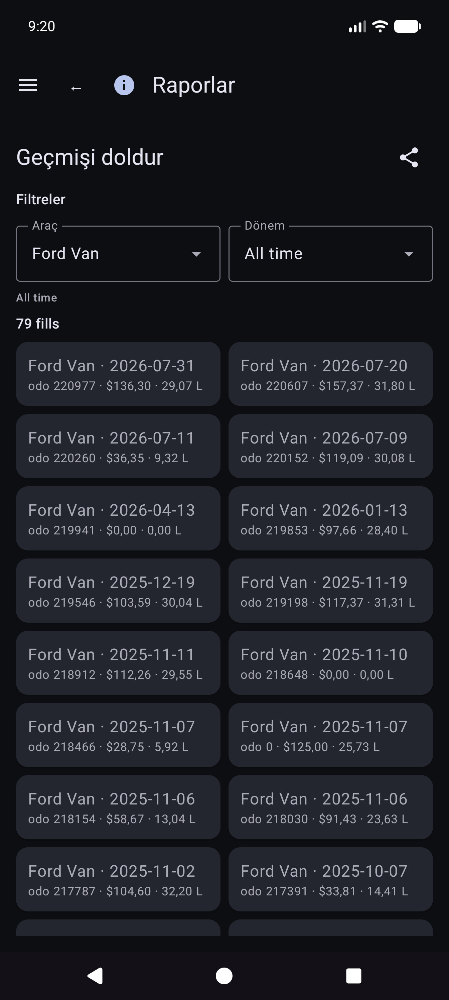
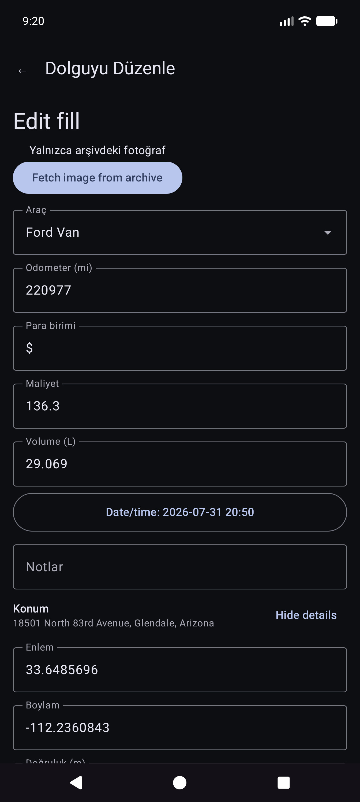
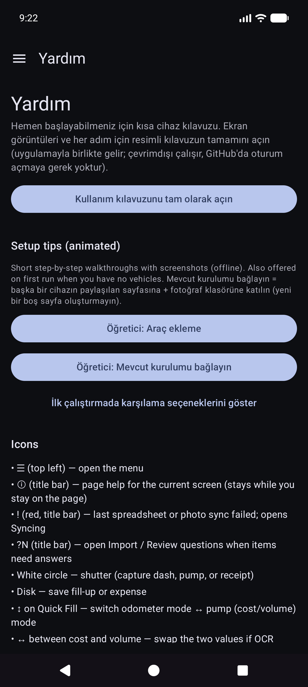
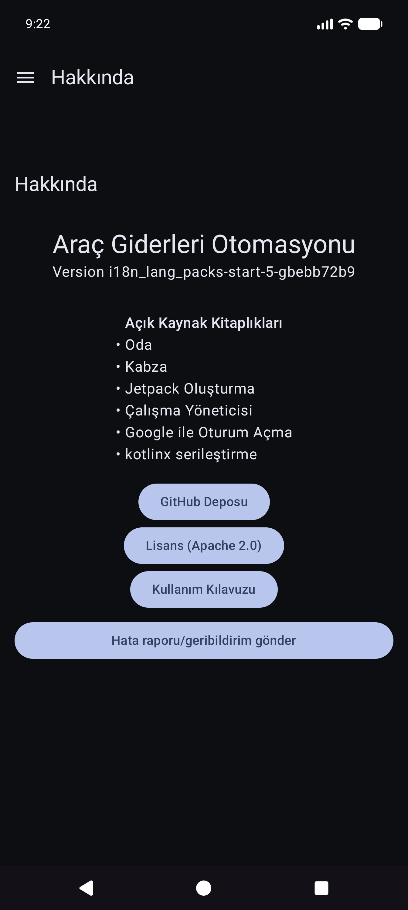

# Araç Giderlerinin Otomatikleştirilmesi — Kullanım Kılavuzu

> **Kaynağı düzenleyin (Markdown).** Tarayıcılar ve uygulama içi okuyucu **oluşturulan HTML'yi** açar:
> - Web: [`docs/user-manual.html`](user-manual.html) (`./scripts/render-user-manual.sh` ile yeniden oluşturun)
> - Uygulama: Yardım / Hakkında → tam kılavuz (birlikte verilen HTML + ekran görüntüleri)
>
> Son kullanıcıları ham ".md" URL'lerine yönlendirmeyin; tarayıcılar yalnızca düz metin gösterir.

**Bulut hesaplarınız** altında isteğe bağlı çoklu cihaz senkronizasyonu ve yedeklemeyle, yakıt dolumları ve araç masrafları için ilk kamera takibi.

Bu **tam kılavuzdur** (ekran görüntüleri + her adım). Telefondaki **Menü → Yardım** daha kısa bir başlangıç ​​kılavuzudur.

**Burada ele alınmayan konular:** Eski Resimleri İçe Aktarma, Hizalama Deneyi ve Pompa Deneyi (geliştirici / gelişmiş araçlar).

---

## İçindekiler tablosu

1. [İhtiyacınız olan şey](#ihtiyacınız olan şey)
2. [Bir bakışta simgeler](#bir bakışta simgeler)
3. [Menüyü aç](#menüyü aç)
4. [İlk kurulum: Araçları Yönet](#ilk kez kurulum-araçları-yönet)
5. [Yedeklemeler ve çoklu cihaz senkronizasyonu](#yedeklemeler ve çoklu cihaz senkronizasyonu)
6. [Hızlı Doldurma (yakıt)](#hızlı yakıt doldurma)
7. [Yolculuğu başlat](#yolculuğu başlat)
8. [Giderler](#giderler)
9. [Raporlar](#raporlar)
10. [Ayarlar (yerel tercihler)](#ayarlar-yerel-tercihler)
11. [Senkronizasyon](#senkronizasyon)
12. [Yardım ve Hakkında](#help--about)
13. [İlgili dokümanlar](#ilgili-dokümanlar)

---

## İhtiyacınız olan şey

- Android telefon veya tablet.
- En iyi OCR için: **pano kilometre sayacınızın** ve **pompa toplamlarının** net bir görünümü (veya sayıları elle yazın).
- İsteğe bağlı: e-tablo verileri ve/veya fotoğraf yedekleme için **kontrol ettiğiniz** hesaplar (bkz. [Yedeklemeler ve çoklu cihaz senkronizasyonu](#backups-and-multi-device-sync)).

---

## Bir bakışta simgeler

Bunlar ana ekranlarda görünür. Bunları bilmek avlanmanın büyük kısmını kurtarır.

| Nerede | Simge / kontrol | Ne işe yarar |
|----------|-----|-------------|
| Üst çubuk | **☰ Menü** (hamburger) | Gezinme çekmecesini açar |
| Üst çubuk | **ⓘ** (sayfa yardımı) | **Geçerli** sayfa için kısa yardım (varsa menünün yanında) |
| Üst çubuk | **`?N`** (sarı) | Bekleyen içe aktarma inceleme soruları — İçe aktarma incelemesini açar |
| Üst çubuk | **!** (kırmızı) | Yakın zamanda bir e-tablo veya fotoğraf hedefi başarısız oldu — düzeltmek için **Senkronizasyon**'u açın |
| Üst çubuk | **☰ + ←** | Çocukları rapor et ve Giderler listesi **menü ve arka kısmı** birlikte gösterir; Rapor merkezi yalnızca menüden oluşur |
| Ayarlar / yakıt düzenleme | **←** | Geri (ayarlar elektronik tablo/fotoğraf ve yakıt düzenleme geriye odaklı kalır) |
| Hızlı Doldur | **Beyaz daire** (deklanşör) | OCR için kilometre sayacını veya pompa ekranını yakalayın |
| Hızlı Doldur | **Disk / Kaydet** | Doldurmayı kaydedin (bir araca ve odo / hacim / maliyetten en az birine ihtiyaç duyar) |
| Hızlı Doldur | **↕ oklar** (mod anahtarı) | **kilometre sayacı modu** ile **pompa (maliyet/hacim) modu** arasında geçiş yapın. Yeşil kenarlık etkin alan grubunu vurgular |
| Hızlı Doldur | **↔ okları** (maliyet ve hacim arasında) | OCR yanlış alanlara koyarsa maliyet ve hacmi değiştirin |
| Hızlı Doldur | **1x yakınlaştır /…** | Lens desteklediğinde kamera yakınlaştırma oranları |
| Hızlı Doldurma (yakaladıktan sonra) | **Yenile** ana düğmede | Önizlemeyi atın ve canlı kameraya dönün |
| Hızlı Doldurma (işlenirken) | **X** ana düğmede | Devam eden yakalamayı/OCR'yi iptal et |
| Gider | **Kaydet** | Masraflardan tasarruf edin |
| Gider | **Deklanşör dairesi** | Makbuz fotoğrafı çekin |
| Gider | **Galeri** | Kitaplıktan bir makbuz resmi seçin |
| Gider | **Yeniden çek** | Mevcut makbuz fotoğrafını silin ve tekrar çekim yapın |
| Gider / Araç Yönetimi | **+ / −** FAB'ler | Fotoğraf önizlemesini yakınlaştırın |
| Yer işaretleri iletişim kutusu | **OCR'yi düzenle** | Motorların gözden kaçırdığı önemli nokta metnini düzeltin veya ekleyin |
| Elektronik Tablo / Fotoğraf formları | **🔍 Ara** | Bir sayfa veya klasör için Google Drive'a göz atın (oturum açtıktan sonra) |

Maliyet alanlarındaki para birimi simgelerine ve hacim alanlarındaki **G/L**'ye dokunulabilir: söz konusu giriş için para birimini veya galon ve litreyi değiştirmek için küçük bir menü açın.

---

## Menüyü aç

1. Sol üstteki **☰** seçeneğine dokunun.
2. Bir sayfa seçin.

**Ana çekmece:** Hızlı Doldurma · Yolculuğu başlat · Araçları Yönet · Yeni gider · **Raporlar** · Ayarlar · Senkronizasyon · Yardım · Hakkında.

**Deneme çekmecesi** (Ayarlar → Deney ekranlarını göster): Hizalama Deneyi · Pompa Deneyi · **Eski Resimleri İçe Aktar**.

**Raporlar merkezi aracılığıyla (ana çekmece değil):** Gider listesi · Geçmişi doldur.

---

## İlk kurulum: Araçları Yönetme

OCR ve **otomatik araç eşleştirme**, her aracı bir **referans kontrol paneli fotoğrafı** ile kaydettikten, kilometre sayacını kırptıktan ve **Discovery**'yi çalıştırdıktan sonra en iyi şekilde çalışır, böylece uygulama o çizgi için önemli metinleri depolar. (Yer işaretlerinin nasıl seçildiği ve eşleştirildiği daha sonraki bir güncellemede daha ayrıntılı olarak belgelenecektir.)

### Araçları Yönet'i açın

Menü → **Araçları Yönet**. Bir araç seçin (veya **Yeni Araç Ekle**).

### Araç ekleyin veya düzenleyin

1. **Araç** açılır menüsünü açın → bir araç seçin veya **Yeni Araç Ekle**.
2. Net bir **referans gösterge fotoğrafı** çekin veya seçin (tam gösterge paneli, iyi aydınlatılmış, telefon kabaca kare şeklinde). **Fotoğraf Çek** veya **Galeri**'yi kullanın.
3. Mahsulleri çizin:
   - **Odo Kırp** — kilometre sayacı rakamlarının etrafında sıkı bir dikdörtgen (bu mod etkinken düğme **Bitti Odo**'yu gösterir).
   - **Kırpmayı Yoksay** — yoksayılacak isteğe bağlı bölge (saat, radyo vb.).
   - **Kırpmaları Düzenle** — mevcut dikdörtgenleri ayarlayın.
4. **Keşif'i Çalıştır**'a dokunun — çok motorlu OCR, ekinlerin dışındaki önemli sözcükleri bulur.
5. **Yer İşaretlerini Göster** ile inceleyin. Yanlış okunanları düzeltmek veya gözden kaçan **eklemek** için **OCR'yi düzenle** seçeneğini kullanın.
6. **Araç Adı** (gerekli) ve marka/model/yıl/plakayı istediğiniz gibi doldurun.
7. **Araç Oluştur** veya **Değişiklikleri Kaydet**'e dokunun (yeni bir araç için ad + referans fotoğrafı gerektirir).

### Yer işaretleri: Discovery'nin gözden kaçırdığı şeyleri düzeltin

**Yer İşaretlerini Göster**'in ardından listeyi kaydırın ve değerleri düzeltin. Motorlar bazen küçük rakamları kaçırır (örneğin, kümenin sağ alt köşesindeki **60** saati). Araç kimliğinin güvenilir kalması için **OCR'yi düzenle**'yi kullanarak bunları ekleyin veya düzeltin.

### Mükemmel bir fotoğraf olmadan yazmak

Uygulamayı, bir araç seçip Hızlı Doldurma'ya kilometre sayacı, hacim ve maliyeti **yazarak** kullanmaya devam edebilirsiniz — OCR her alan için isteğe bağlıdır. Galeriyi içe aktarma, uygulama içinde çekim yapmamayı tercih ettiğinizde referans çizgi fotoğrafı için çalışır.

**İpucu:** E-tablo senkronizasyonundan sonra araç tanımları (ekinler, yer işaretleri) yerel veritabanında yayınlanır; bunları kullanmak için Hızlı Doldurma için Araçları Yönet'i yeniden açmanız gerekmez.

---

## Yedeklemeler ve çoklu cihaz senkronizasyonu

Uygulama, **birden fazla telefon veya tabletin aynı filo verilerini paylaşabileceği** şekilde tasarlanmıştır ve böylece **verilerinizin ve fotoğraflarınızın bir kopyasını cihazdan** saklayabilirsiniz. Bu, **sizin** hesaplarınız veya **kendinizde barındırılan** sunucularınız altında yapılandırdığınız **sizin** hedeflerle yapılır; diğer insanların görebileceği, şirket tarafından işletilen bir "Araç Giderleri bulutu" ile değil.

### Ne nerede çalışır

| tür | Neleri saklıyor | Tipik kullanım |
|----------|-----|------------|
| **E-tablo / tablo senkronizasyonu** | Araçlar, yakıt dolumları, giderler (sıralar ve sekmeler) | Çoklu cihaz birleştirme + yapılandırılmış yedekleme |
| **Fotoğraf yedekleme** | İkili resimler (tire/pompa/makbuz/referans fotoğrafları) | Fotoğraf yedekleme + eksik dosyaları geri yükleme |

Her türden **birden fazla hedefi** yapılandırabilirsiniz (tür başına yumuşak sınır). Manuel **Şimdi senkronize et** ve **arka planda** çalışanlar etkin olanları çalıştırır.

### Önce çevrimdışı

- Doldurma, gider veya makbuz eklemek için **ağ gerekmez**. Her şey **öncelikle yerel olarak** kaydedilir.
- Ağ kullanılabilir olduğunda, senkronizasyon ve fotoğraf yedekleme **arka plan görevleri** olarak çalıştırılır (ayarladığınız bir programa göre ve **Şimdi senkronize et**'e dokunduğunuzda). Arızalar, Ayarlar satırlarının altında kırmızı metinle ve uygulama başlık çubuğunda **!** işaretiyle gösterilir.

### Yalnızca hesaplarınız

Oturum açma ve jetonlar, seçtiğiniz sağlayıcılar (Google, Microsoft, S3 anahtarları, kendi kendine barındırılan URL'ler vb.) için cihazda kalır. Hedefler **kullanıcının tam kontrolü** altındadır (Google hesabınız, OneDrive'ınız, MinIO klasörünüz, EtherCalc ana bilgisayarınız vb.). Paylaşılan bir arka uç aracılığıyla diğer Araç Giderleri kullanıcılarıyla hiçbir şey paylaşılmaz.

### Desteklenen hedefler — veriler (elektronik tablo / tablo halinde)

**Menü → Senkronizasyon → E-tablo senkronizasyonu** altında yapılandırılmıştır (Ayarlar özeti satırlarından da erişilebilir). Birinci sınıf seçici seçenekleri:

| Hedef | Notlar |
|----------|-----------|
| **Google E-Tablolar** | Ortak varsayılan; Araçlar, Giderler ve araç başına yakıt sekmeleri |
| **Excel** | Graph / OneDrive tarzı bağlama yoluyla Microsoft çalışma kitabı |
| **EtherCalc** | Kendi kendine barındırılan ortak çalışmaya dayalı elektronik tablo odaları |
| **Diğer →** uygulanan arka uçlar | **Baserow**, **NocoDB**, **Airtable**, **PocketBase**, **Supabase**, **Firebase**, **Zoho Sheet** |

Ertelendi / henüz başsız değil (Diğer altında listelenmiştir ancak tam olarak uygulanmamıştır): OnlyOffice, Collabora. Ayrıca bkz. [kendi kendine ana bilgisayar dizini](referans/kendi kendine ana bilgisayar/INDEX.md).

CSV **dışa aktarma/içe aktarma** (aynı sekme düzeninin ZIP'i), canlı senkronizasyondan bağımsız olarak taşınabilir bir yedekleme olarak Ayarlar'dan edinilebilir.

### Desteklenen hedefler — fotoğraflar (görüntü yedekleme)

**Menü → Senkronizasyon → Fotoğraf yedekleme** altında yapılandırılmıştır (ayrıca Ayarlar özeti satırlarından):

| Hedef | Notlar |
|----------|-----------|
| **Google Drive** | Seçtiğiniz klasör (URL'ye göz atın veya yapıştırın) |
| **OneDrive** | Microsoft hesabı + yol öneki |
| **S3** | AWS, Wasabi, Cloudflare R2, MinIO ve diğer S3 uyumlu uç noktalar |
| **Diğer** | rclone destekli depolama (ör. WebDAV, SFTP ve uygulama içi seçicide bulunan diğer seçilmiş uzaktan kumandalar) |

Kendi kendine barındırılan fotoğraf ve tablolu hedefler için yardımcı sayfalar oluşturun: [kendi kendine barındırılan dizin](referans/self-host/INDEX.md).

### Çoklu cihaz davranışı (kısa)

- Satırlar **Güncellenen** zaman damgalarında **Son Yazma Kazanımları** ile **Senkronizasyon Kimliği** ile birleştirilir.
- Silme işlemleri yumuşaktır; başka bir cihazdaki daha yeni bir düzenleme, bir satırı geri yükleyebilir.
- İki cihazda **aynı dolguyu iki kez** girmek **iki satır** oluşturur; fark ettiğinizde fazlalıkları silin.
- Daha fazla ayrıntı: [Senkronizasyon davranış notları](#sync-behavior-notes) ve [SYNC_BEHAVIOR.md](referans/SYNC_BEHAVIOR.md).

### Örnek: Google E-Tablolar'ı (veri) ekleyin

1. **Menü → Senkronizasyon → E-tablo senkronizasyonu** (veya Ayarlar → E-tablo senkronizasyonu).

   

2. **E-tablo hedefi ekle**'ye dokunun.

   

3. **Google E-Tablolar**'ı seçin.

   

4. **Google ile oturum açın** → görünen ad → **Sayfa URL'si** veya **🔍** göz at/oluştur → planlama seçenekleri → etkinleştir → kaydet.
5. Sekmeleri oluşturmak/güncellemek için **şimdi senkronize edin**: "Araçlar", "Giderler", "Yakıt - {araç adı}".

### Örnek: Google Drive'ı ekleyin (fotoğraflar)

1. **Menü → Senkronizasyon → Fotoğraf yedekleme** (veya Ayarlar → Fotoğraf yedekleme).

   

2. **Fotoğraf hedefi ekle**'ye dokunun.

   

3. **Google Drive**'ı seçin.

   

4. **Google (Drive) ile oturum açın** → isteğe bağlı klasör URL'si/göz at → etkinleştir → kaydet → **Şimdi senkronize et**.

Fotoğraflar için manuel **Şimdi senkronize et** tam bir geçiştir; arka plan yedeklemesi genellikle **yalnızca beklemedeki** yüklemeleri belirli bir programa göre işler.

### Davranış notlarını senkronize et

- Uygulama yükseltmesinden sonra kısaca **“Yükseltmeden sonra veritabanı güncelleniyor…”** (yerel senkronizasyon kimliği dolgusu) ifadesini görebilirsiniz.
- Bir senkronizasyon kesintiye uğrarsa, bir sonraki **başarılı** senkronizasyon uzak sekmeleri yeniden birleştirir ve onarır.
- Arızalar: Uygulama çubuğunda Senkronizasyon kartları + **!** üzerinde kırmızı özet.

---

## Hızlı Doldurma (yakıt)

Bu, uygulamayı açtığınızda **ana ekrandır**.

### Araç seçimi (genellikle otomatik)

Önce aracı seçmeniz **gerekmez**. Araçları Yönet'te araçlar **yer işaretleri** ayarlandığında, Hızlı Doldurma kilometre sayacını yakaladıktan sonra gösterge tablosu görüntüsünden **hangi aracı** otomatik olarak algılar. Gerekirse geçersiz kılmak için **Araç** açılır menüsünü yine de açabilirsiniz.

### Kilometre sayacına nişan alın

Kilometre sayacı modunda kalın ve kümeyi çerçeveleyin. Talimat: * Kilometre sayacını hedefleyin. Yakalamak için deklanşöre dokunun.*

### Kilometre sayacı deklanşöründen sonra

OCR **Odo**'yu doldurur ve aracı yer işaretlerinden eşleştirmeye çalışır (gerekirse her ikisini de inceleyin). Yeniden çekim yapmak için ana düğme **Yeniden Dene** olur. Talimat okumayı özetler.

### Pompa modu (maliyet ve hacim)

1. Pompa moduna geçmek için **↕** öğesine dokunun: *Pompa ekranını hedefleyin (maliyet/hacim). Deklanşöre dokunun.*
2. Pompa toplamlarını yakalayın. Maliyet ve hacim alanları doldurulur; eğer yer değiştirmişlerse **↔** kullanın.
3. Para birimine veya gerekiyorsa **G/L**'ye, ardından **Kaydet**'e (disk) dokunun. Boş alanlar **kısmi doldurma** oluşturur (hala izin veriliyor).

Bir sonraki durak için Hızlı Doldurma'da kalırsınız (alanlar kaydetmeden sonra temizlenir). Tamamen **çevrimdışı** çalışın; senkronizasyon yapılandırıldığında arka planda daha sonra çalışır.

### Manuel giriş (kamera yok / bozuk OCR)

1. **Odo**, **maliyet** veya **ses düzeyi**'ne dokunun ve değerleri yazın (dikey sistem klavyesini, yatay ise ekran tuş takımını kullanır).
2. Otomatik algılama çalışmadıysa **Araç**'ı seçin veya onaylayın.
3. Yukarıdaki gibi kaydedin.

### Modlar ve sınırlar

- Araç+odo etrafındaki **yeşil kenarlık** → kilometre sayacının yakalanması/düzenlenmesi.
- **Maliyet+hacim → pompa modu etrafında **yeşil kenarlık**.
- **Kaydet**, bir araç seçilene ve odo/maliyet/hacim değerlerinden en az birinde veri bulunana ve OCR hala çalışmayana kadar devre dışı kalır.

Ekran ipucu (talimat satırının altında): *Deklanşör = yakalama · Disk = kaydetme · ↕ = odo/pompa modu · ↔ = maliyet/hacim değiştirme.*

---

## Giderler

### Yeni gider

Menü → **Yeni gider**.

1. **Kaydet** (disk), **deklanşör** (makbuz fotoğrafı) veya **galeri** (resim seç).
2. **Tarih**, **Araç**, **Satıcı**, **Açıklama**, **Tutar** (para birimi sembolüne dokunulabilir), **Kategori**, isteğe bağlı **Kilometre Sayacı**'nı doldurun.
3. Çok sayfalı makbuzlar: Kullanıcı arayüzü sayfalama sunuyorsa ek sayfaları yakalayın (sayfa 0 birincil makbuzdur).
4. Depolamaya **kaydedin** (öncelikle yerel; fotoğraf yedekleme ve e-tablo senkronizasyonu, yapılandırıldığında arka planda gerçekleşir).

### Gider listesi

Menü → **Raporlar** → **Gider listesi** — geçmiş yakıt dışı harcamalara göz atın; Düzenlenecek bir öğeyi açın.

### Gideri düzenle

Listeden bir satır açın. Satıcıyı, miktarı, kategoriyi, aracı ve açıklamayı doğru yapın. Makbuz yalnızca fotoğraf yedeklemesindeyse (okunabilir yerel dosya yoksa), gösterildiğinde **Resmi arşivden getir** seçeneğini kullanın (yapılandırılmış fotoğraf hedeflerinde çalışır).

---

## Yolculuğu başlat

Menü → **Yolculuğu başlat** (çekmecedeki Hızlı Doldurma işleminden sonra). Kilometre sayacını yakalayın veya girin, yolculuk türünü seçin, **disk** simgesiyle kaydedin. **Durdur**, tutulan GPS konumundaki Kişisel için bir kısayoldur. Kontrol hatırlatıcıları için **ⓘ** kullanın.

Yolculuk başlangıçları, **Açma Türü** (normal dolumlar değil) ile yakıt sıraları olarak saklanır. Yakıt Geçmişi altında değil, **Raporlar → Yolculuk milleri** altında görünürler.

---

## Raporlar

Menü → **Raporlar** ürün merkezini açar (tüm zamanların özeti + katalog kartları). Bu, ürün raporlarının tek yüzeyidir; ayrı bir "Raporlar ve Grafikler" çekmecesi öğesi yoktur.

Araç modu (**Tümü / Her Biri / Tekli**), dönem filtreleri, grafikler ve paylaşım (**METİN / CSV / PDF**) için bir kart açın. Rapor edilen çocukların üst çubuğu: **☰ + ←** (ve kayıtlı olduğunda **ⓘ**).

### Zamana dayalı raporlar

Ana harita kartı. **Pürüzsüz** kutular ve **bağımsız Y ölçekleri** (ekonomi solda; para ve seyahat aileleri sağda) ile isteğe bağlı ölçümler (mpg, G/mi gibi hacim/mesafe, $/G gibi birim fiyat, maliyet/mesafe, aylık $, yolculuk milleri, türe göre yolculuk yüzdesi).

Ekonomi matematiğinin ayrıntıları: [REPORTS_METRICS.md](referans/REPORTS_METRICS.md).

### Dolum geçmişi ve Yakıt Geçmişi karşılaştırması

- **Raporlar → Doldurma geçmişi** — rapor filtreleri için kronolojik doldurmalar (**yalnızca doldurmalar**; yolculuk başlamaz).

- **Yakıt Geçmişi** (yapınızın navigasyonunda mevcutsa) — araç başına dolum envanteri, ayrıca yalnızca dolumlar; düzenlemek için bir satıra dokunun.

### Yolculuk mili

**Raporlar → Yolculuk milleri** — türe göre miller, grafikler ve kronolojik **yolculuk başlangıç / bölüm listesi**. Söz konusu satır için **Dolguyu düzenle**'yi açmak için gerçek bir başlangıca dokunun.

### Dolguyu düzenle

Dolum geçmişi, Yakıt Geçmişi veya Yolculuk millerinden bir dolum açın. Düzen: araç ve kilometre sayacı, **maliyet öncesi para birimi**, hacim, notlar. Yolculuk türü yalnızca satır bir yolculuk başlangıcı olduğunda görünür. Konumun bir özeti ve **Konum ayrıntıları** bulunur. Bulut kimliğine sahip yerel fotoğraf eksik: **Arşivden görseli getir**.

Diğer katalog kartlarında kategoriye göre harcamalar, araç özeti ve harcama listesi yer alır.

Para, ayarlandığında her satırın para birimini kullanır. Karışık para birimi toplamları **para birimi başına alt toplamları** gösterir (sessiz döviz dönüşümü yoktur).

---

## Senkronizasyon

Menü → **Senkronizasyon** e-tablo ve fotoğraf hedefleri için merkezdir (yalnızca Ayarlar altında gömülü değildir).

- Kısa durumlu **E-tablo senkronizasyonu** ve **Fotoğraf yedekleme** için kartlar, bu tür için **Senkronizasyon** ve hedef listesine **›**.
- **Bağlantıyı test et** ve **Şimdi senkronize et (bu hedef)** / tamamı yapılandırılmış için bir hedef açın.
- Başarısızlık **Ayrıntılar** ve başlık çubuğundaki kırmızı **!** buraya gelir.
- Adım adım Google E-Tablolar ve Drive kurulumu: [Yedeklemeler ve çoklu cihaz senkronizasyonu](#backups-and-multi-device-sync).

---

## Ayarlar (yerel tercihler)

Menü → **Ayarlar**.

Hedefler için **Menü → Senkronizasyon**'u tercih edin. Ayarlar aynı listeleri açan özet satırlarını göstermeye devam edebilir.

### Yerel tercihler (ortak)

- **Yakıt Makbuz Fotoğraflarını Kaydet** / **Harcama Fotoğraflarını Yerel Olarak Kaydet** — görüntüleri cihazda saklayın (Fotoğraf izni isteyebilir).
- **Deklanşör Sesini Çal**
- **Para birimi** / **Birim birimi** — uygulama varsayılanları (sistem veya açık). Hacim biriminin mevcut yakıt verileriyle değiştirilmesi bir dönüştürme iletişim kutusu sunabilir.
- **Karanlık mod**
- **Kurulum ipuçları** — İlk çalıştırmada araç/senkronizasyon eğitimlerini yeniden açın.
- **Hızlı Doldurmada Hata Ayıklama** / **Deneme ekranlarını göster (geliştirme)** — gelişmiş; günlük kullanıma bırakın. Deney ekranları burada belgelenmemiştir.

CSV **dışa aktarma/içe aktarma** (Araçların ZIP'i / Giderler / Yakıt sekmeleri), mevcut yapı tarafından sunulduğunda Ayarlar'dan edinilebilir.

---

## Yardım ve Hakkında

- **Yardım** — cihaz üzerinde hızlı başlangıç, kurulum eğitimleri, bu kılavuza bağlantı, kendi kendine ana bilgisayar kurulum dizini.
- **Hakkında** — sürüm, lisanslar, GitHub, bu kılavuz (çevrimdışı paket halinde + yayınlandığında çevrimiçi HTML).

---

## İlgili dokümanlar

- [USER_GUIDE.md](referans/USER_GUIDE.md) — yoğunlaştırılmış referans
- [self-host/INDEX.md](referans/self-host/INDEX.md) — kendi kendine barındırılan fotoğraf/tablo kurulumu
- [SYNC_BEHAVIOR.md](referans/SYNC_BEHAVIOR.md) — birleştirme, kurtarma, kopyalar
- [REPORTS_METRICS.md](referans/REPORTS_METRICS.md) — ekonomi ölçüm ayrıntıları