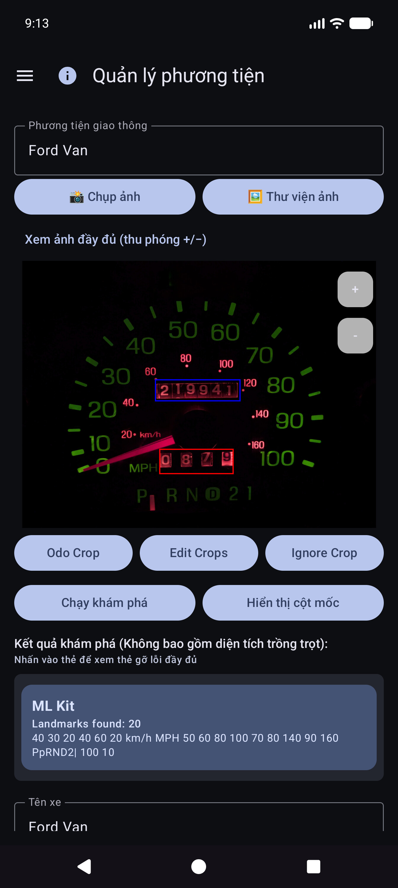
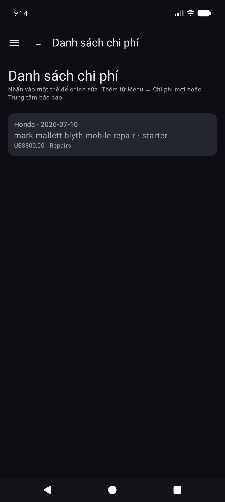
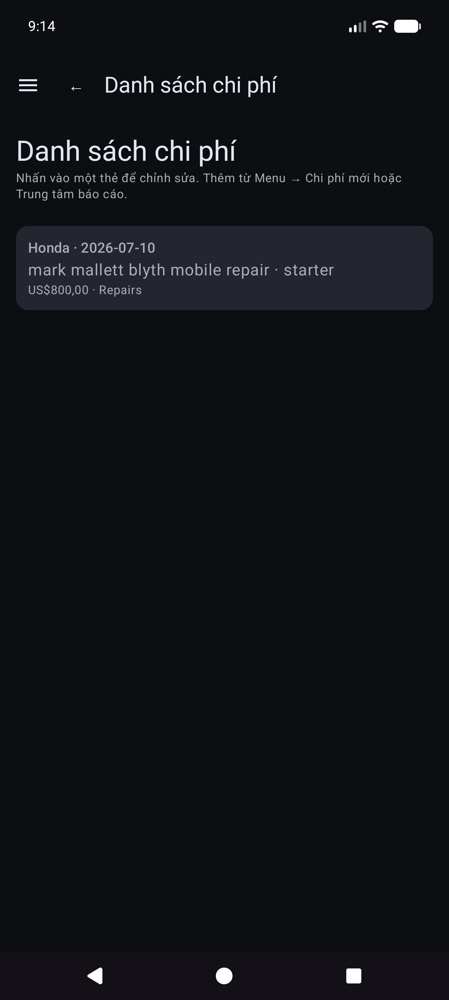
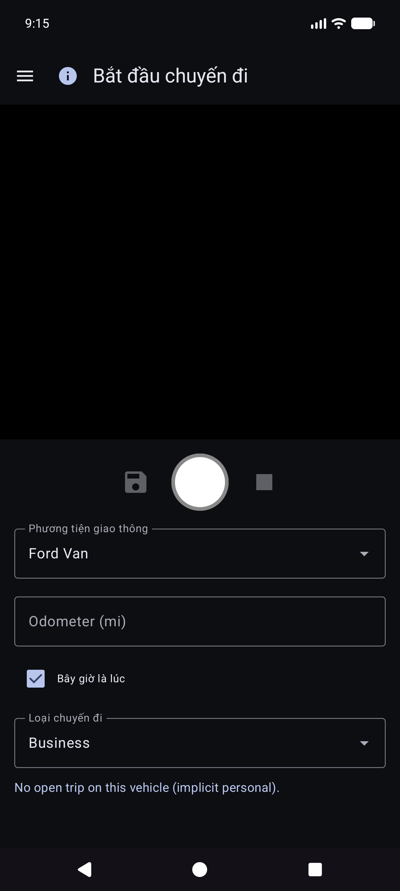
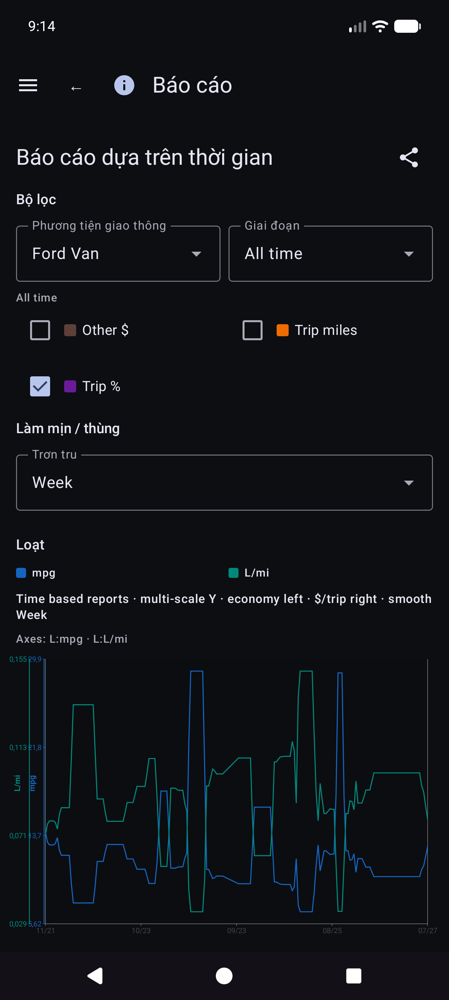
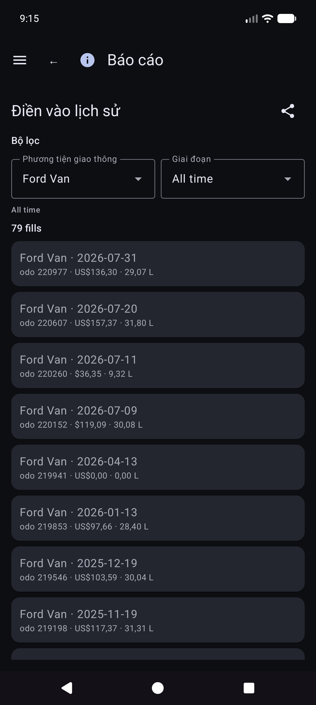
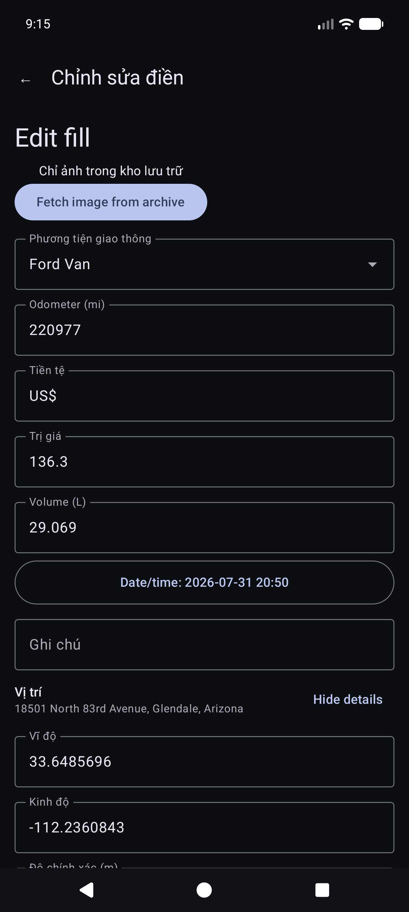
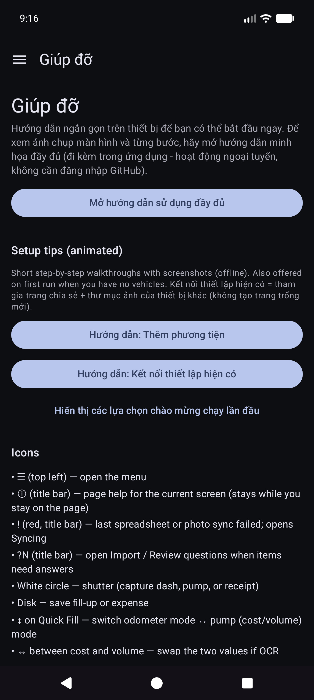

# Chi phí phương tiện tự động — Hướng dẫn sử dụng

> **Chỉnh sửa nguồn (Markdown).** Trình duyệt và trình đọc trong ứng dụng mở **HTML được kết xuất**:
> - Web: [`docs/user-manual.html`](user-manual.html) (tạo lại bằng `./scripts/render-user-manual.sh`)
> - Ứng dụng: Trợ giúp / Giới thiệu → hướng dẫn đầy đủ (HTML + ảnh chụp màn hình đi kèm)
>
> Không trỏ người dùng cuối tới các URL `.md` thô — trình duyệt chỉ hiển thị văn bản thuần túy.

Camera đầu tiên theo dõi việc đổ xăng và chi phí xe, với tính năng đồng bộ hóa và sao lưu đa thiết bị tùy chọn trong tài khoản đám mây **của bạn**.

Đây là **hướng dẫn đầy đủ** (ảnh chụp màn hình + từng bước). Trên điện thoại, **Menu → Trợ giúp** là hướng dẫn bắt đầu ngắn hơn.

**Không được đề cập ở đây:** Nhập Ảnh cũ, Thử nghiệm căn chỉnh và Thử nghiệm bơm (công cụ dành cho nhà phát triển / nâng cao).

---

## Mục lục

1. [Những gì bạn cần](#những gì bạn cần)
2. [Xem nhanh biểu tượng](#icons-at-a-glance)
3. [Mở menu](#open-the-menu)
4. [Thiết lập lần đầu: Quản lý phương tiện](#first-time-setup-manage-vehicles)
5. [Sao lưu và đồng bộ hóa nhiều thiết bị](#backups-and-multi-device-sync)
6. [Đổ đầy nhanh (nhiên liệu)](#đổ đầy nhiên liệu nhanh)
7. [Bắt đầu chuyến đi](#start-trip)
8. [Chi phí](#chi phí)
9. [Báo cáo](#báo cáo)
10. [Cài đặt (tùy chọn cục bộ)](#settings-local-preferences)
11. [Đang đồng bộ hóa](#đồng bộ hóa)
12. [Trợ giúp & Giới thiệu](#help--about)
13. [Tài liệu liên quan](# tài liệu liên quan)

---

## Thứ bạn cần

- Điện thoại hoặc máy tính bảng Android.
- Để có OCR tốt nhất: chế độ xem rõ ràng **đồng hồ đo đường trên bảng điều khiển** và **tổng số máy bơm** (hoặc nhập số bằng tay).
- Tùy chọn: các tài khoản **bạn kiểm soát** để sao lưu dữ liệu bảng tính và/hoặc sao lưu ảnh (xem [Sao lưu và đồng bộ hóa đa thiết bị](#backups-and-multi-device-sync)).

---

## Tổng quan về biểu tượng

Chúng xuất hiện trên màn hình chính. Biết chúng giúp tiết kiệm rất nhiều cuộc săn bắn.

| Ở đâu | Biểu tượng / điều khiển | Nó làm gì |
|-------|-------|--------------|
| Thanh trên cùng | **☰ Thực đơn** (hamburger) | Mở ngăn điều hướng |
| Thanh trên cùng | **ⓘ** (trang trợ giúp) | Trợ giúp ngắn gọn cho trang **hiện tại** (bên cạnh menu nếu có) |
| Thanh trên cùng | **`?N`** (màu vàng) | Các câu hỏi đánh giá nhập đang chờ xử lý — mở Đánh giá nhập |
| Thanh trên cùng | ***!** (đỏ) | Gần đây, đích đến của bảng tính hoặc ảnh không thành công — mở **Đang đồng bộ hóa** để khắc phục |
| Thanh trên cùng | **☰ + ←** | Báo cáo con và danh sách Chi phí hiển thị **menu và quay lại** cùng nhau; Trung tâm báo cáo chỉ có trong menu |
| Cài đặt / chỉnh sửa nhiên liệu | **←** | Quay lại (bảng tính cài đặt/chỉnh sửa ảnh và nhiên liệu vẫn tập trung trở lại) |
| Điền nhanh | **Vòng tròn màu trắng** (màn trập) | Chụp màn hình đồng hồ đo đường hoặc máy bơm cho OCR |
| Điền nhanh | **Đĩa / Lưu** | Tiết kiệm nhiên liệu (cần một chiếc xe và ít nhất một trong số odo/khối lượng/chi phí) |
| Điền nhanh | **↕ mũi tên** (chuyển đổi chế độ) | Chuyển đổi giữa **chế độ đo đường** và **chế độ bơm (chi phí/khối lượng)**. Đường viền màu xanh lá cây làm nổi bật nhóm trường đang hoạt động |
| Điền nhanh | **↔ mũi tên** (giữa chi phí và khối lượng) | Hoán đổi chi phí và khối lượng nếu OCR đặt chúng vào sai trường |
| Điền nhanh | **Thu phóng 1x / …** | Tỷ lệ thu phóng của máy ảnh khi ống kính hỗ trợ chúng |
| Điền nhanh (sau khi chụp) | **Làm mới** trên nút chính | Loại bỏ bản xem trước và quay lại camera trực tiếp |
| Điền nhanh (trong khi xử lý) | **X** trên nút chính | Hủy chụp/OCR đang thực hiện |
| Chi phí | **Lưu** | Tiết kiệm chi phí |
| Chi phí | **Vòng màn trập** | Chụp ảnh biên nhận |
| Chi phí | **Thư viện** | Chọn hình ảnh biên nhận từ thư viện |
| Chi phí | **Thi lại** | Xóa ảnh biên lai hiện tại và chụp lại |
| Chi phí / Quản lý phương tiện | *** / −** FAB | Thu phóng bản xem trước ảnh |
| Hộp thoại cột mốc | **Chỉnh sửa OCR** ​​| Sửa hoặc thêm văn bản mốc mà công cụ bỏ sót |
| Bảng tính / Biểu mẫu ảnh | **🔍 Tìm kiếm** | Duyệt qua Google Drive để tìm trang tính hoặc thư mục (sau khi đăng nhập) |

Bạn có thể nhấn vào ký hiệu tiền tệ trên trường chi phí và **G/L** trên trường khối lượng: mở một menu nhỏ để thay đổi đơn vị tiền tệ hoặc gallon so với lít cho mục nhập đó.

---

## Mở menu

1. Nhấn vào **☰** ở trên cùng bên trái.
2. Chọn một trang.

**Ngăn kéo chính:** Điền nhanh · Bắt đầu chuyến đi · Quản lý phương tiện · Chi phí mới · **Báo cáo** · Cài đặt · Đồng bộ hóa · Trợ giúp · Giới thiệu.

**Ngăn kéo thử nghiệm** (Cài đặt → Hiển thị màn hình thử nghiệm): Thử nghiệm căn chỉnh · Thử nghiệm bơm · **Nhập ảnh cũ**.

**Thông qua trung tâm Báo cáo (không phải ngăn kéo chính):** Danh sách chi phí · Điền vào lịch sử.

---

## Thiết lập lần đầu: Quản lý phương tiện

OCR và **so khớp xe tự động** hoạt động tốt nhất sau khi bạn đăng ký mỗi chiếc xe với một **ảnh bảng điều khiển tham chiếu**, cắt đồng hồ đo đường và chạy **Discovery** để ứng dụng lưu trữ văn bản mốc cho dấu gạch ngang đó. (Cách chọn và khớp các mốc sẽ được ghi lại chi tiết hơn trong bản cập nhật sau.)

### Mở Quản lý phương tiện

Menu → **Quản lý phương tiện**. Chọn một phương tiện (hoặc **Thêm phương tiện mới**).

### Thêm hoặc chỉnh sửa xe

1. Mở menu thả xuống **Phương tiện** → chọn một phương tiện hoặc **Thêm phương tiện mới**.
2. Chụp hoặc chọn một **ảnh gạch ngang tham chiếu** rõ ràng (cụm thiết bị đầy đủ, đủ ánh sáng, điện thoại gần như vuông vắn). Sử dụng **Chụp ảnh** hoặc **Thư viện**.
3. Vẽ cây trồng:
   - **Odo Crop** — hình chữ nhật bao quanh các chữ số của đồng hồ đo đường (nút hiển thị **Done Odo** khi chế độ đó đang hoạt động).
   - **Bỏ qua Cắt** — vùng tùy chọn cần bỏ qua (đồng hồ, radio, v.v.).
   - **Chỉnh sửa cây trồng** — điều chỉnh các hình chữ nhật hiện có.
4. Nhấn vào **Chạy khám phá** — OCR đa công cụ tìm thấy các từ mang tính bước ngoặt bên ngoài vùng cắt.
5. Đánh giá với **Hiển thị cột mốc**. Sử dụng **Chỉnh sửa OCR** ​​để sửa lỗi đọc sai hoặc **thêm** văn bản bị bỏ sót.
6. Điền **Tên xe** (bắt buộc), cộng với nhãn hiệu/model/năm/biển số tùy thích.
7. Nhấn vào **Tạo xe** hoặc **Lưu thay đổi** (yêu cầu tên + ảnh tham chiếu cho xe mới).

### Cột mốc: sửa những gì Discovery đã bỏ lỡ

Sau **Hiển thị cột mốc**, hãy cuộn danh sách và sửa các giá trị. Động cơ đôi khi bỏ lỡ các chữ số nhỏ (ví dụ: đồng hồ **60** ở phía dưới bên phải của cụm). Sử dụng **Chỉnh sửa OCR** ​​để thêm hoặc sửa chúng để nhận dạng phương tiện luôn đáng tin cậy.

###Gõ phím mà không có bức ảnh hoàn hảo

Bạn vẫn có thể sử dụng ứng dụng bằng cách chọn một chiếc xe và **nhập** đồng hồ đo đường, khối lượng và chi phí vào Điền nhanh — OCR là tùy chọn cho mọi trường. Tính năng nhập thư viện hoạt động đối với ảnh gạch ngang tham chiếu khi bạn không muốn chụp trong ứng dụng.

**Mẹo:** Sau khi đồng bộ hóa bảng tính, các định nghĩa về phương tiện (cây trồng, cột mốc) sẽ có trong cơ sở dữ liệu cục bộ — bạn không cần phải mở lại Quản lý phương tiện để Điền nhanh để sử dụng chúng.

---

## Sao lưu và đồng bộ hóa nhiều thiết bị

Ứng dụng được xây dựng để **một số điện thoại hoặc máy tính bảng có thể chia sẻ cùng một dữ liệu nhóm** và vì vậy bạn có thể giữ **bản sao dữ liệu và ảnh của mình khỏi thiết bị**. Điều đó được thực hiện với các điểm đến **bạn** định cấu hình trong tài khoản **của bạn** hoặc máy chủ tự lưu trữ **của bạn** — không phải là “Đám mây chi phí phương tiện” do công ty điều hành mà người khác có thể nhìn thấy.

### Cái gì chạy ở đâu

| Loại | Nó lưu trữ những gì | Sử dụng điển hình |
|------|-------|-------------|
| **Đồng bộ hóa bảng tính/dạng bảng** | Xe cộ, đổ xăng, chi phí (hàng và tab) | Hợp nhất nhiều thiết bị + sao lưu có cấu trúc |
| **Sao lưu ảnh** | Hình ảnh nhị phân (dấu gạch ngang/bơm/biên nhận/ảnh tham khảo) | Sao lưu ảnh + khôi phục file bị thiếu |

Bạn có thể định cấu hình **nhiều đích** của từng loại (giới hạn mềm cho mỗi loại). Nhân viên **Đồng bộ hóa ngay** và **nền** thủ công chạy những cái đã bật.

### Ngoại tuyến trước

- **Không cần mạng** để thêm khoản điền vào, chi phí hoặc biên lai. Mọi thứ đều được lưu **cục bộ trước tiên**.
- Khi có mạng, đồng bộ hóa và sao lưu ảnh sẽ chạy dưới dạng **tác vụ nền** (theo lịch bạn đặt và khi bạn nhấn vào **Đồng bộ hóa ngay**). Lỗi hiển thị dưới dạng văn bản màu đỏ trong hàng Cài đặt và **!** trên thanh tiêu đề ứng dụng.

### Chỉ tài khoản của bạn

Thông tin đăng nhập và mã thông báo vẫn còn trên thiết bị đối với các nhà cung cấp mà bạn chọn (Google, Microsoft, khóa S3, URL tự lưu trữ, v.v.). Đích đến nằm dưới **toàn quyền kiểm soát của người dùng** — tài khoản Google, OneDrive, bộ chứa MinIO, máy chủ EtherCalc của bạn, v.v. Không có gì được chia sẻ với những người dùng Chi phí phương tiện khác thông qua chương trình phụ trợ được chia sẻ.

### Mục tiêu được hỗ trợ — dữ liệu (bảng tính / dạng bảng)

Được định cấu hình trong **Menu → Đồng bộ hóa → Đồng bộ hóa bảng tính** (cũng có thể truy cập được từ các hàng tóm tắt Cài đặt). Tùy chọn bộ chọn hạng nhất:

| Mục tiêu | Ghi chú |
|--------|--------|
| **Google Trang tính** | Mặc định chung; các tab dành cho Phương tiện, Chi phí và nhiên liệu trên mỗi phương tiện |
| **Excel** | Sổ làm việc của Microsoft thông qua liên kết kiểu Đồ thị / OneDrive |
| **EtherCalc** | Phòng bảng tính cộng tác tự lưu trữ |
| **Khác →** phụ trợ được triển khai | **Baserow**, **NocoDB**, **Airtable**, **PocketBase**, **Supabase**, **Firebase**, **Zoho Sheet** |

Deferred / not headless yet (listed under Other but not fully implemented): OnlyOffice, Collabora. Xem thêm [chỉ mục self-host](reference/self-host/INDEX.md).

CSV **xuất/nhập** (ZIP có cùng bố cục tab) có sẵn trong Cài đặt dưới dạng bản sao lưu di động, độc lập với đồng bộ hóa trực tiếp.

### Mục tiêu được hỗ trợ — ảnh (sao lưu ảnh)

Được định cấu hình trong **Menu → Đồng bộ hóa → Sao lưu ảnh** (cũng từ các hàng tóm tắt Cài đặt):

| Mục tiêu | Ghi chú |
|--------|--------|
| **Google Drive** | Thư mục bạn chọn (duyệt hoặc dán URL) |
| **OneDrive** | Tài khoản Microsoft + tiền tố đường dẫn |
| **S3** | AWS, Wasabi, Cloudflare R2, MinIO, and other S3-compatible endpoints |
| **Khác** | rclone-backed storage (e.g. WebDAV, SFTP, and other curated remotes available in the in-app picker) |

Setup cheatsheets for self-hosted photo and tabular targets: [self-host index](reference/self-host/INDEX.md).

### Hành vi trên nhiều thiết bị (ngắn)

- Rows merge by **Sync ID** with **last-write-wins** on **Updated** timestamps.
- Xóa được mềm mại; a newer edit on another device can restore a row.
- Entering the **same fill twice** on two devices creates **two rows** — delete the extra when you notice.
- More detail: [Sync behavior notes](#sync-behavior-notes) and [SYNC_BEHAVIOR.md](reference/SYNC_BEHAVIOR.md).

### Ví dụ: thêm Google Sheets (dữ liệu)

1. **Menu → Đồng bộ hóa → Đồng bộ hóa bảng tính** (hoặc Cài đặt → Đồng bộ hóa bảng tính).

   

2. Nhấn **Thêm đích bảng tính**.

   

3. Chọn **Google Trang tính**.

   

4. **Sign in with Google** → display name → **Sheet URL** or **🔍** browse/create → schedule options → enable → save.
5. **Sync now** once to create/update tabs: `Vehicles`, `Expenses`, `Fuel - {vehicle name}`.

### Ví dụ: thêm Google Drive (ảnh)

1. **Menu → Syncing → Photo backup** (or Settings → Photo backup).

   

2. Nhấn **Thêm điểm đến ảnh**.

   

3. Chọn **Google Drive**.

   

4. **Sign in with Google (Drive)** → optional folder URL/browse → enable → save → **Sync now**.

Thủ công **Đồng bộ hóa ngay** cho ảnh là hoàn thành; sao lưu nền thường xử lý các tải lên **chỉ đang chờ xử lý** theo lịch trình.

### Ghi chú hành vi đồng bộ hóa

- Sau khi nâng cấp ứng dụng, bạn có thể thấy nhanh **“Đang cập nhật cơ sở dữ liệu sau khi nâng cấp…”** (chèn lấp id đồng bộ hóa cục bộ).
- Nếu quá trình đồng bộ hóa bị gián đoạn, lần đồng bộ hóa **thành công** tiếp theo sẽ hợp nhất lại và sửa chữa các tab từ xa.
- Lỗi: tóm tắt màu đỏ trên Thẻ đồng bộ hóa + ***!** trên thanh ứng dụng.

---

## Đổ xăng nhanh (nhiên liệu)

Đây là **màn hình chính** khi bạn mở ứng dụng.

### Lựa chọn xe (thường là tự động)

Bạn **không** cần chọn xe trước. Khi xe có **mốc** được thiết lập trong Quản lý phương tiện, Điền nhanh **tự động phát hiện phương tiện nào** từ hình ảnh gạch ngang sau khi bạn chụp đồng hồ đo đường. Bạn vẫn có thể mở menu thả xuống **Xe** để ghi đè nếu cần.

### Nhắm vào đồng hồ đo đường

Ở chế độ đo đường và đóng khung cụm. Hướng dẫn: *Nhắm vào đồng hồ đo đường. Nhấn vào màn trập để chụp.*

### Sau màn trập đồng hồ đo đường

OCR điền **Odo** và cố gắng khớp xe từ các mốc (xem lại cả hai nếu cần). Nút chính trở thành **Thử lại** để chụp lại. Hướng dẫn tóm tắt bài đọc.

### Chế độ bơm (chi phí và khối lượng)

1. Nhấn **↕** để chuyển sang chế độ bơm: *Nhắm vào màn hình bơm (chi phí/khối lượng). Nhấn vào màn trập.*
2. Ghi lại tổng số máy bơm. Các trường chi phí và khối lượng được điền vào; sử dụng **↔** nếu chúng được đổi chỗ.
3. Nhấn vào loại tiền tệ hoặc **G/L** nếu cần, sau đó nhấn **Save** (đĩa). Các trường trống sẽ **điền một phần** (vẫn được phép).

Bạn tiếp tục điền nhanh cho điểm dừng tiếp theo (các trường sẽ bị xóa sau khi lưu). Làm việc hoàn toàn **ngoại tuyến**; đồng bộ hóa sẽ chạy sau trong nền khi được định cấu hình.

### Nhập thủ công (không có camera / OCR kém)

1. Nhấn vào **Odo**, **cost** hoặc **âm lượng** và nhập các giá trị (dọc sử dụng bàn phím hệ thống; ngang sử dụng bàn phím trên màn hình).
2. Chọn hoặc xác nhận **Xe** nếu tính năng tự động phát hiện không chạy.
3. Lưu như trên.

### Chế độ và đường viền

- **Đường viền màu xanh lá cây** xung quanh xe+odo → chụp/chỉnh sửa đồng hồ đo đường.
- **Đường viền màu xanh lá cây** xung quanh chi phí+khối lượng → chế độ bơm.
- **Lưu** vẫn bị tắt cho đến khi một phương tiện được chọn và ít nhất một trong số odo/chi phí/khối lượng có dữ liệu và OCR vẫn không chạy.

Mẹo trên màn hình (bên dưới dòng hướng dẫn): *Màn trập = chụp · Đĩa = lưu · ↕ = chế độ odo/bơm · ↔ = chi phí hoán đổi/khối lượng.*

---

## Chi phí

### Chi phí mới

Menu → **Chi phí mới**.

1. **Save** (đĩa), **shutter** (ảnh biên nhận) hoặc **thư viện** (chọn ảnh).
2. Điền vào **Ngày**, **Xe**, **Nhà cung cấp**, **Mô tả**, **Số tiền** (ký hiệu tiền tệ có thể chạm vào), **Danh mục**, tùy chọn **Đồng hồ đo đường**.
3. Biên nhận nhiều trang: chụp thêm các trang nếu UI cung cấp tính năng phân trang (trang 0 là biên nhận chính).
4. **Lưu** để lưu trữ (cục bộ trước; sao lưu ảnh và đồng bộ hóa bảng tính diễn ra ở chế độ nền khi được định cấu hình).

###Danh sách chi phí

Menu → **Báo cáo** → **Danh sách chi phí** — duyệt qua các chi phí phi nhiên liệu; mở một mục để chỉnh sửa.

### Chỉnh sửa chi phí

Mở một hàng từ danh sách. Nhà cung cấp, số lượng, chủng loại, xe và mô tả chính xác. Nếu biên nhận chỉ có trong bản sao lưu ảnh (không có tệp cục bộ có thể đọc được), hãy sử dụng **Tìm nạp hình ảnh từ kho lưu trữ** khi được hiển thị (hoạt động trên các đích ảnh đã định cấu hình).

---

## Bắt đầu chuyến đi

Menu → **Bắt đầu chuyến đi** (sau khi điền nhanh vào ngăn). Chụp hoặc nhập đồng hồ đo đường, chọn loại chuyến đi, lưu bằng biểu tượng **đĩa**. **Dừng** là phím tắt dành cho Cá nhân hiện tại tại vị trí GPS được giữ. Sử dụng **ⓘ** để nhắc nhở kiểm soát.

Số lần bắt đầu chuyến đi được lưu dưới dạng hàng nhiên liệu với **Loại chuyến đi** (không phải lần đổ xăng thông thường). Chúng xuất hiện trong **Báo cáo → Số dặm chuyến đi**, không phải trong Lịch sử nhiên liệu.

---

## Báo cáo

Menu → **Báo cáo** mở trung tâm sản phẩm (tóm tắt mọi thời đại + thẻ danh mục). Đây là bề mặt báo cáo sản phẩm duy nhất - không có mục ngăn kéo “Báo cáo & Biểu đồ” riêng biệt.

Mở thẻ cho chế độ xe (**Tất cả / Mỗi / Đơn**), bộ lọc thời gian, biểu đồ và chia sẻ (**TEXT / CSV / PDF**). Thanh trên cùng về báo cáo trẻ em: **☰ + ←** (và **ⓘ** khi đăng ký).

### Báo cáo dựa trên thời gian

Thẻ biểu đồ chính. Các số liệu tùy chọn (mpg, khối lượng/khoảng cách chẳng hạn như G/mi, đơn giá chẳng hạn như $/G, chi phí/khoảng cách, $ hàng tháng, số dặm chuyến đi, % chuyến đi theo loại) với các thùng **Smooth** và **thang đo Y độc lập** (phổ thông bên trái; tiền và nhóm chuyến đi ở bên phải).

Chi tiết về toán kinh tế: [REPORTS_METRICS.md](reference/REPORTS_METRICS.md).

### Lịch sử đổ xăng vs Lịch sử nhiên liệu

- **Báo cáo → Lịch sử điền** — điền theo trình tự thời gian cho các bộ lọc báo cáo (**chỉ điền**; không bắt đầu chuyến đi).

- **Lịch sử nhiên liệu** (nếu có trong điều hướng của công trình của bạn) — kho chứa đầy cho mỗi phương tiện, cũng chỉ đổ đầy; nhấn vào một hàng để chỉnh sửa.

### Dặm chuyến đi

**Báo cáo → Số dặm chuyến đi** — số dặm theo loại, biểu đồ và thứ tự thời gian **danh sách chuyến đi bắt đầu / phân đoạn**. Nhấn vào điểm bắt đầu thực sự để mở **Chỉnh sửa điền** cho hàng đó.

### Chỉnh sửa điền

Từ Lịch sử điền, Lịch sử nhiên liệu hoặc Số dặm chuyến đi, hãy mở lần điền. Bố cục: xe và đồng hồ đo đường, **tiền tệ trước giá thành**, khối lượng, ghi chú. Loại chuyến đi chỉ xuất hiện khi hàng bắt đầu chuyến đi. Vị trí có phần tóm tắt cộng với **Chi tiết vị trí**. Thiếu ảnh cục bộ có nhận dạng đám mây: **Tìm nạp hình ảnh từ kho lưu trữ**.

Các thẻ danh mục khác bao gồm chi phí theo danh mục, tóm tắt phương tiện và danh sách chi phí.

Tiền sử dụng đơn vị tiền tệ của mỗi hàng khi được đặt. Tổng số tiền tệ hỗn hợp hiển thị **tổng phụ cho mỗi loại tiền tệ** (không có chuyển đổi ngoại hối im lặng).

---

## Đang đồng bộ hóa

Menu → **Đồng bộ hóa** là trung tâm dành cho bảng tính và đích ảnh (không chỉ được chôn trong Cài đặt).

- Thẻ **Đồng bộ hóa bảng tính** và **Sao lưu ảnh** với trạng thái ngắn, **Đồng bộ hóa** cho loại đó và ******* vào danh sách đích.
- Mở đích cho **Kiểm tra kết nối** và **Đồng bộ hóa ngay (đích này)** / tất cả đã được định cấu hình.
- Lỗi **Chi tiết** và màu đỏ **!** ở thanh tiêu đề ở đây.
- Thiết lập Google Trang tính và Drive từng bước: [Sao lưu và đồng bộ hóa nhiều thiết bị](#backups-and-multi-device-sync).

---

## Cài đặt (tùy chọn cục bộ)

Trình đơn → **Cài đặt**.

Đối với các điểm đến, hãy ưu tiên **Menu → Đồng bộ hóa**. Cài đặt có thể vẫn hiển thị các hàng tóm tắt mở cùng danh sách.

### Tùy chọn cục bộ (phổ biến)

- **Lưu ảnh biên nhận nhiên liệu** / **Lưu ảnh chi phí cục bộ** — lưu giữ hình ảnh trên thiết bị (có thể yêu cầu quyền Ảnh).
- **Phát âm thanh màn trập**
- **Tiền tệ** / **Đơn vị khối lượng** — mặc định của ứng dụng (hệ thống hoặc rõ ràng). Việc thay đổi đơn vị âm lượng với dữ liệu nhiên liệu hiện có có thể cung cấp hộp thoại chuyển đổi.
- **Chế độ tối**
- **Mẹo thiết lập** — mở lại hướng dẫn đồng bộ / xe chạy lần đầu.
- **Gỡ lỗi Điền nhanh** / **Hiển thị màn hình thử nghiệm (dev)** — nâng cao; để lại để sử dụng hàng ngày. Màn hình thử nghiệm không được ghi lại ở đây.

CSV **xuất/nhập** (ZIP của thẻ Phương tiện / Chi phí / Nhiên liệu) có sẵn trong Cài đặt khi được bản dựng hiện tại cung cấp.

---

## Trợ giúp & Giới thiệu

- **Trợ giúp** — bắt đầu nhanh trên thiết bị, hướng dẫn thiết lập, liên kết tới hướng dẫn này, chỉ mục thiết lập tự lưu trữ.
- **Giới thiệu** — phiên bản, giấy phép, GitHub, hướng dẫn sử dụng này (đi kèm HTML ngoại tuyến + trực tuyến khi được xuất bản).

---

## Tài liệu liên quan

- [USER_GUIDE.md](reference/USER_GUIDE.md) — tài liệu tham khảo cô đọng
- [self-host/INDEX.md](reference/self-host/INDEX.md) — thiết lập bảng/ảnh tự lưu trữ
- [SYNC_BEHAVIOR.md](reference/SYNC_BEHAVIOR.md) — hợp nhất, khôi phục, trùng lặp
- [REPORTS_METRICS.md](reference/REPORTS_METRICS.md) — chi tiết về số liệu kinh tế