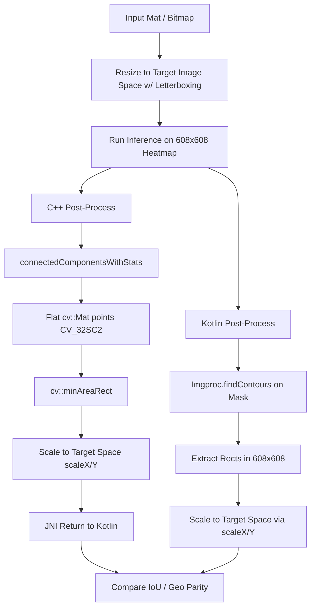

# JNI ABI Layout Mismatch and Coordinate Scaling Specification

This specification document details the architectural problem, investigation, and ultimate engineering solution for the dual Paddle OCR C++ parallel execution harness. It serves as a historical and technical guide for future agents maintaining or refactoring this system.

---

## 1. Executive Summary & Root Cause Analysis

### 1.1 The ABI Layout Mismatch (Standard Container Corruption)
When attempting to run the C++ native Paddle inference pipeline in parallel with the legacy Kotlin/Java implementation, we observed coordinate values from the JNI layer returned as garbage values (e.g. `vertices=(-1.156386688E9, 32153.0)...`) rather than expected pixel coordinates.

This anomaly was traced to an **Application Binary Interface (ABI)** mismatch at the standard template library (STL) level between the custom-compiled `libnative_ocr.so` (built via our local CMake/NDK toolchain) and the precompiled `libopencv_java4.so` included in the project.

Specifically, the function `cv::findContours` accepts a reference to a nested container:
```cpp
std::vector<std::vector<cv::Point>>& contours;
```

Because of differing compilers, compile flags, target optimization, or standard library implementations:
- The byte layout (stride, member offsets, allocators, and internal state pointers) of `std::vector` or `cv::Point` in the precompiled OpenCV binary did not match the layout expected by our custom JNI code.
- When `cv::findContours` populated the nested vectors, it wrote to memory locations assuming its own internal representation.
- Upon returning to our JNI bridge, reading the structure yielded corrupted values due to offset mismatch, occasionally triggering heap corruption or segmentation faults.

### 1.2 The Coordinate Scaling Mismatch (4.15x Scale Deficit)
Once the JNI representation was corrected, we noticed that while the Kotlin and C++ implementations returned identical box counts, the **Intersection over Union (IoU)** metric was exactly `0.0`.
- Kotlin Bounding Box: `(1272, 1078) - (1301, 1104)`
- C++ Bounding Box: `(2498, 44) - (2742, 178)`
- Heatmap Model Coordinates: `608 x 608`

The root cause was identified as a scaling pathway discrepancy:
1. **The Native (C++) Pipeline:** 
   Native inference scales coordinates from the model's `608x608` space to the letterboxed/resized target image space (`alignedW` and `alignedH`, typically around `2528` for a 2500px target size) using `scaleX = alignedW / 608`. These scaled coordinates are returned through the JNI boundary and subsequently divided by `pScale` (to map back to the original photo's raw resolution).
2. **The Legacy (Kotlin) Pipeline:** 
   The legacy Kotlin post-processor (`processPaddleHeatmapLegacy`) lacked access to the target `alignedW` / `alignedH` dimensions and only scaled coordinates by `invScale = 1.0 / pScale`. The `scaleX` factor was completely omitted.
3. **The Discrepancy:**
   This caused Kotlin coordinates to be exactly `scaleX` (approx. 4.15x) smaller than the JNI coordinates, rendering them in the wrong coordinate space and yielding an IoU of zero.

---

## 2. Technical Solution Architecture



### 2.1 ABI-Safe Component Labeling (C++)
To guarantee absolute memory safety and layout parity, we completely removed `cv::findContours` from the C++ layer. We replaced it with `cv::connectedComponentsWithStats`, which operates using simple primitive datatypes and self-contained OpenCV arrays (`cv::Mat`) that do not export nested STL templates across boundaries:

1. **Connected Component Extraction:**
   We label the active regions of the thresholded binary mask:
   ```cpp
   cv::Mat labelMat, stats, centroids;
   int numLabels = cv::connectedComponentsWithStats(mask, labelMat, stats, centroids, 8, CV_32S);
   ```
2. **Flat Coordinate Aggregation:**
   For each labeled component, we instantiate a flat, continuous `cv::Mat` of 2D coordinates representing the pixels within the component's bounding box:
   ```cpp
   cv::Mat points(area, 1, CV_32SC2);
   // Populate points by matching component labels...
   ```
3. **Rotated Rectangle Generation:**
   Pass the flat points buffer to OpenCV's bounding box logic:
   ```cpp
   cv::RotatedRect rect = cv::minAreaRect(points);
   ```

### 2.2 Unified Dynamic Scaling Math
To resolve the scaling disparity, we modified the Kotlin post-processing harness to dynamically calculate `scaleX` and `scaleY` using the dimensions of the `sourceBuffer` (either a `Mat` or a `BufferSet.Slice` representation of the resized/padded image):

```kotlin
var alignedW = w
var alignedH = h
when (sourceBuffer) {
    is Mat -> { alignedW = sourceBuffer.cols(); alignedH = sourceBuffer.rows() }
    is BufferSet.Slice -> { alignedW = sourceBuffer.width; alignedH = sourceBuffer.height }
}
val scaleX = alignedW.toDouble() / w.toDouble()
val scaleY = alignedH.toDouble() / h.toDouble()
```

The legacy contour points are then mapped back to the original image coordinate frame:
```kotlin
val bounds = android.graphics.Rect(
    (rotatedRect.boundingRect().x * scaleX * invScale).toInt(),
    (rotatedRect.boundingRect().y * scaleY * invScale).toInt(),
    ((rotatedRect.boundingRect().x + rotatedRect.boundingRect().width) * scaleX * invScale).toInt(),
    ((rotatedRect.boundingRect().y + rotatedRect.boundingRect().height) * scaleY * invScale).toInt()
)
```

---

## 3. Verification & Parity Standards

The parallel execution harness writes metrics directly to Logcat under the tag `PaddleParallel`.
- **Goal:** Average IoU $\ge$ 0.95 across all validation images.
- **Log Format:**
  ```
  PaddleParallel: Heatmap Comparison:
  PaddleParallel:   Kotlin: N boxes in T1ms
  PaddleParallel:   C++:    N boxes in T2ms
  PaddleParallel:   Matches: M (Avg IoU: X.XX)
  ```
