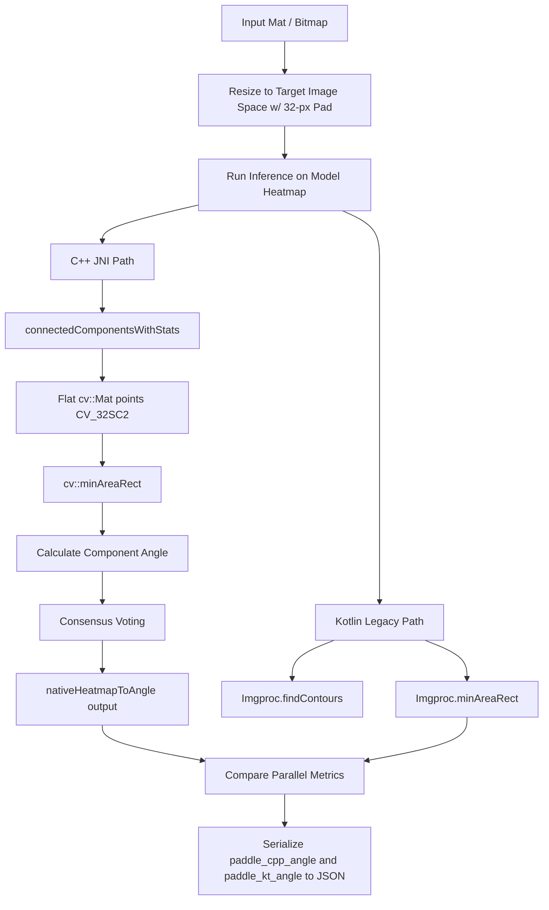

# Paddle OCR Parallel Execution & Consensus Verification Harness

This specification document details the design, JNI implementation, coordinate processing, consensus voting algorithm, and host-side verification pipeline for the C++ parallel execution harness. 

---

## 1. Architectural Overview & JNI Integration

The application leverages PaddleOCR to detect odometer text areas on dashboard photos. To identify the exact tilt of the dashboard and correct it, the image processing pipeline runs a deskewing step. 

To improve performance and execution safety, the post-processing of PaddleOCR's model heatmap is offloaded to C++ via JNI. To prevent regressions, the codebase runs the C++ native path in parallel with the legacy Kotlin path, logging comparative diagnostics and serializing both results to the JSON experiment reports.



---

## 2. C++ Component & Consensus Voting Algorithms

The C++ post-processing logic is implemented in [NativeImageUtils.cpp](file:///home/dlang/git/VehicleExpenses-automated/agent-2/app/src/main/cpp/NativeImageUtils.cpp). 

### 2.1 Connected Components Extraction
We run `cv::connectedComponentsWithStats` on the thresholded binary mask of the PaddleOCR heatmap. Using flat OpenCV matrix structures ensures memory layout safety across the compiler boundaries:
* **JNI function:** `Java_com_davidlang_vehicleexpensesautomated_ui_util_NativeImageUtils_nativeHeatmapToAngle`
* **Connectivity:** 8-way connectivity.
* **Component Noise Filter:** Components with an area of fewer than 10 pixels are discarded.

### 2.2 Consensus Angle Voting
For each valid component:
1. A rotated bounding box (`cv::RotatedRect`) is computed via `cv::minAreaRect`.
2. The skew angle is extracted and normalized to the interval `(-45.0, 45.0]` by picking the edge angle with the smallest absolute value.
3. The component's average confidence is calculated as the mean heatmap value of its pixels.
4. Each component casts a vote weighted by its boundary arc-length and average confidence:
   $$\text{Weight} = \text{arcLength}(\text{points}, \text{true}) \times \text{averageConfidence}$$
5. Votes are accumulated in 0.5-degree buckets:
   $$\text{bucketIdx} = \text{round}(\text{angle} \times 2.0)$$
6. The bin with the maximum cumulative weight is selected, and its center angle (bin index / 2.0) is returned as the final C++ consensus angle.

---

## 3. Parallel Comparison Pipeline

In [OdometerOcrUtils.kt:deskewPaddleDual](file:///home/dlang/git/VehicleExpenses-automated/agent-2/app/src/main/java/com/davidlang/vehicleexpensesautomated/ui/util/OdometerOcrUtils.kt#L236), the consensus angles from both pipelines are computed in parallel:

```kotlin
// 1. Parallel Angle Calculation via JNI C++
val tAngleCpp0 = System.currentTimeMillis()
val cppAngle = NativeImageUtils.heatmapToAngle(det.heatmap, det.width, det.height, 0.20f)
val tAngleCpp = System.currentTimeMillis() - tAngleCpp0

// 2. Legacy Weighted Average Calculation in Kotlin
val rawBlocks = processPaddleHeatmap(...)
val clusteredBoxes = clusterRects(rawBlocks.map { it.boundingBox })
// ...
val srcH = (pHeight / pScale).toInt()
val tAngleKt0 = System.currentTimeMillis()
val angleV3 = calculateWeightedAverage(blocks, srcH)
```

The system logcat outputs comparative metrics under the tag `PaddleParallel`:
```
PaddleParallel: Angle Consensus Triple:
PaddleParallel:   ML Kit: -7.5
PaddleParallel:   Paddle Kotlin: 0.0
PaddleParallel:   Paddle C++:    -6.5
```

---

## 4. Serialization Strategy

Both consensus angles are recorded in the JSON report's `deskew` dictionary at the vehicle level in [ExperimentAlignmentScreen.kt:L591](file:///home/dlang/git/VehicleExpenses-automated/agent-2/app/src/main/java/com/davidlang/vehicleexpensesautomated/ui/experiment/ExperimentAlignmentScreen.kt#L591):

```json
"deskew": {
  "angle_a": -7.5,
  "paddle_cpp_angle": -6.5,
  "paddle_kt_angle": 0.0
}
```

---

## 5. Host-Side Verification & Report Generation

To audit the C++ consensus angles and components on the host without deploying code to the physical hardware, run the generation script using the designated miniconda environment:

```bash
/home/dlang/miniconda3/envs/paddle_env_v3/bin/python generate_reports.py
```

This processes the base64-encoded PaddleOCR heatmaps from [alignment_results_2026-05-30_12-14-21.json](file:///home/dlang/git/VehicleExpenses-automated/dev-ai-interaction/latest-report/alignment_results_2026-05-30_12-14-21.json) and outputs:
1. [cpp_angles_report.md](file:///home/dlang/git/VehicleExpenses-automated/dev-ai-interaction/cpp_angles_report.md): Skew angle values per image.
2. [cpp_rectangles_report.json](file:///home/dlang/git/VehicleExpenses-automated/dev-ai-interaction/cpp_rectangles_report.json): Rotated bounding box geometry and confidence per component.
3. [cpp_rectangles_summary.md](file:///home/dlang/git/VehicleExpenses-automated/dev-ai-interaction/cpp_rectangles_summary.md): Summary count and confidence metrics per photo.
